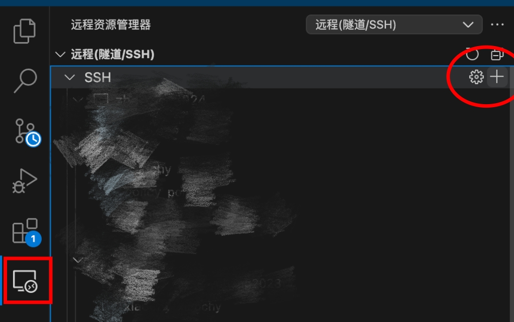
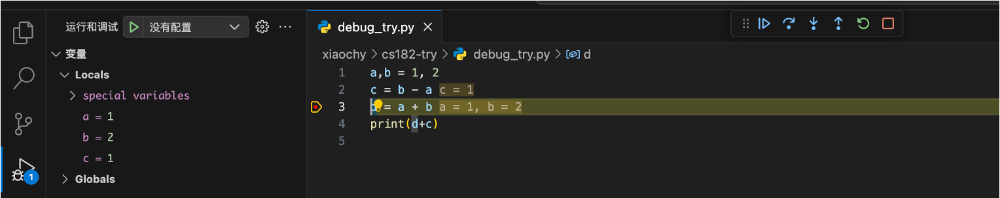
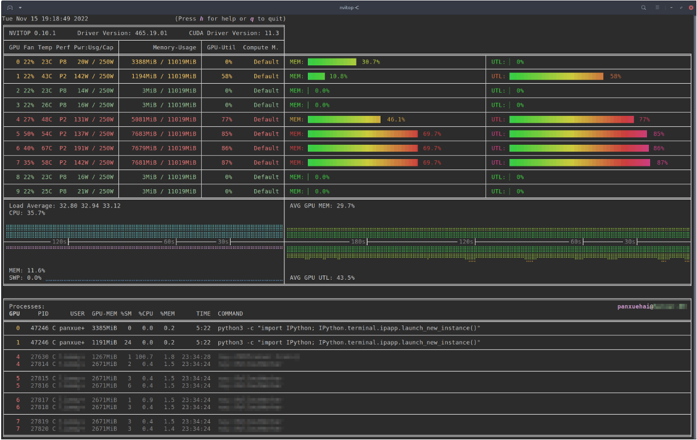

# Guidance on using AI Cluster 🌻

ShanghaiTech AI cluster reference website: [Cluster Documentation](http://10.15.89.177:8889/accounts/index.html) 

- For demonstration files used in the video, see the `Demo` folder, which includes an example `slurm` script in apply_gpu and test files to verify GPU availability.
- If you cannot SSH to the server even with the correct IP, username, and port, please verify your VSCode version by running `code --version` in the terminal. Only VSCode versions between `1.96 and 1.98` are compatible with our AI cluster. If your version falls outside this range, you'll need to downgrade.
- `Port 22112` is only available on the `login node`. `Debug nodes and compute nodes` don't need to specify the port number!

## Your AI cluster account 🆔
| Field            | Description                                  |
|------------------|----------------------------------------------|
| **Username**     | Your email prefix + "-cs182" (e.g. zhang3-cs182) |
| **Initial Password** | `sist` (Change immediately after login using `yppasswd`) |
| **Queue**        | CS182                                 |
| **GPU Limits**   | Max 2 GPUs, each 2-day maximum runtime   |


The maximal using time of a gpu is 2 days. After 2 days, the gpu will be released and you should apply for a new gpu if you want to continue training your task. Therefore, make sure that the gpu has adequate remaining time to train your task or save the model checkpoints every several training epochs in case of training crash.

Do not use the server as the cloud drive! You should back up your files on it frequently in case of emergency. Note that your account will be retrieved by the Admin when the course is over.

## The steps of using SSH 👣
- First, install Remote - SSH in vscode

- Second, you can see there is an icon of computer on the left toolbar:

Click the ➕ (plus) icon in the top right corner of the SSH extension panel, then enter the connection details:  
`ssh your_username@10.15.89.191 -p 22112`  

*Where:*
    - *`10.15.89.191` is a login node IP (used for file management and job submission only)*
    - *22112 is the required port number*
    - *Alternative login nodes: `10.15.89.192` or `10.15.89.41`*  
    - *❌ GPU*
    - *✅ Internet*

You can connect to the `debug node` using `ssh your_username@10.15.88.73` where:
- *`10.15.88.73` and `10.15.88.74` are the debug node IP (used for debug your code)*
- *No port number for the debug node*
- *✅ GPU*
- *Install `python debugger` extension in Vscode to debug with UI*




**Important Notes:** ⚠️
1. Login nodes are strictly for:
   - File operations
   - Submitting GPU allocation requests
2. All computations must be performed on GPU nodes after allocation. Never run training scripts directly on login nodes
3. Refer to [Cluster Documentation](http://10.15.89.177:8889/accounts/index.html) for complete guidelines


- The ssh extension will automatically add those lines into your config, where you can alternate the Host on the first name to help you better remember what this server relates to.


Congratulations! You have successfully connected to the `login node` of the AI cluster! 😊


## The steps of applying for a GPU 💻
- First, you should create a `2080.slurm` file which includes:
```#!/bin/bash
#SBATCH -J 2080_GPU
#SBATCH -p CS182
#SBATCH --cpus-per-task=12
#SBATCH -N 1
#SBATCH -t 2-00:00:00
#SBATCH --output=%j.out
#SBATCH --error=%j.err
#SBATCH --mail-type=ALL
#SBATCH --mem-per-cpu=10240
#SBATCH --gres=gpu:NVIDIAGeForceRTX2080Ti:1
#SBATCH --mail-user=zhang3@shanghaitech.edu.cn
# sleep 9999999
```
where `2080_GPU` is the name of your task, `CS182` is the queue name you submit to and `mail-user` should use your own email address. Other information suggests that you apply for one 2080 GPU with 120G CPU memory.

Note that if you are queueing for a GPU and at some time the GPU is distributed for you, you don't use it immediately. Then, after some time, this gpu may be released for the its low utilization where the `sleep` command cannot help. In this case, you may need to add a GPU-reserving program named `force_gpu.py` to your slurm script. Here is an example of the GPU-reserving program:(You can design other version of it if you want. The example is a matrix multiplication):
```
import torch
from time import sleep
device = torch.device("cuda" if torch.cuda.is_available() else "cpu")
if not torch.cuda.is_available():
    print("CUDA is not available. Running on CPU...")

# You can change N here
N = 500
# Ensure persistent computation to maintain GPU occupancy
while True:
    a = torch.randn(N, N, device=device)
    b = torch.randn(N, N, device=device)
    c = torch.matmul(a, b)
    d = torch.matmul(a, b)
    sleep(0.01)
```
N should be tuned s.t. it should not occupy a large gpu memory which may hinder your training, but it should occupy around 5% gpu utilization. 

Furthermore, since this GPU-reserving process cannot be terminated after you successfully get the gpu, which means if you terminate this process, the gpu will also be released. So you should make sure N is suitable.

After that, your slurm script should look like:
```#!/bin/bash
#SBATCH -J 2080_GPU
#SBATCH -p CS182
#SBATCH --cpus-per-task=12
#SBATCH -N 1
#SBATCH -t 2-00:00:00
#SBATCH --output=%j.out
#SBATCH --error=%j.err
#SBATCH --mail-type=ALL
#SBATCH --mem-per-cpu=10240
#SBATCH --gres=gpu:NVIDIAGeForceRTX2080Ti:1
#SBATCH --mail-user=zhang3@shanghaitech.edu.cn
conda activate your_conda_env_name
cd /the_path_to_force_gpu.py
python force_gpu.py
```

- Second, open your terminal(on login node) and input:
```
sbatch 2080.slurm
```
After that, you can input:
```
squeue
```
to see your submitted task and whether you have got this gpu.

## The steps to login to the compute node and train your model 😊
### For python files: 📃
- Once you get the gpu like `sist_gpu68`, you can ssh to it through terminal:
```
ssh sist_gpu68
```
- Then you can input your password, which is the same as your account password. After that, you should successfully log in to the gpu, where you can run your training code in terminal, for example:
```
python training.py
```

### For Jupter Notebook 📓(Used in HW5!⛽️):
- You can use VSCode ssh extension, click plus buttom and input:
```
ssh -J your_user_name@10.15.89.191:22112 your_user_name@sist_gpu68
```
- Then when you run the following code in your jupter notebook, you should see the output is `Using device cuda`
```
# Determine the device
device = torch.device("cuda" if torch.cuda.is_available() else "cpu")
print("Using device", device)
```

⚠️ **Important Network Restriction**: All internet-dependent operations (dataset downloads, package installations, etc.) must be performed on the login node before submitting your job. Compute nodes are intentionally isolated without internet access - attempting network operations on GPU nodes will fail. Plan your resource preparation accordingly.

## Some Useful Tools 🔧
- `conda`: A cross-platform package and environment manager that simplifies installing, running, and managing dependencies for Python and other languages.
    - `anaconda3` has been installed to your home directory, check `conda -v` to see if you can use conda correctly.
    - Some common commands:
        - `conda create -n my_env python=3.9`: create a conda env named my_env with python version 3.9
        - `conda activate my_env`: activate your conda env named my_env
        - `conda deactivate my_env`: deactivate your conda env named my_env
        - `conda env list`: list all the conda env names you have
    - Tutorial: https://docs.conda.io/projects/conda/en/stable/user-guide/getting-started.html


- `tmux`: A terminal multiplexer that lets you run multiple sessions, windows, and panes within a single terminal, enabling persistent remote work and efficient multitasking. (Continue training your model even if you disconnect the server.🎉)
    - Already install on the login node; No installation on compute node
    - Some common commands:
        - `tmux ls` : list all the tmux window names and created time
        - `tmux new -s my_session_name`: create a new tmux window
        - `tmux attach -t my_session_name`: attach to a created tmux window
    - Tutorial: https://github.com/tmux/tmux/wiki


- `nvitop`: An interactive NVIDIA GPU monitoring tool for terminals, providing real-time stats like usage, memory, and processes in a user-friendly top-like interface.
    - Tutorial: https://github.com/XuehaiPan/nvitop



## Tips 📒
What if I don't want to enter my password again and again when ssh to the server?
- Generate a pair of public key and private key!
### Steps: (Use login node as an example)
*Open your computer's terminal*:
- `ssh-keygen -t ed25519 -C "your_email_address"`
    - email address can be any address you have
    - Generate a secure SSH key pair (public/private) using the Ed25519 algorithm, saved to `~/.ssh/`

- `ssh-copy-id -i ~/.ssh/id_ed25519.pub -p 22112 your_user_name@10.15.89.191`
    -  Copy your local SSH public key (`~/.ssh/id_ed25519.pub`) to the remote server `10.15.89.191 on port 22112`, adding it to `~/.ssh/authorized_keys` to enable password-less login for the user `your_user_name`.


- You can try `ssh your_user_name@10.15.89.191 -p 22112`, and hope you find you don't need to input the password anymore! 😊


## Conclusion 🌈
That's all for the guidance to use AI cluster! If you have any question, feel free to open an issue on Piazza, we will try to help you as soon as possible 😊. Hope you have a pleasant journey of learning machine learning!

---
*Authored by: Chuyang Xiao*  
*Email: `xiaochy@shanghaitech.edu.cn`*\
*Last updated: 2025-04-16*
