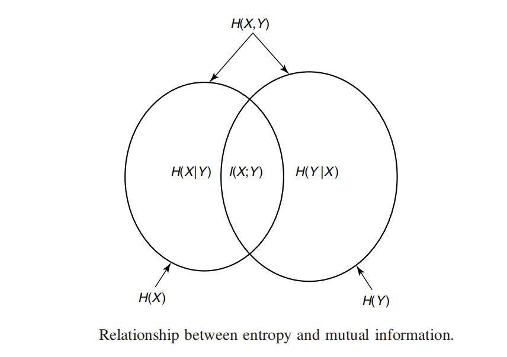
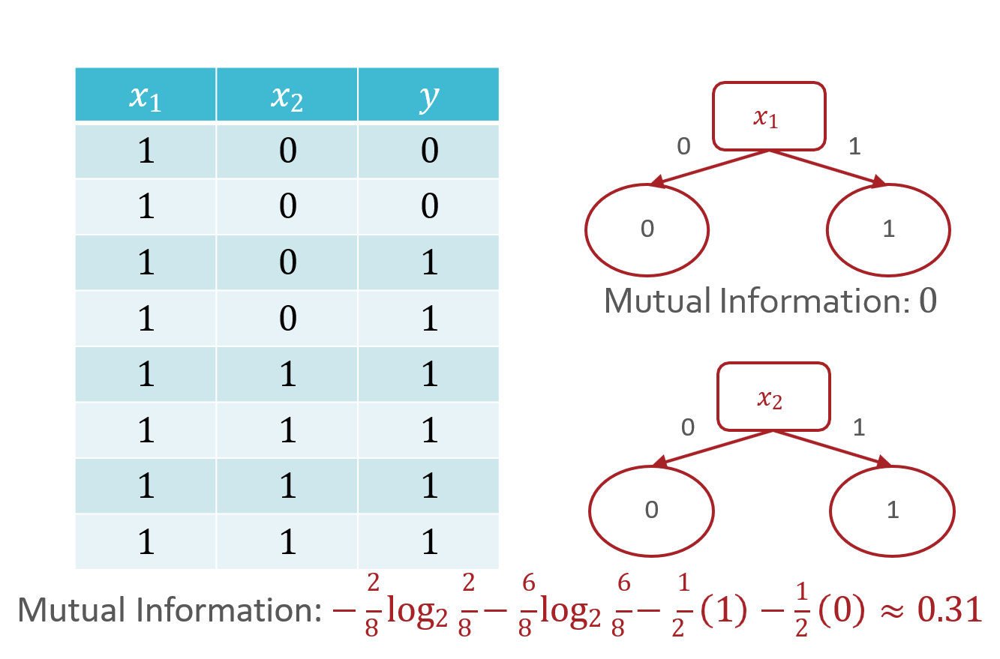
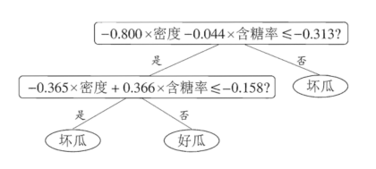

# CS182 Introduction to Machine Learning
# Recitation 1
2025.2.26

---

# Contact us
- piazza
- email TAs (see lecture1 P58)
- teacher's office hours
周三10:00~11:00, SIST 1C-303C
shiyj2@shanghaitech.edu.cn
- Contact me
  - my qq: 1354038619
  - my email: zhoushch@shanghaitech.edu.cn

---

# 课程安排
- Grading
作业 30% + 期末project 30% + 期末考试 40%

- Recitation
- Homework
- Project

---

# What is taught in IML
对于大二、大三同学来说, IML可能是第一次学习与人工智能、神经网络等词汇有较
强关联的课程，但：
- IML (以及他对应的研究生课ML)主要关注机器学习领域的数学理论
- 大量用到线性代数和概率论等前置课程知识
侧重于基于概率、基于统计的学习模型
(而不是深度学习及PyTorch的使用)
- 较少的关于深度学习领域的介绍

---

# 劝退环节
- Notice: 这是一门数学课 + 代码实现 + project
你想要在这么课中收获什么?
- 传统的机器学习算法 $\checkmark$
- 数学理论基础 $\checkmark$
- 水学分 / 完成培养方案 $\checkmark$
- 获得进组炼丹所需的能力 $\times$
- 学习 Deep Learning 调参技巧 $\times$
- 了解最前沿的科研进展 $\times$

---

### To learn more on math and theory:
- Numerical Optimization (SI152)
- Convex Optimization (SI151A, SI251)
- Machine Learning (CS282)
- Reinforcement Learning (SI252)
- $\cdots$

### To learn more on deep learning and applications:
- Computer Vision (CS172, CS271, CS272)
- Natural Language Processing (CS274A)
- Deep Learning (CS280)
- $\cdots$
> 各种网上的课程e.g. CS229, CS231n, CS224n

---

# Types of Machine Learning

- 监督学习
  (分类、回归)
- 无监督学习
  (聚类、降维、生成模型)
- 强化学习

---

# Recitation schedule
- Math reviews(or maybe previews)
  - Information Theory
  - Linear Algebra
  - Probability and Statistics
  - Optimization
- Course reviews
- Homework recitation

---

# Review(Preview): Linear Algebra
- 为什么用到线性代数：
  - 线性代数是描述空间和变换的工具，让描述问题变得简单
  - 大量学习算法通过建模输入空间到输出空间的变换来解决问题
  - 线性代数的矩阵分解理论提供了寻找主成分的理论基础
- 用哪些线性代数：
  - 矩阵的基本运算和性质(回忆一下特殊矩阵：对称矩阵、对角矩阵、单位矩阵、正交矩阵、上三角矩阵)
  - 常用的两种矩阵分解: 特征值分解、SVD分解
  - 最小二乘法
  - 矩阵求导*(由于将向量记作行向量还是列向量有分歧，因此有两套矩阵求导公式，请注意如果没有特殊说明，我们均默认列向量)

---

# Review(Preview): Probability & Statics
- 什么用到概率论与数理统计：
  - 概率论为机器学习提供了问题的假设
  - 回归和分类问题都可以描述为一个估计问题
  - 数据的分布往往服从正态分布
- 用哪些知识：
  - 常用的概率公式(条件概率、全概率、贝叶斯)
  - 常用的分布和他们的特殊性质(正态、泊松、两点、二项、均匀)
  - 常用的统计量(均值、方差、协方差)和他们的无偏估计

---

# Review(Preview): Optimization
- 通常讨论凸优化的范围
  - 凸集
  - 凸函数
  - 凸优化问题
- 优化方法
  - Lagrange Duality
  - KKT method
  - Gradient Descent(SGD, ...)

---

# Review(Preview): Information Theory
- Decision Tree in Lecture 3
  - Entropy
  - Cross Entropy
  - Mutual Information
  - KL Divergence
- More details: EE142

> reference repo: https://github.com/zsc2003/ShanghaiTech-EE142

---

# Entropy 熵
$\log x$若无特殊说明, 默认为$\log_2 x$, $0\log 0=0$.
离散型随机变量$\mathcal{X}$看作是有限的, i.e. $|\mathcal{X}|<+\infty$.
事件$x$发生的概率为$p(x)$, 则$x$的信息量为$\log\dfrac{1}{p(x)}$.
离散型随机变量$X$的熵 (entropy) $H(X)$ 或写作 $H(p)$: 所有事件发生的期望信息量
$\begin{aligned}
  H(X)&= -\sum_{x\in\mathcal{X}}p(x)\log p(x) \\
      &= \sum_{x\in\mathcal{X}}p(x)\log\dfrac{1}{p(x)} \\
      &= \mathbb{E}\left[\log\dfrac{1}{p(x)}\right]
\end{aligned}$

---

# Entropy 熵
$\begin{aligned}
  H(X)&= -\sum_{x\in\mathcal{X}}p(x)\log p(x) \\
      &= \sum_{x\in\mathcal{X}}p(x)\log\dfrac{1}{p(x)} \\
      &= \mathbb{E}\left[\log\dfrac{1}{p(x)}\right]
\end{aligned}$
- $0\leq H(X)\leq \log|\mathcal{X}|$.
  - $X$为冲激函数时取$0$ 事件是确定的(deterministic), 信息量为0.
  - $X$为均匀分布时取到 $\log|\mathcal{X}|$.

---

# Joint Entropy 联合熵 $H(X,Y)$
$\begin{aligned}
H(X,Y)&= -\sum_{x\in\mathcal{X}}\sum_{y\in\mathcal{Y}}p(x,y)\log p(x,y) \\
&= \sum_{x\in\mathcal{X}}\sum_{y\in\mathcal{Y}}\textcolor{red}{p(x,y)}\log\dfrac{1}{p(x,y)} \\
&= \mathbb{E}\left[\log\dfrac{1}{p(x,y)}\right]
\end{aligned}$

---

# 条件熵 (conditional entropy) $H(Y|X)$:
$\begin{aligned}
H(Y|X)&=\textcolor{red}{\sum_{x\in\mathcal{X}}p(x)H(Y|X=x)} \\
&= -\sum_{x\in\mathcal{X}}p(x)\sum_{y\in\mathcal{Y}}p(y|x)\log p(y|x) \\
&= \sum_{x\in\mathcal{X}}\sum_{y\in\mathcal{Y}}\textcolor{red}{p(x,y)}\log\dfrac{1}{p(y|x)} \\
&= \mathbb{E}\left[\log\dfrac{1}{p(y|x)}\right]
\end{aligned}$

---

# Chain Rule
chain rule:
$H(X_1,X_2,\cdots,X_n)=\sum\limits_{i=1}^nH(X_i|X_1,X_2,\cdots,X_{i-1})=\sum\limits_{i=1}^nH(X_i|X_{i+1}, \cdots, X_n)$
二元情况:
$H(X,Y)=H(X)+H(Y|X)$
> proof: chain rule of probability
$p(x_1,x_2,\cdots,x_n)=\prod\limits_{i=1}^np(x_i|x_1,x_2,\cdots,x_{i-1})=\prod\limits_{i=1}^np(x_i|x_{i+1},\cdots,x_n)$

---

# Cross Entropy
> 通常被用作分类任务中的损失函数

一个分类任务中, 标签的真实分布为$p(x)$, 模型的预测分布为$q(x)$. 则模型的交叉熵(cross entropy)为:
$$\begin{aligned}
H(p,q) &= -\sum_{x\in\mathcal{X}}p(x)\log q(x) \\
&= \sum_{x\in\mathcal{X}}p(x)\log\dfrac{1}{q(x)} \\
&= \mathbb{E}_{x\sim p(x)}\left[\log\dfrac{1}{q(x)}\right]
\end{aligned}$$

---

# KL Divergence (KL散度)
两个分布$p(x),q(x)$的相对熵 Relative Entropy(KL-Divergence):
$$\begin{aligned}
D\left(p(x)\|q(x)\right) &= \sum_{x\in\mathcal{X}}p(x)\log\dfrac{p(x)}{q(x)} \\
&= \sum_{x\in\mathcal{X}}p(x)\log p(x) + \sum_{x\in\mathcal{X}}p(x)\log\dfrac{1}{q(x)} \\
&= -H(p) + H(p,q)
\end{aligned}$$
- $\textcolor{red}{D(p\|q)\neq D(q\|p)}$
- 物理意义: 两个分布之间的距离(相似性).
- 当真实分布$p(x)$固定时, KL散度和交叉熵等价, 只是多了一个常数项.
- $D\left(p(x)\|q(x)\right)\geq 0$.
当且仅当$p(x)=q(x)$时等号成立(Jensen's Inequality成立条件: 函数是线性的).

---

# Correlation 相关性
概率论衡量两个变量相关程度(概率论方法):
$$\rho_{X,Y}=\dfrac{\operatorname{Cov}(X,Y)}{\sqrt{\operatorname{Var}(X)\operatorname{Var}(Y)}}\in[-1,1]$$
只能刻画**线性**相关性, 且正负相关程度相同(正负相关).
$X$,$Y$独立, 则$\rho_{X,Y}=0$. 但是$\rho_{X,Y}=0$**不一定**独立.
> e.g. $Y=X^2, X\sim N(0,1)\Rightarrow \mathbb{E}(X)=0, \text{Var}(X)=1, \mathbb{E}(Y)=\mathbb{E}(X^2)=1$
$\text{Cov}(X,Y)=\mathbb{E}(XY)-\mathbb{E}(X)\mathbb{E}(Y)=0$

$\textcolor{red}{Gaussian分布独立\Leftrightarrow不相关}$.

---

# Mutual Information
信息论衡量方法(用bit衡量):
$I(X;Y)$: $X$,$Y$之间的互信息(mutual information).
$$\begin{aligned}
I(X;Y) &= \sum_{x,y}p(x,y)\log\dfrac{p(x,y)}{p(x)p(y)} = D\left(p(x,y)\|p(x)p(y)\right) \\
\end{aligned}$$

- $I(X;Y)=I(Y;X)$
- $0\leq I(X;Y)\leq \min\{H(X),H(Y)\}$
  - $0\leq I(X;Y)$: 当且仅当 $p(x,y)=p(x)p(y)$ 时等号成立, 即$X$,$Y$独立.

  - $I(X;Y)\leq \min\{H(X),H(Y)\}$: Since $H(X)\geq 0$, similarly, $H(X|Y)\geq 0$.
$$I(X;Y) = H(X) - H(X|Y) \leq H(X)$$
当且仅当$H(X|Y)=0$时等号成立. 另一个同理.

---

# Mutual Information

  

$\begin{aligned}
H(X,Y) &\ = H(X) + H(Y|X) \\
I(X;Y) &= H(X) - H(X|Y) = H(Y) - H(Y|X) \\
&= H(X) + H(Y) - H(X,Y)
\end{aligned}$

---

# Decision Tree

- 离散属性的决策树

  

> 按互信息高的方式划分

---

# Decision Tree
- 连续属性的决策树

  

> 对连续的属性进行划分, 选择一个阈值进行划分(e.g. 二分)
> 含参的多变量决策树(trainable)
> 多棵决策树 boosting (random forest)