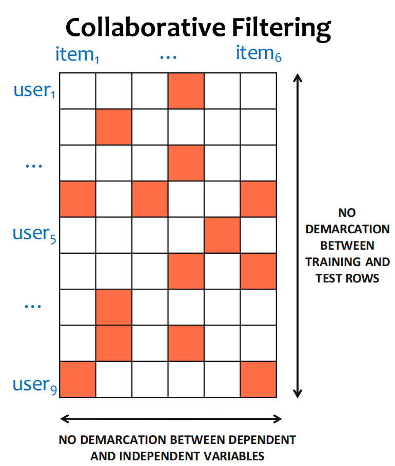

# CS182 Introduction to Machine Learning
# Recitation 10
2025.5.21

---

# Outline
- Recommendation system
- PCA
- Kmeans

---

# Recommendation system

  

> Sparse -> Low rank

---

# Matrix Factorization

  

$r_{i,j}$是用户对物品的评分, 打分较少, 所以$R$是稀疏低秩矩阵
$Rank(R)=k\ll\min(m,n)$, $k$是超参数
$R=UV^{\top}$
预测用户$i$对物品$j$的评分: $\hat{r}_{ij}=U_iV^{\top}_j$

---

# Matrix Factorization

  

$J(U,V)=\left\|R-UV^{\top}\right\|_F^{2}+\lambda(\|U\|_F^{2}+\|V\|_F^{2})$

---

# LoRA (Low Rank Adaptation)

  

<!-- 为何用数千的样本就能将一个数十亿参数的模型微调得比较好
预训练模型拥有极小的内在维度(instrisic dimension)，即存在一个极低维度的参数，微调它和在全参数空间中微调能起到相同的效果。
同时Aghajanyan发现在预训练后，越大的模型有越小的内在维度，这也解释了为何大模型都拥有很好的few-shot能力。 -->
<!-- --- -->
<!-- 受instrisic dimension工作的启发，作者认为参数更新过程中也存在一个‘内在秩’。对于预训练权重矩阵$W_0\in\mathbb{R}^{d\times k}$, 我们可以用一个低秩分解来表示参数更新$\Delta W$, 即： -->
$$W_0+\Delta W = W_0 + BA\qquad B\in\mathbb{R}^{d\times r}, A\in\mathbb{R}^{r\times k}\qquad r\ll\min(d,k)$$
<!-- 训练过程中冻结参数$W_0$，仅训练A和B中的参数。如上图所示，对于$h=W_0x$，前向传播过程变为： -->
$$h=W_0x+\Delta Wx=W_0x+BAx$$

---

# PCA (Principal Component Analysis)

  

---

# PCA

  

- 最大化投影后的方差 / 最小化重建误差

---

# PCA
1. Centerization
    $X = X - \mu$

2. Eigenvalue Decomposition / SVD
    $X=U\Sigma V^{\top}$
    ($U$是$XX^{\top}$的特征向量, $V$是$X^{\top}X$的特征向量)

3. 取出$V_1,V_2,\dots,V_k$(假设数据矩阵式**行向量**拼起来)

4. Projection
    $X_i' = X_i [V_1,V_2,\dots,V_k]$

---

# PCA是特殊的Encoder-Decoder结构(线性)

  

---

# Visualize Latent Space

  

---

# 其他降维方式

- PCA
- LDA
- t-SNE
- UMAP
- ...

---

# Kmeans

E-step: $z_i=\arg\min\limits_k\|x_i-\mu_k\|_2^2$
M-step: $\mu_k=\dfrac{1}{n_k}\sum\limits_{i:z_i=k}x_i$

---

# Initialization

  

---

# Kmeans++

1. 从所有点中均匀随机选择一个, 作为第一个簇的中心$c_1$. 所有簇的中心的集合为$C=\{c_1\}$
2. 对于每个非中心点$x_i$, 计算$x_i$到$C$中每个簇中心的距离
    $D^2(x)=\min\limits_{c\in C}\|x-c\|^2,\quad x\notin C$
3. 选择下一个中心:
    $\Pr(x_i\text{被选作下一个中心})=\dfrac{D^2(x_i)}{\sum\limits_{x\notin C}D^2(x)}$
4. 重复步骤2和步骤3, 直到$|C|=k$
