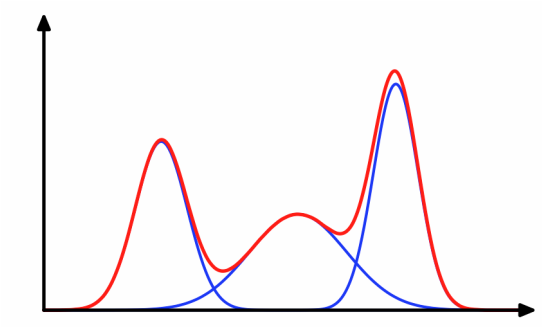

# CS182 Introduction to Machine Learning
# Recitation 11
2025.5.28

---

# Outline
- Ensemble Learning
- EM Algorithm
- GMM
- Learning Theorem*

---

# Ensemble Learning (集成学习)
- Boosting
- Bagging(Boostrap AGGregretion)
Boostrap: 自举

Boosting: 串行：基学习器按顺序训练，后一个学习器专注于修正前一个模型的错误, 目标是降低偏差(e.g. AdaBoost, XGBoost)
Bagging: 并行：每棵基学习器在相互独立的数据子集上同时训练，训练过程互不影响, 目标是降低方差(e.g. Random Forest)

> Key idea: 把许多单个模型组合成一个整体更强的模型

---

# Boosting

  

---

# AdaBoost(Adaptive Boosting)

  

---

# AdaBoost
- Derive of $Z_t$
$$\begin{aligned}
\sum_{i=1}^{m} D_{t+1}(i)  &= \sum_{i=1}^{m}\dfrac{D_{t}(i)}{Z_t}\exp\left(-\alpha_ty_ih_t(x_i)\right)=\dfrac{1}{Z_t}\sum_{i=1}^{m}D_{t}(i)\exp(-\alpha_ty_ih_t(x_i))=1 \\
\Rightarrow\quad Z_t &= \sum_{i=1}^{m}D_{t}(i)\exp\left(-\alpha_ty_ih_t(x_i)\right) \\
&= \sum_{i:y_i\neq h_t(x_i)}D_{t}(i)e^{\alpha_t}+\sum_{i:y_i=h_t(x_i)}D_{t}(i)e^{-\alpha_t} \\
&= e^{\alpha_t}\sum_{i=1}^{m}D_{t}(i)\mathbb{I}(y_{i} \neq h_{t}(x_{i}))+e^{-\alpha_t}\sum_{i=1}^{m}D_{t}(i)\mathbb{I}(y_{i} = h_{t}(x_{i})) \\
&= e^{\alpha_t}\epsilon_t+e^{-\alpha_t}(1-\epsilon_t)
\end{aligned}$$

---

# AdaBoost
- Derive of $\alpha_t$
$$\begin{align*}
\epsilon_{\text{final}} &=\dfrac{1}{m}\sum_{i=1}^m\mathbb{I}(y_i\neq H_{\text{final}}(x_i))\\
& =\frac{1}{m} \sum_{i=1}^m \begin{cases}1 & \text { if } y_i \neq H_{\text{final}}\left(x_i\right) \\
0 & \text { otherwise }\end{cases} \\
& =\frac{1}{m} \sum_{i=1}^m \begin{cases}1 & \text { if } y_i \left(\sum\limits_{t=1}^T\alpha_th_t(x_i)\right) \leq 0 \\
0 & \text { otherwise }\end{cases} \\
& \leq \frac{1}{m} \sum_{i=1}^m \exp \left(-y_i \left(\sum\limits_{t=1}^T\alpha_th_t(x_i)\right)\right)
\end{align*}$$

---

# AdaBoost
- Derive of $\alpha_t$
$$\begin{align*}
D_{T+1}(i) &= \dfrac{D_{T}(i)}{Z_T}\exp(-\alpha_{T}y_ih_{T}(x_i)) \\
&\quad\quad\vdots \\
D_2(i) &= \dfrac{D_1(i)}{Z_1}\exp(-\alpha_1y_ih_1(x_i)) \\
D_1(i) &= \dfrac{1}{m} \\
\Rightarrow\quad D_{T+1}(i) &= \dfrac{1}{m}\prod_{t=1}^{T}\dfrac{1}{Z_t}\exp(-\alpha_ty_ih_t(x_i))=\dfrac{1}{m}\cdot \dfrac{1}{\prod\limits_{t=1}^{T}Z_t}\cdot \exp\left(-y_i\sum_{t=1}^{T}\alpha_th_t(x_i)\right)
\end{align*}$$

---

# AdaBoost
- Derive of $\alpha_t$

$$\begin{aligned}
Z_t&=e^{\alpha_t}\epsilon_t+e^{-\alpha_t}(1-\epsilon_t) \\
\epsilon_{\text{final}}&\leq \prod_{t=1}^{T}Z_t \\
\dfrac{\partial Z_t}{\partial\alpha_t} &= \epsilon_te^{\alpha_t}-(1-\epsilon_t)e^{-\alpha_t} \\
\dfrac{\partial^2 Z_t}{\partial\alpha_t^2} &= \epsilon_te^{\alpha_t}+(1-\epsilon_t)e^{-\alpha_t}>0 \\
\Rightarrow\qquad \alpha_t &= \dfrac{1}{2}\log\dfrac{1-\epsilon_t}{\epsilon_t}
\end{aligned}$$

---

# AdaBoost

  

$$Z_t = 2\sqrt{\epsilon_t(1-\epsilon_t)} \qquad \alpha_t = \dfrac{1}{2}\log\dfrac{1-\epsilon_t}{\epsilon_t}$$

---

# Bagging
1. Bootstrap 采样：从原始训练集随机有放回地抽取样本，得到 B 个大小与原集相同的子集。

2. 独立训练基模型：在每个子集上分别训练一份同类型的基学习器

3. 聚合预测：

    回归任务取 B 个模型输出的平均值；
    分类任务采用多数投票或概率平均。

---

# Random Forest

  

---

# ELBO(Evidence Lower Bound)

  

$$\log p(X) =\underbrace{\int q(z) \log \dfrac{p(X, z)}{q(z)} dz}_{\text {Evidence Lower Bound(ELBO)}} + \text{KL}(q(Z) \| p(Z \mid X))$$

---

# Expectation-Maximization(EM) Algorithm
- E step: 先根据当前模型把看不见的那块猜出来

- M step: 拿这份猜出来的数据重新调模型

  

> https://www.zhihu.com/question/40797593/answer/275171156?utm_campaign=&utm_medium=social&utm_psn=1865308003504357376&utm_source=qq

---

# Kmeans

E-step: $z_i=\arg\min\limits_k\|x_i-\mu_k\|_2^2$
M-step: $\mu_k=\dfrac{1}{n_k}\sum\limits_{i:z_i=k}x_i$

---

# Gaussian Mixture Model(GMM) 高斯混合模型

  
  

Given a Gaussian mixture model, the goal is to maximize the likelihood function with respect to the parameters (comprising the means and covariances of the components and the mixing coefficients).

---

# GMM

1. Initialize the means $\boldsymbol{\mu}_k$, covariances $\boldsymbol{\Sigma}_k$ and mixing coefficients $\pi_k$.

2. E step. Evaluate the responsibilities using the current parameter values
$$
\gamma\left(z_{n k}\right)=\frac{\pi_k \mathcal{N}\left(\mathbf{x}_n \mid \boldsymbol{\mu}_k, \boldsymbol{\Sigma}_k\right)}{\sum_{j=1}^K \pi_j \mathcal{N}\left(\mathbf{x}_n \mid \boldsymbol{\mu}_j, \boldsymbol{\Sigma}_j\right)} .
$$

3. M step. Re-estimate the parameters using the current responsibilities
$$
\begin{aligned}
\boldsymbol{\mu}_k^{\text {new }} & =\frac{1}{N_k} \sum_{n=1}^N \gamma\left(z_{n k}\right) \mathbf{x}_n \\
\boldsymbol{\Sigma}_k^{\text {new }} & =\frac{1}{N_k} \sum_{n=1}^N \gamma\left(z_{n k}\right)\left(\mathbf{x}_n-\boldsymbol{\mu}_k^{\text {new }}\right)\left(\mathbf{x}_n-\boldsymbol{\mu}_k^{\text {new }}\right)^{\top} \\
\pi_k^{\text {new }} &= N_k / N
\end{aligned}
$$

---

# Learning Theory*
- Parameter Model & Non-Parameter Model
- PAC(Probably Approximately Correct)
- VC-dimension
- No Free Lunch Theorem

---

# Parameter Model(参数模型) / Non-Parameter Model(非参数模型)

参数模型通常假设总体服从某个分布 ,非参数模型对于总体的分布不做任何假设或者说是数据分布假设自由

https://blog.csdn.net/u014482444/article/details/107663940

参数模型
https://blog.csdn.net/qlkaicx/article/details/134638010

常见的参数机器学习模型有： 1、逻辑回归(logistic regression) 2、线性成分分析(linear regression) 3、感知机(perceptron)

常见的非参数机器学习模型有： 1、决策树 2、朴素贝叶斯 3、支持向量机, 4. 神经网络 5. KNN

---

# No Free Lunch Theorem (NFL定理)

是一种在计算机科学和优化理论中广泛讨论的概念， 尤其是在算法性能分析方面.

如果考虑所有可能的问题, 所有的优化算法在平均性能上都是相同的

这个定理的重要启示是, 选择或设计算法时, 我们不能寻找或期望有一个"万能"算法能解决所有类型的问题. 相反, 我们需要根据具体问题的特点和需求来选择或定制算法. 这也解释了为什么在机器学习和数据科学中, 针对不同的数据集和任务, 我们需要尝试和比较多种模型和方法.

---

# No Free Lunch Theorem (NFL定理)

没有一个算法可以在所有可能的问题上都表现最好.
这意味着算法的有效性高度依赖于问题的具体特性.

  

---

  

