# CS182 Introduction to Machine Learning
# Recitation 12
2025.6.4

---

# Outline

<ul>
  <li>Decision Trees</li>
  <li>KNN (k-Nearest Neighbors)</li>
  <li>Perceptron</li>
  <li>Linear Regression</li>
  <li>Kernel Methods</li>
  <li>SVM (Support Vector Machines)</li>
  <li>Logistic Regression</li>
  <li>MLE (Maximum Likelihood Estimation)</li>
</ul>

<ul>
  <li>Neural Networks & Backpropagation</li>
  <li>Matrix Factorization</li>
  <li>K-Means Clustering</li>
  <li>GMM (Gaussian Mixture Models)</li>
  <li>EM (Expectation-Maximization)</li>
  <li>PCA (Principal Component Analysis)</li>
</ul>

---

# Types of Machine Learning

  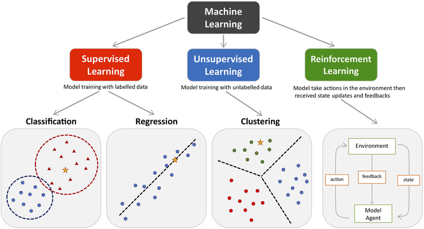

---

# Supervised Learning

### Classification & Regression

<ul>
  <li>Decision Tree</li>
  <li>KNN</li>
  <li>Linear Classification</li>
  <li>Perceptron</li>
  <li>SVM</li>
  <li>Logistic Regression</li>
</ul>

<ul>
  <li>Linear Regression</li>
</ul>

### Mixed
- Neural Networks
- Ensemble Learning

---

# Unsupervised Learning
- K-Means
- Gaussian Mixture Models
- PCA

---

# Mathematics methods
- Matrix derivative
- Lagrangian function
- KKT
- MAP & MLE
- Optimization methods
- Matrix Factorization
- ELBO
- EM algorithm

---

# Machine Learning Concepts
- Kernel Method
- Bias & Variance
- Overfitting & Underfitting
- Regularization
- ...

---

# Supervised Learning

### Classification & Regression

<ul>
  <li>Decision Tree</li>
  <li>KNN</li>
  <li>Linear Classification</li>
  <li>Perceptron</li>
  <li>SVM</li>
  <li>Logistic Regression</li>
</ul>

<ul>
  <li>Linear Regression</li>
</ul>

### Mixed
- Neural Networks
- Ensemble Learning

---

# Decision Tree
## Entropy 熵
$\log x$若无特殊说明, 默认为$\log_2 x$, $0\log 0=0$.
离散型随机变量$\mathcal{X}$看作是有限的, i.e. $|\mathcal{X}|<+\infty$.
事件$x$发生的概率为$p(x)$, 则$x$的信息量为$\log\dfrac{1}{p(x)}$.
离散型随机变量$X$的熵 (entropy) $H(X)$ 或写作 $H(p)$: 所有事件发生的期望信息量
$\begin{aligned}
  H(X)&= -\sum_{x\in\mathcal{X}}p(x)\log p(x) \\
      &= \sum_{x\in\mathcal{X}}p(x)\log\dfrac{1}{p(x)} \\
      &= \mathbb{E}\left[\log\dfrac{1}{p(x)}\right]
\end{aligned}$

---

# Decision Tree
## 条件熵 (conditional entropy) $H(Y|X)$:
$\begin{aligned}
H(Y|X)&=\textcolor{red}{\sum_{x\in\mathcal{X}}p(x)H(Y|X=x)} \\
&= -\sum_{x\in\mathcal{X}}p(x)\sum_{y\in\mathcal{Y}}p(y|x)\log p(y|x) \\
&= \sum_{x\in\mathcal{X}}\sum_{y\in\mathcal{Y}}\textcolor{red}{p(x,y)}\log\dfrac{1}{p(y|x)} \\
&= \mathbb{E}\left[\log\dfrac{1}{p(y|x)}\right]
\end{aligned}$

---

# Decision Tree
## Mutual Information 互信息

$$\begin{aligned}
I(X;Y) &= \sum_{x,y}p(x,y)\log\dfrac{p(x,y)}{p(x)p(y)} = D\left(p(x,y)\|p(x)p(y)\right) \\
&= H(X) - H(X|Y) \\
&= H(Y) - H(Y|X)
\end{aligned}$$

---

# Decision Tree

- 离散属性的决策树

  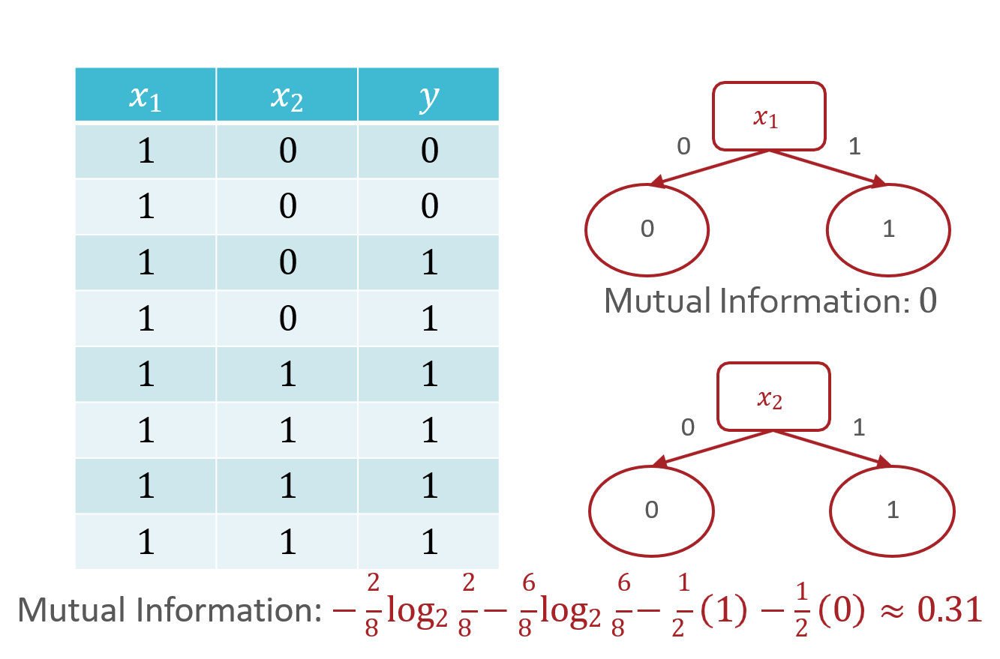

> 按互信息高的方式划分

---

# KNN (K-Nearest Neighbors)

  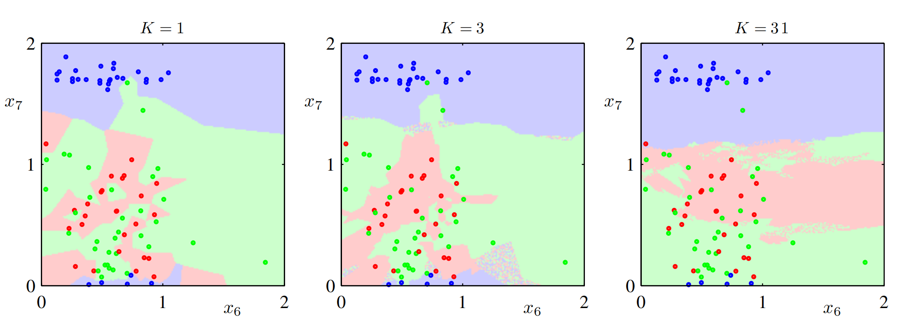

---

# Linear Classification

$\hat{y} = \text{sign}(\mathbf{w}^{\top}\mathbf{x}+b)=\begin{cases}
1 &\text{if }\mathbf{w}^{\top}\mathbf{x}+b\geq 0\\
-1 &\text{otherwise}
\end{cases}$

  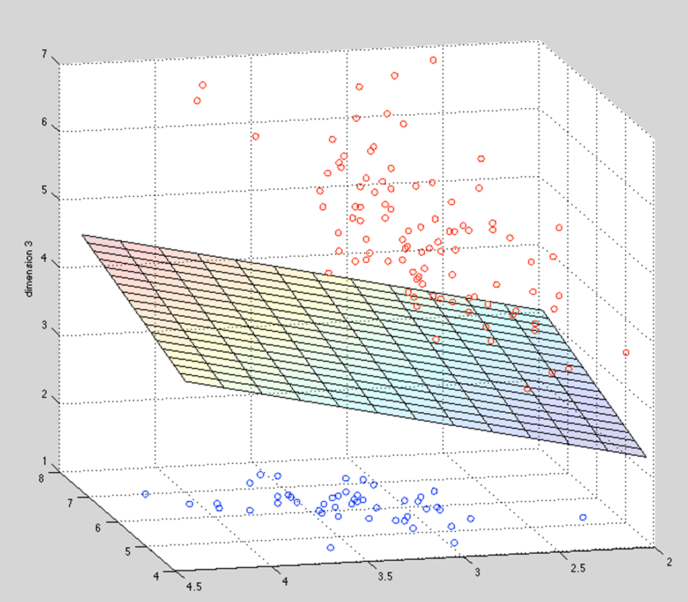

---

# Perceptron
update rules

  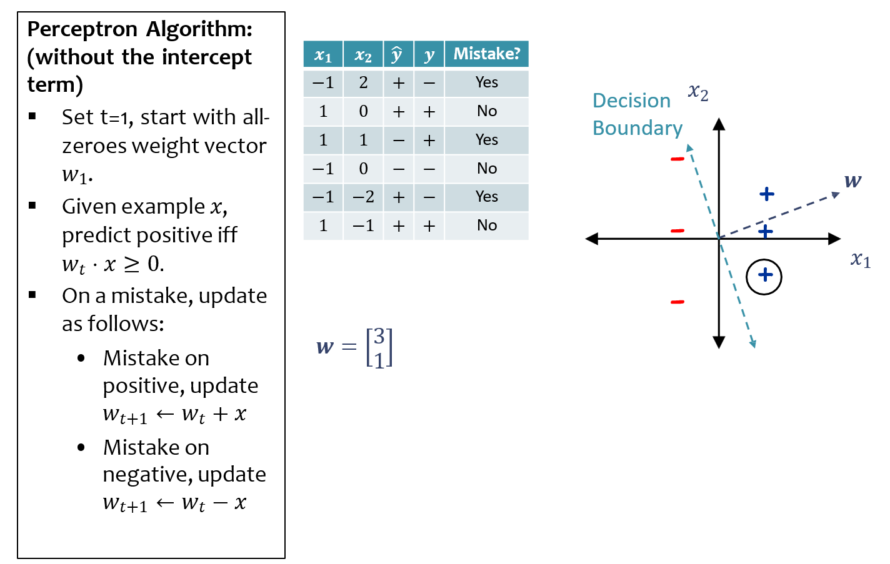

---

# Support Vector Machine(SVM) 支持向量机
> Max Margin Classifier
Margin $\gamma$: **Support Vector** 到 Hyperplane $\mathcal{H}$ 的距离
$\mathcal{H} = \{\mathbf{x} | \mathbf{w}^{\top}\mathbf{x} + b = 0\}$

  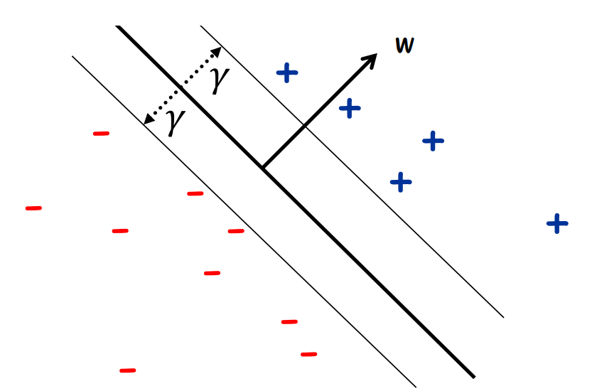

---

# SVM 线性可分

$$
\begin{equation}
\begin{aligned}
&\max_{w, \gamma}\qquad\quad \gamma \\
&\text{subject to}\quad \|w\|=1 \\
&\qquad\qquad\quad\ y_i(x_i\cdot w + b)\geq \gamma,\ \forall i\in\{1,2,\cdots,n\} \\
\end{aligned}
\end{equation} \\
$$
$$\Downarrow$$
$$
\begin{aligned}
& \min_{w'}
& & \|w'\|^2 \\
& \text{subject to}
& & y_i(x_i\cdot w' + b')\geq 1,\ \forall i\in\{1,2,\cdots,n\} \\
\end{aligned}
$$

---

# SVM 线性不可分

$$
\begin{aligned}
& \min_{w, \xi}
& & \|w\|^2 + \lambda \sum_{i=1}^n \xi_i \\
& \text{subject to}
& & y_i(x_i\cdot w + b)\geq 1 - \xi_i,\ \forall i\in\{1,2,\cdots,n\} \\
& & & \xi_i \geq 0,\ \forall i\in\{1,2,\cdots,n\}
\end{aligned}
$$

  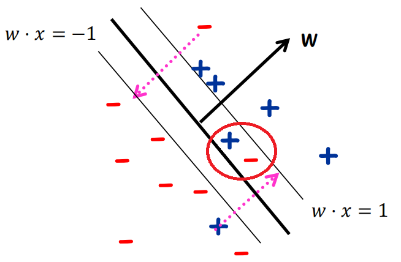

---

# Logistic Regression

  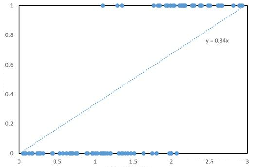

> https://zhuanlan.zhihu.com/p/139122386

---

# Sigmoid function

  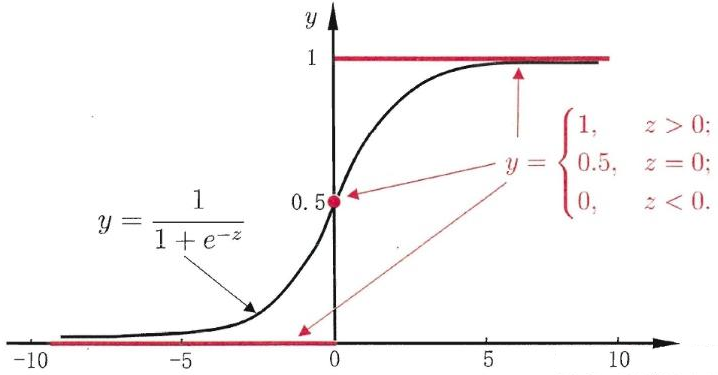

$$p(y_i=1|x_i;\theta)=\sigma(\theta^{\top}x_i)=\frac{1}{1+e^{-\theta^{\top}x_i}}$$
$$p(y_i=0|x_i;\theta)=1-\sigma(\theta^{\top}x_i)=\frac{e^{-\theta^{\top}x_i}}{1+e^{-\theta^{\top}x_i}}$$

---

# Logistic Regression
$$\begin{aligned}
p(y_i=1|x_i;\theta) &= \sigma(\theta^{\top}x_i)=\frac{1}{1+e^{-\theta^{\top}x_i}} \\
p(y_i=0|x_i;\theta) &= 1-\sigma(\theta^{\top}x_i)=\frac{e^{-\theta^{\top}x_i}}{1+e^{-\theta^{\top}x_i}} \\
\Rightarrow p(y_i|x_i;\theta) &= \left[\sigma(\theta^{\top}x_i)\right]^{y_i}\cdot\left[1-\sigma(\theta^{\top}x_i)\right]^{1-y_i}
\end{aligned}$$
$$\begin{aligned}
\hat{\theta} &= \arg \max_{\theta} \prod_{i=1}^{n} p(y_i|x_i;\theta) \\
&= \arg \max_{\theta} \prod_{i=1}^{n} \left[\sigma(\theta^{\top}x_i)\right]^{y_i}\cdot\left[1-\sigma(\theta^{\top}x_i)\right]^{1-y_i} \\
&= \arg \max_{\theta} \sum_{i=1}^{n} y_i\log \left[\sigma(\theta^{\top}x_i)\right] + (1-y_i)\log \left[1-\sigma(\theta^{\top}x_i)\right]
\end{aligned}$$

---

# Linear Regression

Sample points $\{(x_i,y_i)\}_{i=1}^n$.
Linear: 关于参数是线性的.
$$\hat{y}=w^{\top}x$$
$$\min_{w} \sum_{i=1}^n \left(y_i - \hat{y}_i\right)^2$$
$$\min_{w} \sum_{i=1}^n \left\|\mathbf{y}-Xw\right\|^2$$

> Least Square, Lasso Regression, Ridge Regression, ...

---

# Neural Networks

  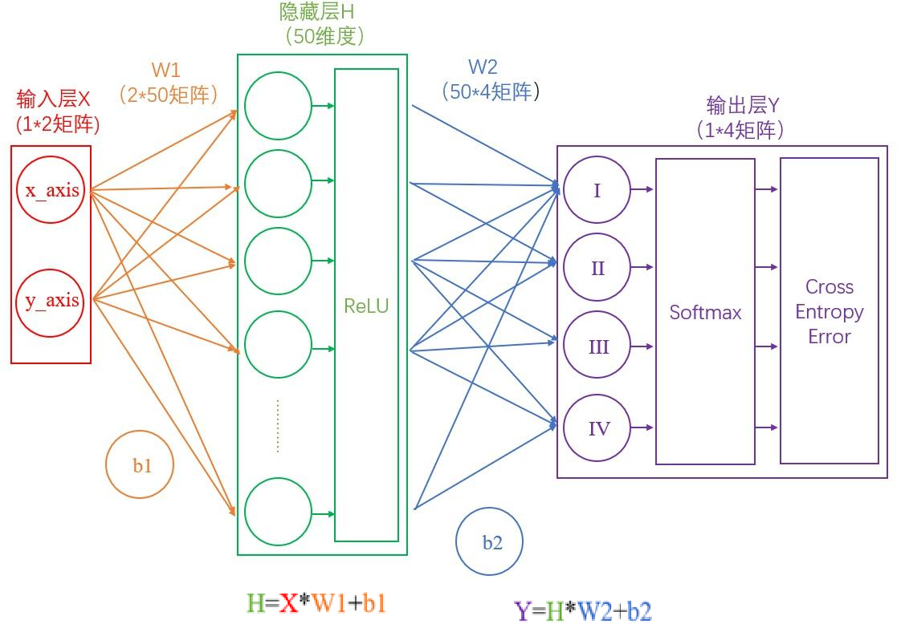

> have a play! https://playground.tensorflow.org/

---

# Neural, Activation Functions(激活函数)
> 没有激活函数, 不管多少层MLP都可以用一层替代

  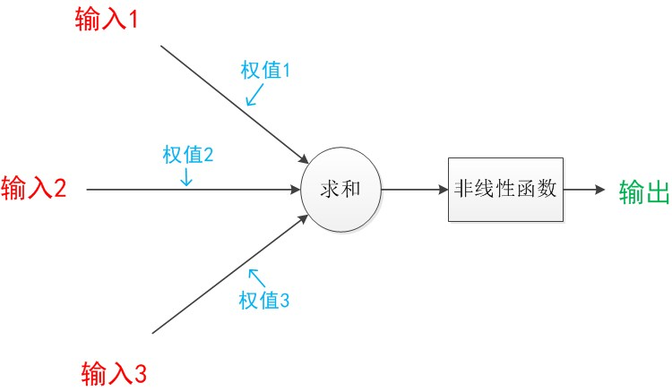

---

# Activation Functions

  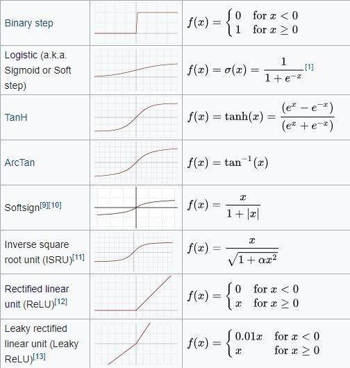

---

# Multi-layer Perceptron(MLP) 多层感知机 / 全连接层

  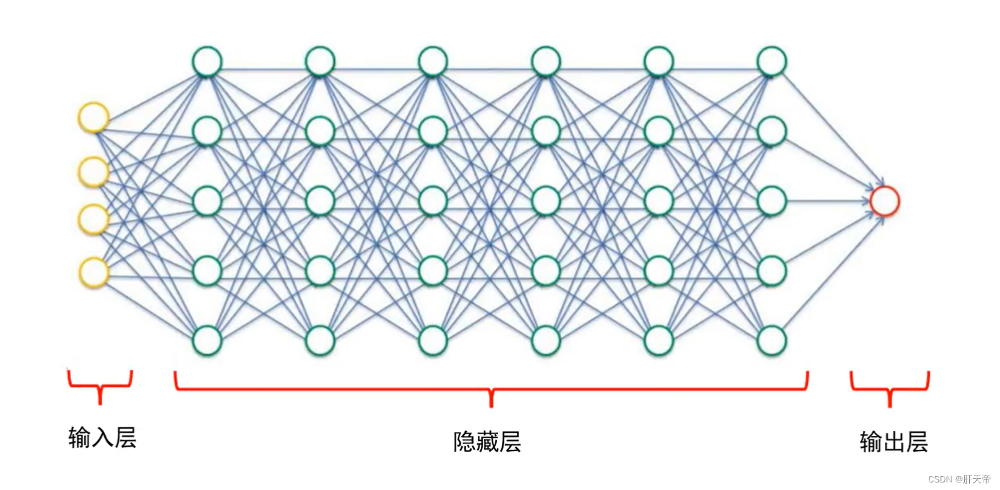

---

# BackPropagation(BP) 反向传播

  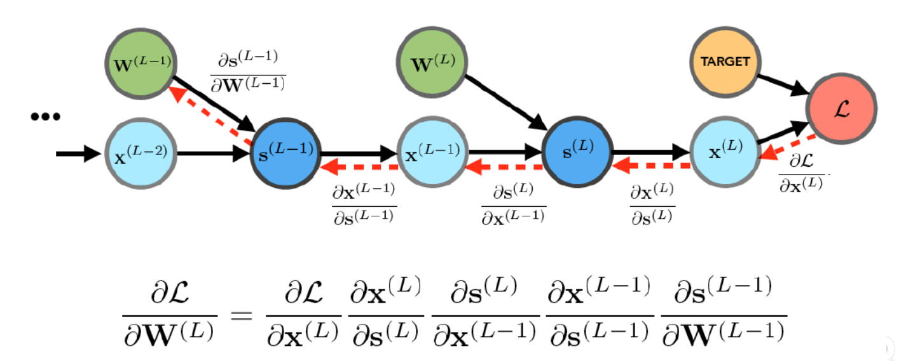

---

# BackPropagation
- Chain Rule 矩阵求导链式法则
注意将矩阵的维度对上
$$\dfrac{\partial z}{\partial\mathbf{x}} = \left(\dfrac{\partial \mathbf{y}}{\partial\mathbf{x}}\right)^{\top}\dfrac{\partial z}{\partial\mathbf{y}}$$
$$\dfrac{\partial z}{\partial\mathbf{y}_1} = \left(\dfrac{\partial \mathbf{y}_{n}}{\partial\mathbf{y}_{n-1}}\dfrac{\partial \mathbf{y}_{n-1}}{\partial\mathbf{y}_{n-2}}\cdots\dfrac{\partial \mathbf{y}_{2}}{\partial\mathbf{y}_{1}}\right)^{\top}\dfrac{\partial z}{\partial\mathbf{y}_n}$$
> https://www.cnblogs.com/yifanrensheng/p/12639539.html

---

  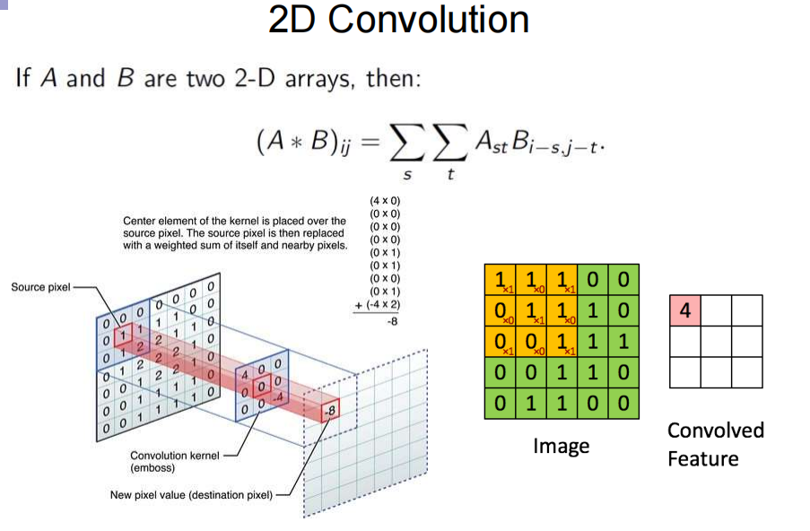

> 卷积核反转一下就是做一个相关, 因为卷积核的参数是可训练的, 所以在CNN里具体是做的卷积还是做的相关其实并不重要. 实际上torch就是用correlation算的
https://pytorch.org/docs/stable/generated/torch.nn.Conv2d.html#torch.nn.Conv2d

---

# Dimension of convolution operation 卷积操作的维度

  

一个$W_1*H_1*D_1$的图像, 经过$K$个$F*F*D_1$的卷积核, padding的大小为$P$, 步长为$S$
最终得到一个$W_2*H_2*D_2$的特征图

---

# Upsampling 上采样 & Downsampling 下采样

  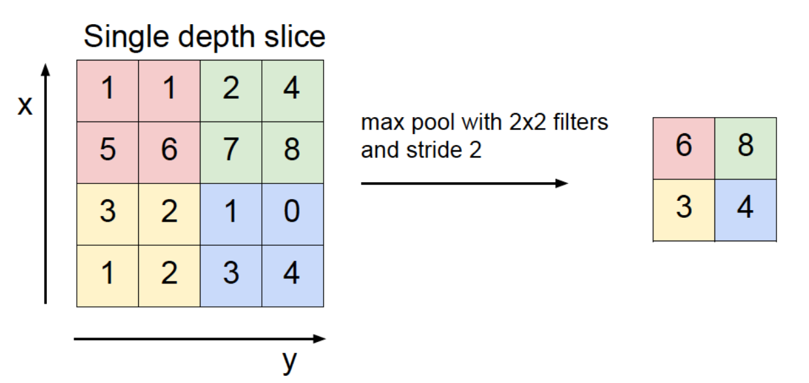

- upsample: 时域 / 频域 补零
- downsample: max pooling / average pooling / ...

---

# Dimension of pooling operation 池化操作的维度

  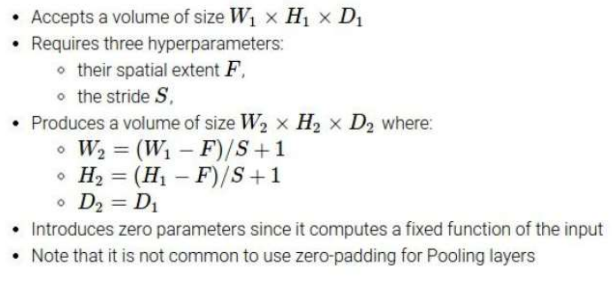

> pooling操作只改变图像的大小, 不改变特征的维度
一个$W_1*H_1*D_1$的图像, 经过**感受野**$F*F$池化, 步长为$S$
最终得到一个$W_2*H_2*D_1$的特征图

---

# Ensemble Learning (集成学习)
- Boosting
- Bagging(Boostrap AGGregretion)

Boosting: 串行：基学习器按顺序训练，后一个学习器专注于修正前一个模型的错误, 目标是降低偏差(e.g. AdaBoost, XGBoost)
Bagging: 并行：每棵基学习器在相互独立的数据子集上同时训练，训练过程互不影响, 目标是降低方差(e.g. Random Forest)

> Key idea: 把许多单个模型组合成一个整体更强的模型

---

# Boosting

  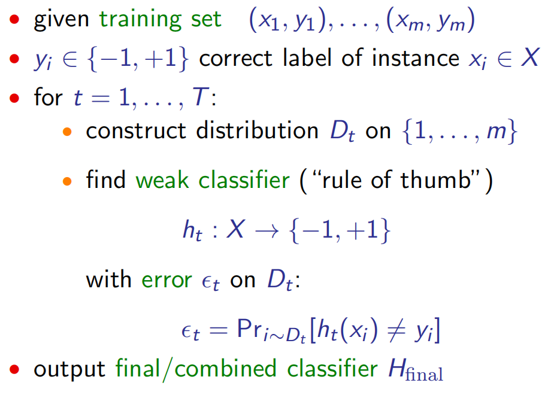

---

# AdaBoost(Adaptive Boosting)

  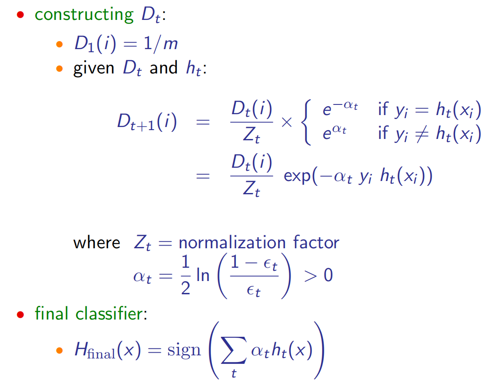

---

# Random Forest

  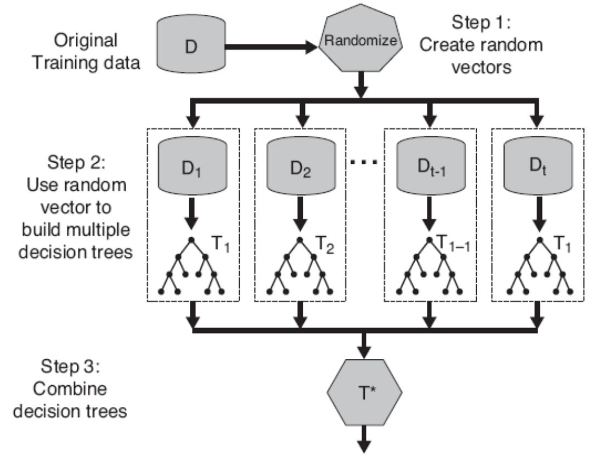

---

# Unsupervised Learning
- K-Means
- Gaussian Mixture Models
- PCA

---

# Kmeans

E-step: $z_i=\arg\min\limits_k\|x_i-\mu_k\|_2^2$
M-step: $\mu_k=\dfrac{1}{n_k}\sum\limits_{i:z_i=k}x_i$

---

# Initialization

  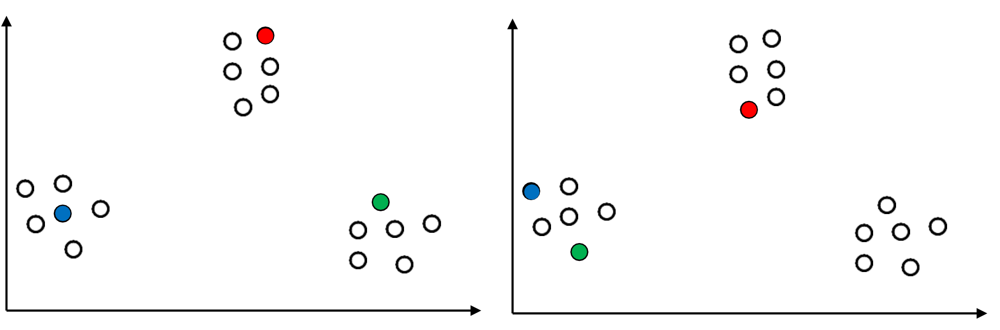

---

# Kmeans++

1. 从所有点中均匀随机选择一个, 作为第一个簇的中心$c_1$. 所有簇的中心的集合为$C=\{c_1\}$
2. 对于每个非中心点$x_i$, 计算$x_i$到$C$中每个簇中心的距离
    $D^2(x)=\min\limits_{c\in C}\|x-c\|^2,\quad x\notin C$
3. 选择下一个中心:
    $\Pr(x_i\text{被选作下一个中心})=\dfrac{D^2(x_i)}{\sum\limits_{x\notin C}D^2(x)}$
4. 重复步骤2和步骤3, 直到$|C|=k$

---

# Gaussian Mixture Model(GMM) 高斯混合模型

  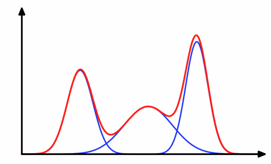
  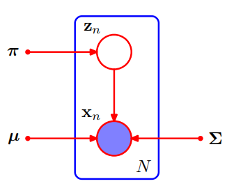

Given a Gaussian mixture model, the goal is to maximize the likelihood function with respect to the parameters (comprising the means and covariances of the components and the mixing coefficients).

---

# GMM

1. Initialize the means $\boldsymbol{\mu}_k$, covariances $\boldsymbol{\Sigma}_k$ and mixing coefficients $\pi_k$.

2. E step. Evaluate the responsibilities using the current parameter values
$$
\gamma\left(z_{n k}\right)=\frac{\pi_k \mathcal{N}\left(\mathbf{x}_n \mid \boldsymbol{\mu}_k, \boldsymbol{\Sigma}_k\right)}{\sum_{j=1}^K \pi_j \mathcal{N}\left(\mathbf{x}_n \mid \boldsymbol{\mu}_j, \boldsymbol{\Sigma}_j\right)} .
$$

3. M step. Re-estimate the parameters using the current responsibilities
$$
\begin{aligned}
\boldsymbol{\mu}_k^{\text {new }} & =\frac{1}{N_k} \sum_{n=1}^N \gamma\left(z_{n k}\right) \mathbf{x}_n \\
\boldsymbol{\Sigma}_k^{\text {new }} & =\frac{1}{N_k} \sum_{n=1}^N \gamma\left(z_{n k}\right)\left(\mathbf{x}_n-\boldsymbol{\mu}_k^{\text {new }}\right)\left(\mathbf{x}_n-\boldsymbol{\mu}_k^{\text {new }}\right)^{\top} \\
\pi_k^{\text {new }} &= N_k / N
\end{aligned}
$$

---

# GMM

  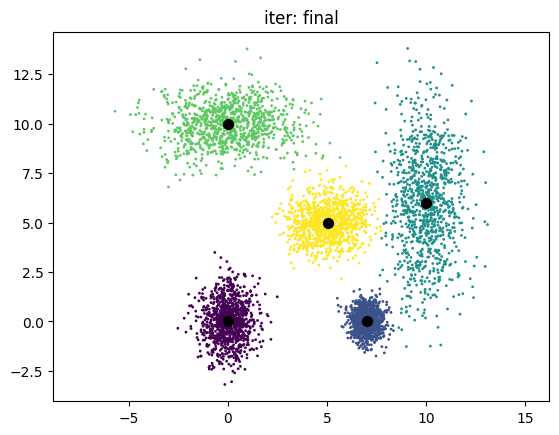

---

# PCA

  

- 最大化投影后的方差 / 最小化重建误差

---

# PCA
1. Centerization
    $X = X - \mu$

2. Eigenvalue Decomposition / SVD
    $X=U\Sigma V^{\top}$
    ($U$是$XX^{\top}$的特征向量, $V$是$X^{\top}X$的特征向量)

3. 取出$V_1,V_2,\dots,V_k$(假设数据矩阵式**行向量**拼起来)

4. Projection
    $X_i' = X_i [V_1,V_2,\dots,V_k]$

---

# Mathematics methods
- Matrix derivative
- Lagrangian function
- KKT
- MAP & MLE
- Optimization methods
- Matrix Factorization
- ELBO
- EM algorithm

---

# Matrix Derivatives 矩阵求导

  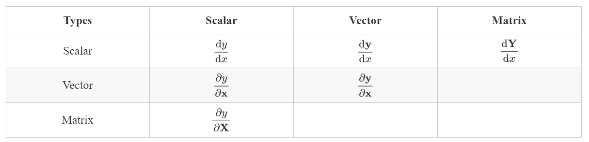

---

# layout
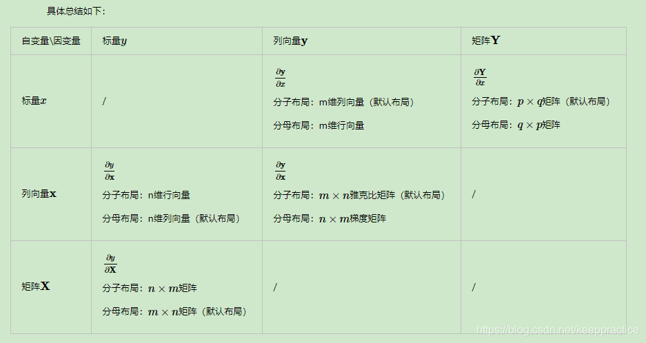

- 分子布局
  numerator layout:
  求导结果的维度以分子为主
- 分母布局
  denominator layout:
  求导结果的维度以分母为主
- 机器学习通常使用混合布局:
  向量或者矩阵对标量求导，则使用分子布局为准，如果是标量对向量或者矩阵求导，则以分母布局为准

---

# Matrix Derivatives
常见求导:
- $\dfrac{\partial \mathbf{a}^{\top}\mathbf{x}}{\partial \mathbf{x}}=\dfrac{\partial \mathbf{x}^{\top}\mathbf{a}}{\partial \mathbf{x}}=\mathbf{a}$
- $\dfrac{\partial \mathbf{x}^{\top}\mathbf{A}\mathbf{x}}{\partial \mathbf{x}}=(\mathbf{A}+\mathbf{A}^{\top})\mathbf{x}$

- more details:
> Matrix cookbook

- Chain Rule 矩阵求导链式法则
注意将矩阵的维度对上
> https://www.cnblogs.com/yifanrensheng/p/12639539.html

---

# Lagrangian function
- 对于一个优化问题:
$\begin{aligned}
\min\limits_{\mathbf{x}} &\quad f_0(\mathbf{x}) \\
s.t. &\quad f_i(\mathbf{x}) \leq 0, i = 1, 2, \cdots, m \\
&\quad h_i(\mathbf{x}) = 0, i = 1, 2, \cdots, n
\end{aligned}$
- 其拉格朗日函数为:
$\mathcal{L}(\mathbf{x}, \boldsymbol{\lambda}, \boldsymbol{\nu}) = f_0(\mathbf{x}) + \sum\limits_{i=1}^m \lambda_i f_i(\mathbf{x}) + \sum\limits_{i=1}^n \nu_i h_i(\mathbf{x})$
其中$\boldsymbol{\lambda}$和$\boldsymbol{\nu}$是拉格朗日乘子, $\lambda_i \geq 0$, $\nu_i$无约束

---

# KKT Condition
-  primal feasibility:
$$\begin{cases}
f_i(\mathbf{x}) \leq 0, i = 1, 2, \cdots, m \\
h_i(\mathbf{x}) = 0, i = 1, 2, \cdots, n
\end{cases}$$
- dual feasibility:
$$\boldsymbol{\lambda} \succeq 0$$
- complementary slackness:
$$\lambda_i f_i(\mathbf{x}) = 0, i = 1, 2, \cdots, m$$
- gradient of Lagrangian:
$$\nabla_{\mathbf{x}}\mathcal{L}(\mathbf{x}, \boldsymbol{\lambda}, \boldsymbol{\nu}) = 0$$

---

# MAP: maximum a posteriori 最大后验分布
> Bayesian 统计学派

  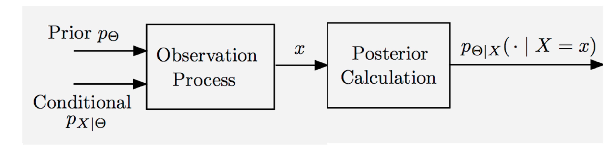

贝叶斯学派把一切变量看作随机变量, 利用过去的知识和抽样数据,将概率解释为信念度(degree of belief), 不需要大量的实验
$\Theta$是个随机变量, 根据样本的具体情况来估计参数, 使样本发生发可能性最大(与时俱进,不断更新)
$$\hat{\theta} = \arg \max_{\theta} p(\theta|\mathcal{D}) \propto P(\mathcal{D}|\theta)P_{\Theta}(\theta)$$

---

# MLE: maximum a likelihood 最大似然估计
> Frequentist 统计学派

  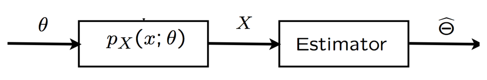

频率学派把未知参数看作普通变量(固定值), 把样本看作随机变量, 仅仅利用抽样数据, 频率论方法通过大量独立实验将概率解释为统计均值(大数定律)

$$\begin{aligned}
\hat{\theta} = \arg \max_{\theta} p(\mathcal{D};\theta) \text{ or } \hat{\theta} &= \arg \max_{\theta} p(\mathcal{D}|\theta) \\
&\stackrel{i.i.d.}{=} \arg \max_{\theta} \prod_{i=1}^{n} p(y_i|\theta) \\
&= \arg \max_{\theta} \sum_{i=1}^{n} \log p(y_i|\theta) \\
\end{aligned}$$

---

# Optimization methods
## Gradient Descent 梯度下降

  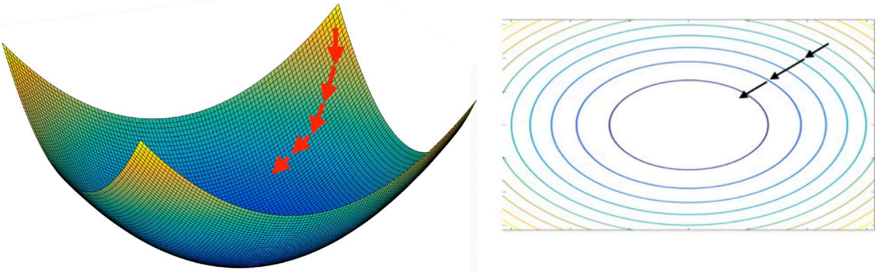

初始化一个位置, 然后迭代:
$$x^{k+1}\gets x^{k} - \alpha_k \nabla f(x^{k})$$
Until convergence: $\|\nabla f(x^{k})\|<\epsilon$, 或 $\|x^{k+1}-x^{k}\|\leq\epsilon$, 或 $\|f(x^{k+1})-f(x^{k})\|\leq\epsilon$...

---

# SVD
记录 $A$ 的奇异值分解为 $A=U\Sigma V^{\top}$, 其中 $U$ 和 $V$ 是正交矩阵，$\Sigma$ 是对角矩阵.
- $V$ & $\Sigma$
$A^{\top}A=V\Sigma^{\top}U^{\top}U\Sigma V^{\top}=V\Sigma^{\top}\Sigma V^{\top}$
$AA^{\top}V=V\Sigma^2$
对于$V$的每个列向量$v_i$, $A^{\top}Av_i=\sigma_i^2v_i$
所以$\Sigma$为$A^{\top}A$的特征值的平方根, $V$为正交规范化的特征向量拼成的矩阵
- $U$: 同理可得$AA^{\top}u_i=\sigma^2u_i$
设奇异值$\sigma_i$的左奇异向量为$u_i$, 右奇异向量为$v_i$, 则
$Av_i=U\Sigma V^{\top}v_i=U\Sigma e_i=\sigma_iu_i$
同理: $A^{\top}u_i=\sigma_iv_i$
由于$U$是正交矩阵, 所以求解方程组 $\mathbf{x}\cdot\mathbf{u}_i=0$的解即可得到$U$

---

# SVD

$$A=\begin{bmatrix}1&0\\1&1\\-1&1\end{bmatrix}=\begin{bmatrix}\frac{1}{\sqrt{3}}&0&\frac{2}{\sqrt{6}}\\\frac{1}{\sqrt{3}}&\frac{1}{\sqrt{2}}&-\frac{1}{\sqrt{6}}\\-\frac{1}{\sqrt{3}}&\frac{1}{\sqrt{2}}&\frac{1}{\sqrt{6}}\end{bmatrix}\begin{bmatrix}\sqrt{3}&0\\0&\sqrt{2}\\0&0\end{bmatrix}\begin{bmatrix}1&0\\0&1\end{bmatrix}$$

---

# Matrix Factorization

  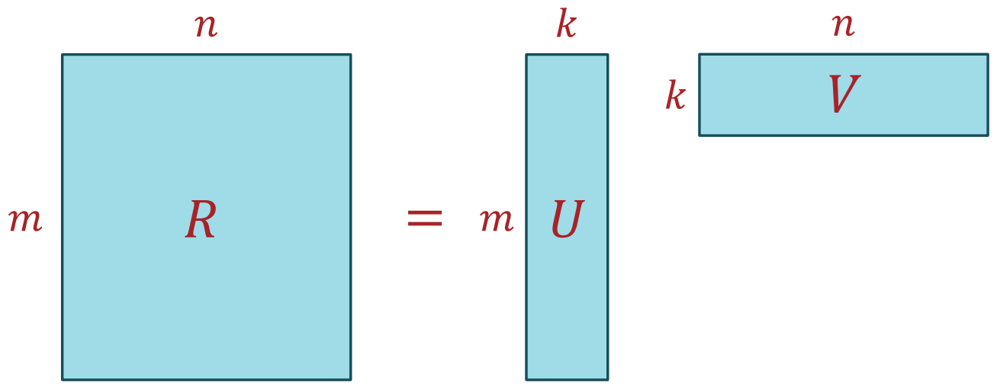

$J(U,V)=\left\|R-UV^{\top}\right\|_F^{2}+\lambda(\|U\|_F^{2}+\|V\|_F^{2})$

---

# ELBO(Evidence Lower Bound)

  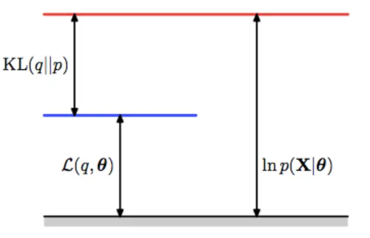

$$\log p(X) =\underbrace{\int q(z) \log \dfrac{p(X, z)}{q(z)} dz}_{\text {Evidence Lower Bound(ELBO)}} + \text{KL}(q(Z) \| p(Z \mid X))$$

---

# Expectation-Maximization(EM) Algorithm
- E step: 先根据当前模型把看不见的那块猜出来
- M step: 拿这份猜出来的数据重新调模型

  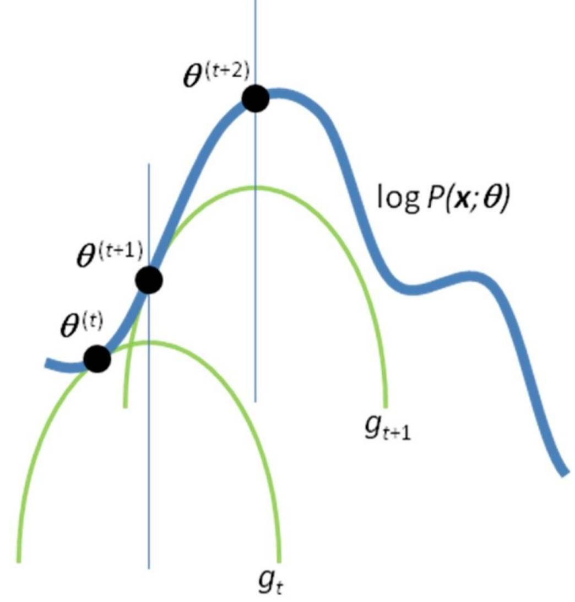

> https://www.zhihu.com/question/19824625/answer/275401651

---

# Machine Learning Concepts
- Kernel Method
- Bias & Variance
- Overfitting & Underfitting
- Regularization
- ...

---

# Kernel Methods 核方法

  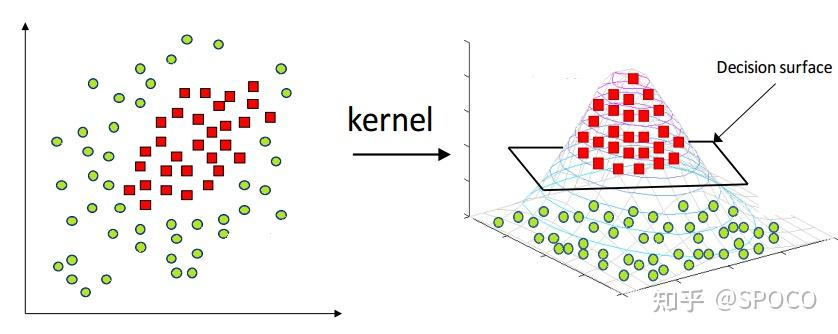

Definition: $K(\cdot, \cdot)$ is a kernel if it can be viewed as a legal definition of inner product:
$\exists \phi: K(x, z) = \phi(x)\cdot\phi(y)$
使用时将所有内积$x^{\top} z$替换为$K(x, z)$

---

# Bias & Variance

  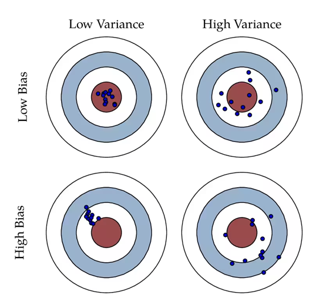

> https://www.bilibili.com/opus/412801371382122346

---

# Underfitting & Overfitting

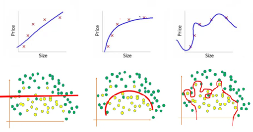

---

# Regularization
降低模型复杂度, 增加 robustness
- L2 正则化(Ridge Regression)

  

$$\begin{aligned}
\min \sum_{i=1}^n \left(y_i - \hat{y}_i\right)^2 \\
s.t. \|\beta\|_2^2 \leq \lambda
\end{aligned}$$

  

$$\min \sum_{i=1}^n \left(y_i - \hat{y}_i\right)^2 + \lambda \|\beta\|_2^2$$

  

- L1 正则化(Lasso Regression)

---

# Regularization for NNs
- L1 / L2 regularization
- Dropout

  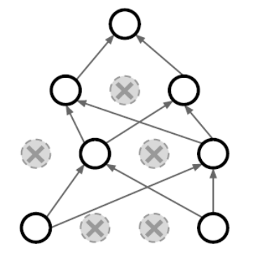

