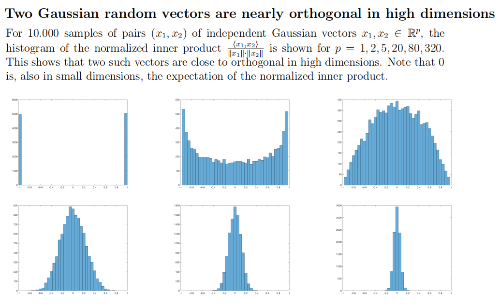
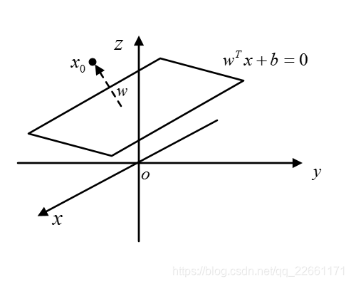

# CS182 Introduction to Machine Learning
# Recitation 2
2025.3.5

---

# Outline
- KNN
- Curse of Dimensionality
- Review(Preview): Linear Algebra

---

# KNN (K-Nearest Neighbors)

  

---

# Curse of Dimensionality (维度诅咒)
Local neighborhoods become increasingly global, as the $p$ increases
$p$: 维度数, $e$:边长, $r=\dfrac{e^p}{1}$, $e_p(r)=r^{\frac{1}{p}}$

  

高维情况下, 距离, cosine similarity等度量方式失效.
e.g. 1维, 2维 Gaussian distribution PDF集中在均值附近, 但是在高维空间中, 大部分数据点都位于边界附近

---

# Curse of Dimensionality (维度诅咒)

  

---

# Curse of Dimensionality (维度诅咒)

  

---

# 外差(Extrapolation), 内插(Interpolation).

外差是指在已知数据范围之外做预测的过程。在高维情况下，由于数据点之间的距离普遍较大，模型往往需要在大量空白或未探索的空间中进行预测，这通常会导致预测不准确。

内插是指在已知数据点之间进行预测的过程。在低维空间，数据点比较密集，内插通常可以较好地进行。然而在高维空间，即使是最近的邻居也可能相距甚远，这使得内插的效果大打折扣。

---

# Review(Preview): Linear Algebra

- 为什么用到线性代数：
  - 线性代数是描述空间和变换的工具，让描述问题变得简单
  - 大量学习算法通过建模输入空间到输出空间的变换来解决问题
  - 线性代数的矩阵分解理论提供了寻找主成分的理论基础
- 用哪些线性代数：
  - 矩阵的基本运算和性质(回忆一下特殊矩阵：对称矩阵、对角矩阵、单位矩阵、正交矩阵、上三角矩阵)
  - 常用的两种矩阵分解: 特征值分解、SVD分解
  - 最小二乘法
  - 矩阵求导*(由于将向量记作行向量还是列向量有分歧，因此有两套矩阵求导公式，请注意如果没有特殊说明，我们均默认列向量)

---

# linear algebra in CS

> 你们觉得你们现在学的东西没有用，并不是因为它真的没有用，只是你们还没有遇到要用到那门课的时候

---

# linear algebra in CS

- 一个CS的学生, 在大学期间其实会多次重新学习线性代数

- 学习过的内容不需要你牢牢记住, 但是需要你知道它的存在, 以及它的用途, 以及清楚的知道你需要的时候去哪里找

---

# linear algebra in CS

  

---

# linear algebra in IML

  

---

# linear algebra in IML

- for optimizations

  

---

# Review(Preview) Outline
- Trace, Transpose, Inverse, Symmetric, Determinant, Rank
- Quadratic Form
- Positive (Semi) Definite Matrix
- Orthogonal Matrix
- Eigenvalues Decomposition
- Singular Value Decomposition

---

# Trace 迹
> only for square matrix

$\operatorname{Tr}(A)=\sum\limits_{i=1}^n a_{ii}$

- $\operatorname{Tr}(AB) = \operatorname{Tr}(BA)$
- matrix inner product
$<A,B>=\operatorname{Tr}(A^{\top}B)=\operatorname{Tr}(B^{\top}A)$
> <$\mathbf{x},\mathbf{y}$>=$\mathbf{x}^{\top}\mathbf{y}=\mathbf{y}^{\top}\mathbf{x}$
- $\operatorname{Tr}(aA+bB)=a\operatorname{Tr}(A)+b\operatorname{Tr}(B)$
> Trace is a linear operator

---

# Transpose 转置
$(A^⊤)_{ij} = (A)_{ji}$

- $(AB)^{\top}=B^{\top}A^{\top}$
- $AA^{\top}$ must be a symmetric matrix

---

# Inverse 逆
- nonsingular matrix $\leftrightarrow$ invertible matrix
$AB = BA = I_n$
$B=A^{-1}$
 otherwise, $A$ is singular and has no inverse
  $(|A|=0)$

> singular: 奇异的. 所以一个所有元素都随机的矩阵大概率是可逆的
i.e. 奇异矩阵是不可逆矩阵
e.g. $A\in \mathbb{R}^{1\times 1}$, $A$ is singular if and only if $a_{11}=0$

---

# Properties of Inverse

- inverse matrix of $A$ is unique
  $B,C​$ are $A​$'s inverse matrices
  $B=BI_n=B(AC)=(BA)C=I_nC=C$

- $(A^{-1})^{-1}=A$
- $(AB)^{-1}=B^{-1}A^{-1}$
> proof: $(AB)(B^{-1}A^{-1})=A(BB^{-1})A^{-1}=AA^{-1}=I_n$
- $(A^{\top})^{-1}=(A^{-1})^{\top}\to A^{-T}$
> proof: $A^{\top}(A^{-1})^{\top}=(A^{-1}A)^{\top}=I_n$

---

# Symmetric matrix 对称矩阵
- $A^{\top}=A$

all properties of symmetric matrix are based on this definition(this time)
(more propertires later such as similarity and diagonalizable)

- $\forall A_{m\times n}, AA^{\top}$ or $A^{\top}A$ are symmetric matrix
- 全体对称矩阵的集合: $\mathbb{S}^n$

---

# Determinant 行列式
- a function mapping a matrix $A$ into a scalar $\text{det}(A)$ or $|A|$
- $A^{-1} = \frac{1}{|A|}A^*$
- $A^*=[C_{ij}]^{\top}$, $C_{ij}$ is the cofactor of $a_{ij}$
- $C_{ij}=(-1)^{i+j}M_{ij}$, $M_{ij}$ is the minor of $a_{ij}$
- the most simple usage: invertibility

---

# Determinant Properties

> compare with the elementary row(column) operations
1. $B$ is obtained from $A$ by interchanging two rows(columns)
$|B|=-|A|$
2. $B$ is obtained from $A$ by multiplying one row(column) by a nonzero scalar $k$
$|B|=k|A|$
3. $B$ is obtained from $A$ by adding a multiple of one row(column) to another row(column)
$|B|=|A|$

---

# Determinant Properties

$|A^{\top}|=|A|$
$|\lambda A| = \lambda^n|A|$
$|AB|=|A||B|$
$|A^{-1}|=\frac{1}{|A|}$

---

# Triangular Matrix 上/下三角矩阵

- upper triangular matrix
the elements **below** the diagonal are all zero
**(the elements on the diagonal can be zero or not)**

$A = \begin{bmatrix}
a_{11} & a_{12} & \cdots & a_{1n} \\
0 & a_{22} & \cdots & a_{2n} \\
\vdots & \vdots & \ddots & \vdots \\
0 & 0 & \cdots & a_{nn}
\end{bmatrix}$,

then elements on the diagonal of $A^k$ are $a_{11}^k, a_{22}^k,\cdots,a_{nn}^k$

- similar to the lower triangular matrix

---

# Triangular Matrix
$A=\begin{bmatrix}
a_{11} & a_{12} & \cdots & a_{1n} \\
0 & a_{22} & \cdots & a_{2n} \\
\vdots & \vdots & \ddots & \vdots \\
0 & 0 & \cdots & a_{nn}
\end{bmatrix}$

- $\text{det}(A) = \prod\limits_{i=1}^na_{ii}$

- and the lower triangular matrix is the same

---

# Diagonal Matrix 对角矩阵

- for diagonal matrix $\Lambda$, $\Lambda_{ij} = 0$ for $i \neq j$
so it can be written as $\Lambda = \text{diag}(d_1, d_2, \cdots, d_n)$

- the power of diagonal matrix is easy to compute
$\Lambda^k = \text{diag}(d_1^k, d_2^k, \cdots, d_n^k)$
$\to$ similarity and diagonalizable

- the diagonal matrix $\Lambda$ is invertible if and only if $\forall i, d_i \neq 0$
> $|\Lambda|=\prod\limits_{i=1}^n d_i$

---

# Row space, Column space and Null space
$A$ is a $m\times n$ matrix
- row space 行空间
  $row(A)=span\{\mathbf{r}_1,\cdots,\mathbf{r}_m\}$

- column space 列空间
  $col(A)=span\{\mathbf{c}_1,\cdots,\mathbf{c}_n\}$
- null space 零空间
  $null(A)=\{\mathbf{x}\in\mathbb{R}^n:A\mathbf{x}=\mathbf{0}\}$
- left null space 左零空间
  $null(A^{\top})=\{\mathbf{x}\in\mathbb{R}^m:A^{\top}\mathbf{x}=\mathbf{0}\}$

---

# Fundamental Matrix Spaces

- 行空间和零空间互为正交补
- 列空间和左零空间互为正交补

正交补(Orthogonal Complements)
> 正交: $col(A)\perp null(A)$, 补: $col(A)+null(A)=\mathbb{R}^n$

---

# Row space, Column space and Null space

---

# Rank, Nullity 秩, 零化度

- $rank(A)=\dim(row(A))=\dim(col(A))$
  $A$ 的秩 = $A$ 的行阶梯矩阵的首一个数
  **最本质: 非0奇异值的个数**

  $\Rightarrow rank(A)\leq\min(n,m)$

- $rank(A)$ 可看作行阶梯矩阵的首一(非零行/主元) 个数
  $nullity(A)=\dim(Null(A))$ 可看作自由元的个数
  $\Rightarrow rank(A)+nullity(A)=n$

---

# rank property

- $A\in \mathbb{R}^{m\times n}$
  $rank(A)\leq \min(m, n)$

- $rank(AB)\leq \min(rank(A),rank(B))$

- $rank(A^{\top}A)=rank(A)$

---

# Equivalent expression
$A\in M_{n\times n}$

---

# Norm 范数

满足:
- triangle inequality
$\left\|\mathbf{x}+\mathbf{y}\right\|\leq\left\|\mathbf{x}\right\|+\left\|\mathbf{y}\right\|$
when $p=2$: triangle inequality
- $\left\|\mathbf{x}\right\|\geq 0, \left\|\mathbf{x}\right\|=0\Leftrightarrow \mathbf{x}=\mathbf{0}$
- $\forall a, \left\|a\mathbf{x}\right\|=|a|\left\|\mathbf{x}\right\|$

则$\|\cdot\|$是一个范数

> all norm $f:\mathbb{R}^n\to \mathbb{R}$ are convex.

---

# Norm
- $p$-norm of a vector $\mathbf{v}=(v_1,\cdots,v_n)$
$\left\|\mathbf{v}\right\|_p=\sqrt[p]{|v_1|^p+|v_2|^p+\cdots+|v_n|^p}$

- $0$-norm: the number of nonzero entries in $\mathbf{v}$
    $\textcolor{red}{0-norm不是范数(non-convex)!}$

- $1$-norm / L1-norm:
    $\left\|\mathbf{v}\right\|_1=|v_1|+|v_2|+\cdots+|v_n|$

- $2$-norm(Euclidean norm, L2-norm):
    $\left\|\mathbf{v}\right\|_2=\sqrt{v_1^2+v_2^2+\cdots+v_n^2}$

- $\infty$-norm:
    $\left\|\mathbf{v}\right\|_\infty=\max\{|v_1|,|v_2|,\cdots,|v_n|\}$

---

# Norm

$p$-norm : $\left\|\mathbf{v}\right\|_p=\sqrt[p]{|v_1|^p+|v_2|^p+\cdots+|v_n|^p}$,  **$p\geq 1$**

- $0$ norm is actually not a norm, but metric(度量)
- Hölder's inequality (赫尔德不等式)
    $p,q\geq 1$, $\dfrac{1}{p}+\dfrac{1}{q}=1$
    $\sum\limits_{i=1}^n|a_ib_i|\leq\left\|x\right\|_p\left\|y\right\|_q$
    $\sum\limits_{i=1}^n|a_ib_i|\leq\left\|x\right\|_1\left\|y\right\|_\infty$
- Cauchy inequality ($p=q=2$)
    $\sum\limits_{i=1}^n|a_ib_i|\leq\sqrt{\sum\limits_{i=1}^na_i^2}\sqrt{\sum\limits_{i=1}^nb_i^2}$

---

# Norms for matrices

- $p$-norm: $\left\|A\right\|_p=\max\limits_{\left\|\mathbf{x}\right\|_p\neq 0} \dfrac{\left\|A\mathbf{x}\right\|_p}{\left\|\mathbf{x}\right\|_p}$

- 1-norm(列范数): $\left\|A\right\|_1=\max\limits_{1\leq j\leq n}\sum\limits_{i=1}^m|a_{ij}|$

- 2-norm(spectral norm, 谱范数): $\left\|A\right\|_2=\sqrt{\lambda_{\max}(A^{\top}A)}$
- $\infty$-norm(行范数): $\left\|A\right\|_\infty=\max\limits_{1\leq i\leq m}\sum\limits_{j=1}^n|a_{ij}|$

- Frobenius norm: $\left\|A\right\|_F=\sqrt{\sum\limits_{i=1}^m\sum\limits_{j=1}^n|a_{ij}|^2}=\sqrt{\operatorname{Tr}(A^{\top}A)}$

- Nuclear norm(核范数): $\left\|A\right\|_*=\sum\limits_{i=1}^{\min(m,n)}\sigma_i(A)$

> Nuclear norm and the Frobenius norm are conjugate norms.

---

# Dual Norm 对偶范数
范数$\|\cdot\|$的对偶范数$\|\cdot\|_*$定义为
$$\|\mathbf{x}\|_*=\sup\limits_{\|\mathbf{z}\|\leq 1}<\mathbf{x},\mathbf{z}>$$
e.g.
- $\|\mathbf{x}\|_1$ & $\|\mathbf{x}\|_{\infty}$
- $\|\mathbf{x}\|_2$ & $\|\mathbf{x}\|_2$
- $\|X\|_2$ & $\|X\|_*$

性质:
$$\mathbf{x}^{\top}\mathbf{z}\leq\|\mathbf{x}\|_*\|\mathbf{z}\|$$
> proof: $\|\mathbf{x}\|_*=\sup\limits_{\|\mathbf{z}\|\leq 1} \mathbf{x}^{\top}\mathbf{z} \geq \mathbf{x}^{\top}\dfrac{\mathbf{z}}{\|\mathbf{z}\|} \Rightarrow \mathbf{x}^{\top}\mathbf{z}\leq\|\mathbf{x}\|_*\|\mathbf{z}\|$

---

# 点到点的距离
the Euclidean distance between $\mathbf{u}$ and $\mathbf{v}$
$d(u,v)=d(u,v)=\left\|\mathbf{u}-\mathbf{v}\right\|=\sqrt{(u_1-v_1)^2+(u_2-v_2)^2+\cdots+(u_n-v_n)^2}$

---

# 点到平面的距离

点$\mathbf{x}_0\in\mathbb{R}^n$到高维超平面 (hyperplane) $H=\{\mathbf{x}\in\mathbb{R}^n:\mathbf{w}^{\top}\mathbf{x}+b=0\}$的距离为
$$d=\dfrac{|\mathbf{w}^{\top}\mathbf{x}_0+b|}{\left\|\mathbf{w}\right\|}$$

  

---

# Projection Theorem
- orthogonal projection of $\mathbf{u}$ on $\mathbf{v}$
$\mathbf{w}_1=proj_{\mathbf{v}}(\mathbf{u})=\dfrac{\mathbf{u}\cdot\mathbf{v}}{\left\|\mathbf{v}\right\|^2}\mathbf{v}$

- the vector component of $\mathbf{u}$ orthogonal to $\mathbf{v}$
$\mathbf{w}_2=\mathbf{u}-\mathbf{w}_1=\mathbf{u}-proj_{\mathbf{v}}(\mathbf{u})=\mathbf{u}-\dfrac{\mathbf{u}\cdot\mathbf{v}}{\left\|\mathbf{v}\right\|^2}\mathbf{v}$

---

# Quadratic Form 二次型

- $Q(\mathbf{x})=\mathbf{x}^{\top}A\mathbf{x}$
- $Q(\mathbf{x})=\sum\limits_{i=1}^n\sum\limits_{j=1}^na_{ij}x_ix_j$

e.g.
$\begin{matrix}
Q(\mathbf{x})=x_1^2+2x_1x_2+3x_2^2\\
Q(\mathbf{x})=\begin{bmatrix}x_1&x_2\end{bmatrix}\begin{bmatrix}1&1\\1&3\end{bmatrix}\begin{bmatrix}x_1\\x_2\end{bmatrix}
\end{matrix}$

---

# Positive (Semi) Definite Matrix (半)正定矩阵

- $A \in \mathbb{S}^n$: symmetric matrix
  $A^{\top}=A$
- $A \in \mathbb{S}^n_+$: symmetric positive semi-definite matrix
  $A^{\top}=A, A\succeq 0: \forall \mathbf{x}\in\mathbb{R}^n, \mathbf{x}^{\top}A\mathbf{x} \geq 0$
- $A \in \mathbb{S}^n_{++}$: symmetric positive definite matrix
  $A^{\top}=A, A\succ 0: \forall \mathbf{x}\in\mathbb{R}^n\textbackslash
\{\mathbf{0}\}, \mathbf{x}^{\top}A\mathbf{x}>0$

> $\forall A\in \mathbb{S}^n_+$, $A$ can be decomposed as $A=BB^{\top}$

---

# 正定矩阵的判定方法
- 所有的特征值均$>0$
- 二次型 $Q(\mathbf{x})=\mathbf{x}^{\top}A\mathbf{x}>0, \forall \mathbf{x}\neq\mathbf{0}$
- 顺序主子式均$>0$

e.g. $A^{\top}A$是正定矩阵
> $\forall x, x^{\top}A^{\top}Ax=\|Ax\|^2\geq 0\Leftrightarrow A^{\top}A \succeq 0\Leftrightarrow A^{\top}A$的特征值都是非负的

同理, $AA^{\top}$的特征值一定都是非负的

---

# Orthogonal 正交

- $\mathbf{u},\mathbf{v}$ are orthogonal **iff** $\mathbf{u}\cdot\mathbf{v}=0$

- orthogonal set
$\mathbf{v}_1,\cdots,\mathbf{v}_n$ are orthogonal
$\left\|\mathbf{v}_1+\cdots+\mathbf{v}_n\right\|= \left\|\mathbf{v}_1\right\|+\cdots+\left\|\mathbf{v}_n\right\|$

---

# Orthogonal Matrix 正交矩阵

- $A^{\top}A=AA^{\top}=I_n$
    $A^{-1}=A^{\top}$

e.g. rotation matrix $R=\begin{bmatrix}\cos\theta&-\sin\theta\\\sin\theta&\cos\theta\end{bmatrix}$

---

# 正交矩阵性质
- $A$ 是正交矩阵 $\Leftrightarrow$ $A$ 的行/列向量组成的集合是正交规范集合

- 正交矩阵的行/列向量是**标准正交基底**

- $A$是正交矩阵 $\Leftrightarrow$ $A^{\top}$是正交矩阵

- $A$是正交矩阵 $\Leftrightarrow \|A\mathbf{x}\|=\|\mathbf{x}\|$

- $A$是正交矩阵 $\Leftrightarrow A\mathbf{x}\cdot A\mathbf{y}=\mathbf{x}\cdot\mathbf{y}$

- $A$是正交矩阵 $\Leftrightarrow A^{-1}$也是正交矩阵

- $A,B$是正交矩阵 $\Rightarrow AB$也是正交矩阵

- $A$是正交矩阵 $\Rightarrow |A|=1$ or $|A|=-1$

---

# eigenvalue 特征值
$A\mathbf{x}=\lambda\mathbf{x}$
$(\lambda I-A)\mathbf{x}=\mathbf{0}$

$\mathbf{x}\neq\mathbf{0}$
$\big|\lambda I-A\big|=0$

- $p(\lambda)=\big|\lambda I-A\big|$: eigen polynomial 特征多项式
- $p(\lambda)=0$: characteristic equation 特征方程

---

# eigenvector 特征向量
$A\mathbf{x}=\lambda\mathbf{x}$
$(A-\lambda I)\mathbf{x}=\mathbf{0}$
$\mathbf{x}\neq\mathbf{0}$

- the nontrivial solutions of $(A-\lambda I)\mathbf{x}=\mathbf{0}$
- $\mathbf{x}\in null(A-\lambda I)$
- $\mathbf{x}$ : the eigenvectors(特征向量) of $A$ corresponding to $\lambda$
- $null(A-\lambda I)$ : the eigenspace(特征空间) of $A$ corresponding to $\lambda$

The number of the eigenvectors of $A$ corresponding to $\lambda_i$ is same as the multiplicity of roots of $\lambda_i$ of $p(\lambda)$

---

# eigenvalue and eigenvector
$A=\begin{bmatrix}0&0&-2\\
1&2&1\\
1&0&3\end{bmatrix}$

find the eigenvalues and eigenvectors of $A$

---

# 相似对角化 Diagonalization
若一个矩阵$A$可写作$\Lambda=P^{-1}AP$,即$A=P\Lambda P^{-1}$, 则称$A$可对角化(diagonalizable)

usage:
$A^n=P\Lambda P^{-1}P\Lambda P^{-1}\cdots P\Lambda P^{-1}=P\Lambda^nP^{-1}$

---

# 特征值分解 / 谱分解 Eigenvalues Decomposition
将$A$对角化为 $A=P\Lambda P^{-1}$:

1. 求$A$的特征值和特征向量
2. 将特征向量组成$P$
原因: $A=P\Lambda P^{-1}\Leftrightarrow AP=P\Lambda$

$\Lambda$: 特征值
$P$: 特征空间的基拼成(对应特征值)

**若某个特征值的几何重数(特征空间的维度)小于代数重数(特征值的重数), 则$A$不可对角化**

---

# Orthogonal Diagonalization 正交对角化

- **实对称矩阵**不同特征值对应的特征向量彼此正交
  proof:
  设$\lambda_1\neq \lambda_2$, 其对应的特征向量为$\mathbf{x}_1,\mathbf{x}_2$
  $A\mathbf{x}_1=\lambda_1\mathbf{x}_1,A\mathbf{x}_2=\lambda_2\mathbf{x}_2$
  $\mathbf{x}_1^{\top}A\mathbf{x}_2=\mathbf{x}_1^{\top}\lambda_2\mathbf{x}_2=\lambda_2\mathbf{x}_1^{\top}\mathbf{x}_2$
  $(A\mathbf{x}_1)^{\top}\mathbf{x}_2=(\lambda_1\mathbf{x}_1)^{\top}\mathbf{x}_2$
  $(\lambda_2-\lambda_1)\mathbf{x}_1^{\top}\mathbf{x}_2=x_1^{\top}A\mathbf{x}_2-x_1^{\top}A^{\top}\mathbf{x}_2=0$

---

# Orthogonal Diagonalization 正交对角化

- 若将**实对称矩阵**的每个特征值对应的特征向量的基**施密特正交化**得到$P$,则$P$是正交矩阵, i.e. $P^{\top}P=I$
- 实对称矩阵一定可以相似对角化 $\Rightarrow$ 一定可以正交对角化
  $A=P\Lambda P^{-1} \Rightarrow A=P\Lambda P^{\top}$

---

# Singular Value Decomposition(SVD) 奇异值分解

  

整个 SVD 分解过程可以视为: 首先通过 $V^{\top}$ 把数据旋转到一个新的坐标系，在这个坐标系中通过 $\Sigma$ 对数据进行不同程度的拉伸(或压缩), 最后通过 $U$ 可以将这些变化映射回原始或另一个适当的空间.

---

# SVD
记录 $A$ 的奇异值分解为 $A=U\Sigma V^{\top}$, 其中 $U$ 和 $V$ 是正交矩阵，$\Sigma$ 是对角矩阵.
- $V$ & $\Sigma$
$A^{\top}A=V\Sigma^{\top}U^{\top}U\Sigma V^{\top}=V\Sigma^{\top}\Sigma V^{\top}$
$AA^{\top}V=V\Sigma^2$
对于$V$的每个列向量$v_i$, $A^{\top}Av_i=\sigma_i^2v_i$
所以$\Sigma$为$A^{\top}A$的特征值的平方根, $V$为正交规范化的特征向量拼成的矩阵
- $U$: 同理可得$AA^{\top}u_i=\sigma^2u_i$
设奇异值$\sigma_i$的左奇异向量为$u_i$, 右奇异向量为$v_i$, 则
$Av_i=U\Sigma V^{\top}v_i=U\Sigma e_i=\sigma_iu_i$
同理: $A^{\top}u_i=\sigma_iv_i$
由于$U$是正交矩阵, 所以求解方程组 $\mathbf{x}\cdot\mathbf{u}_i=0$的解即可得到$U$

---

# SVD

$$A=\begin{bmatrix}1&0\\1&1\\-1&1\end{bmatrix}=\begin{bmatrix}\frac{1}{\sqrt{3}}&0&\frac{2}{\sqrt{6}}\\\frac{1}{\sqrt{3}}&\frac{1}{\sqrt{2}}&-\frac{1}{\sqrt{6}}\\-\frac{1}{\sqrt{3}}&\frac{1}{\sqrt{2}}&\frac{1}{\sqrt{6}}\end{bmatrix}\begin{bmatrix}\sqrt{3}&0\\0&\sqrt{2}\\0&0\end{bmatrix}\begin{bmatrix}1&0\\0&1\end{bmatrix}$$
