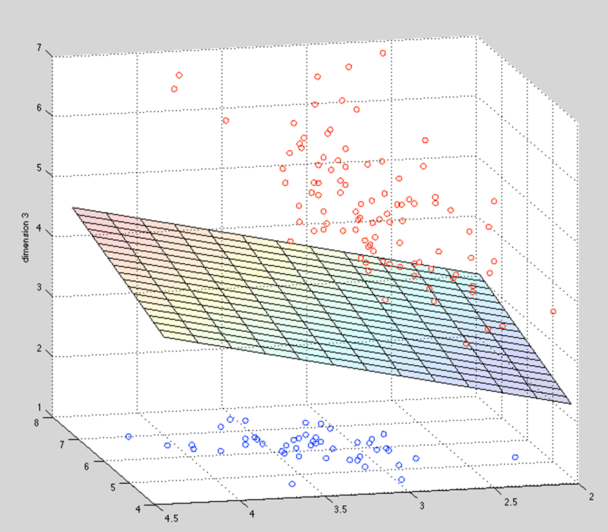
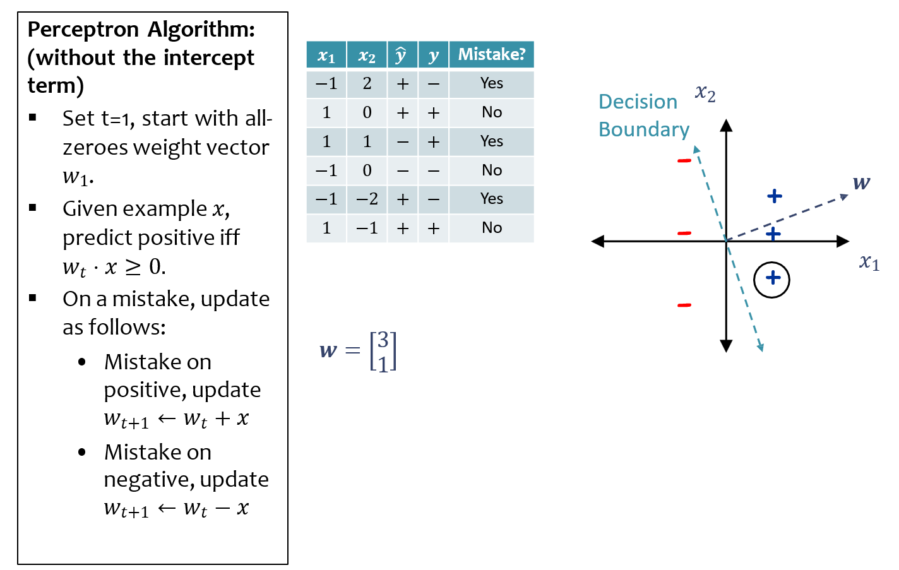
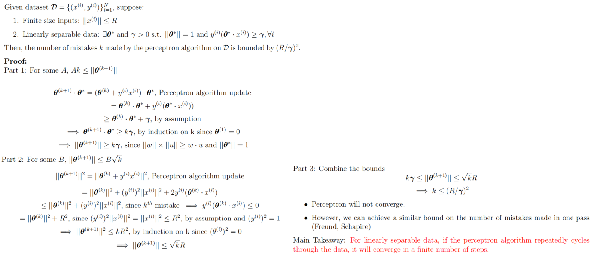
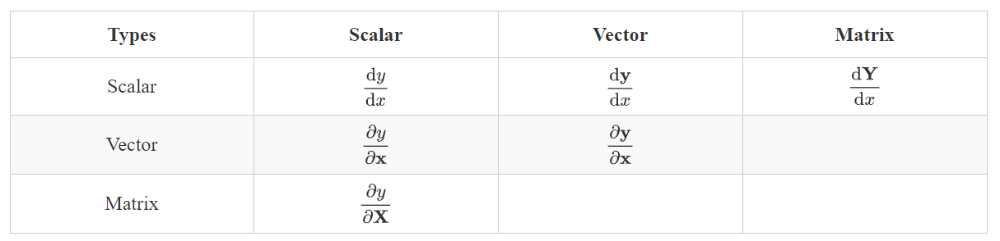
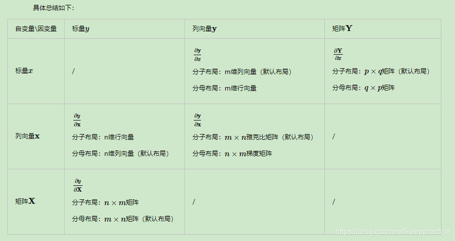
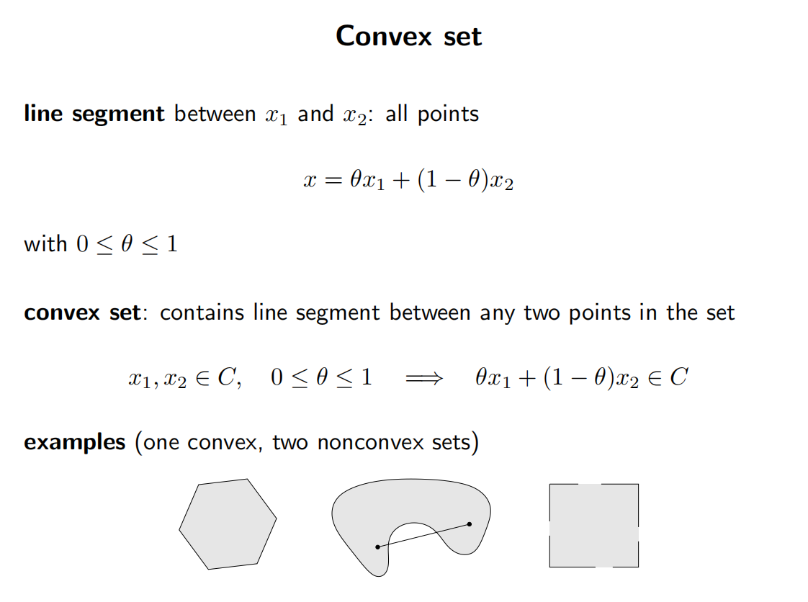
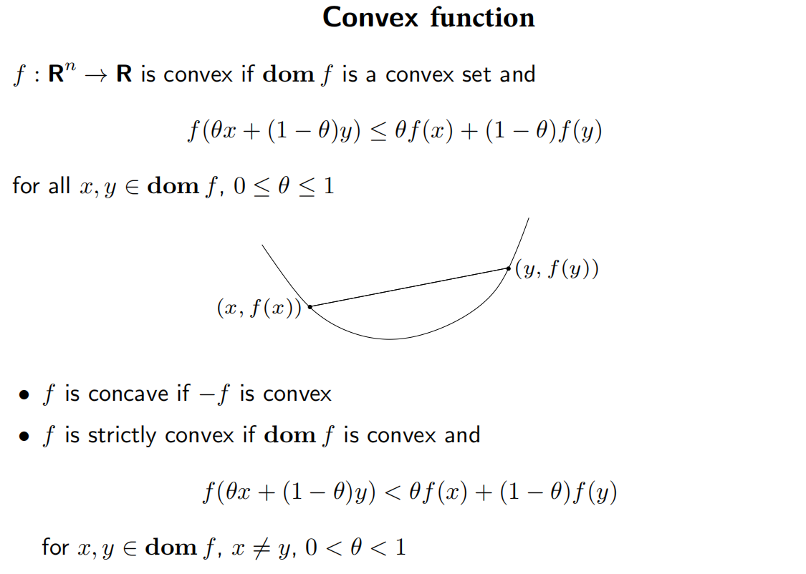
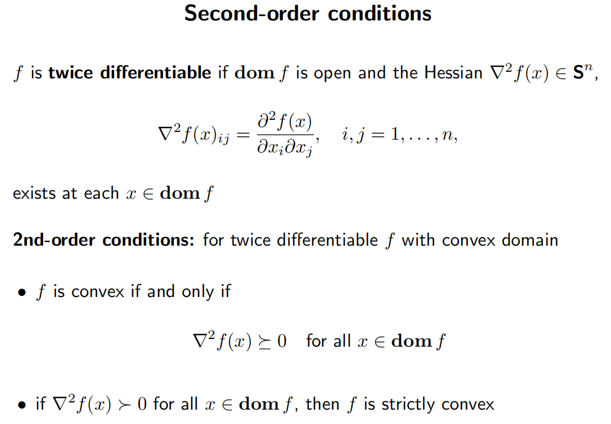
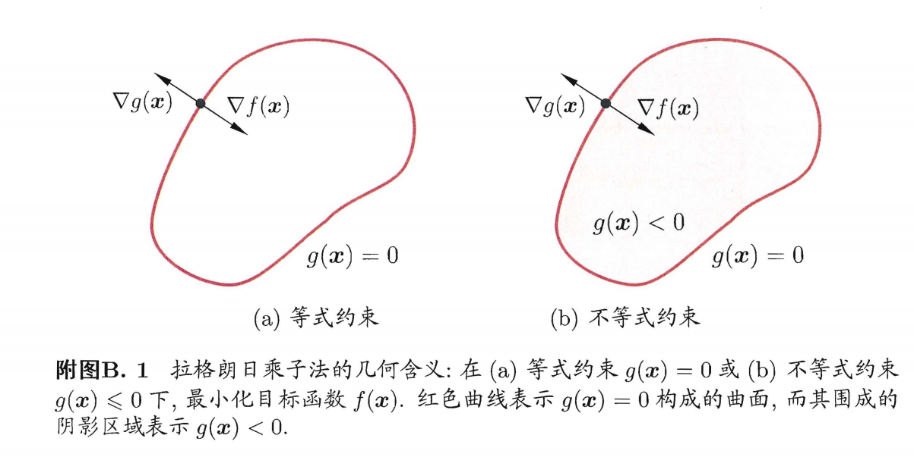
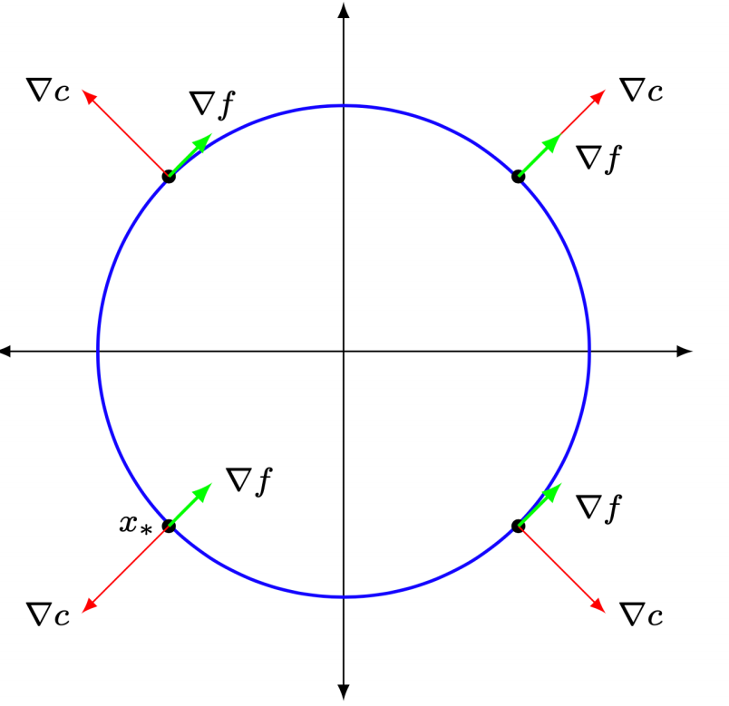

# CS182 Introduction to Machine Learning
# Recitation 3
2025.3.12

---

# Outline
- Perceptron
- Review(Preview): Optimization

---

# Linear Classification

$\hat{y} = \text{sign}(\mathbf{w}^{\top}\mathbf{x}+b)=\begin{cases}
1 &\text{if }\mathbf{w}^{\top}\mathbf{x}+b\geq 0\\
-1 &\text{otherwise}
\end{cases}$

  

---

# Perceptron
update rules

  

---

# Perceptron Convergence

  

> If data has margin $\gamma$ and all points inside a ball of radius $R$, then Perceptron $\leq\left(\dfrac{R}{\gamma}\right)^2$ mistakes
---

# Review(Preview): Optimization
- 通常讨论凸优化的范围
  - 凸集
  - 凸函数
  - 凸优化问题
- 优化方法
  - Lagrange Duality
  - KKT method

---

# Review(Preview) Outline
- Matrix Derivative
- Convex Function
- Convex Problem
- Duality, KKT Condition

---

# Matrix Derivatives 矩阵求导

  

---

# layout

- 分子布局
  numerator layout:
  求导结果的维度以分子为主
- 分母布局
  denominator layout:
  求导结果的维度以分母为主
- 机器学习通常使用混合布局:
  向量或者矩阵对标量求导，则使用分子布局为准，如果是标量对向量或者矩阵求导，则以分母布局为准

---

# Matrix Derivatives
常见求导:
- $\dfrac{\partial \mathbf{a}^{\top}\mathbf{x}}{\partial \mathbf{x}}=\dfrac{\partial \mathbf{x}^{\top}\mathbf{a}}{\partial \mathbf{x}}=\mathbf{a}$
- $\dfrac{\partial \mathbf{x}^{\top}\mathbf{A}\mathbf{x}}{\partial \mathbf{x}}=(\mathbf{A}+\mathbf{A}^{\top})\mathbf{x}$

- more details:
> Matrix cookbook

- Chain Rule 矩阵求导链式法则
注意将矩阵的维度对上
> https://www.cnblogs.com/yifanrensheng/p/12639539.html

---

# least square approximation
$\min\limits_{\mathbf{x}\in\mathbb{R}^n} \mathcal{L} =\|\mathbf{b}-A\mathbf{x}\|_2^2$

$\mathcal{L} =\|\mathbf{b}-A\mathbf{x}\|_2^2=(\mathbf{b}-A\mathbf{x})^{\top}(\mathbf{b}-A\mathbf{x})=\mathbf{b}^{\top}\mathbf{b}-\mathbf{b}^{\top}A\mathbf{x}-\mathbf{x}^{\top}A^{\top}\mathbf{b}+\mathbf{x}^{\top}A^{\top}A\mathbf{x}$
$\dfrac{\partial\mathcal{L}}{\partial\mathbf{x}}=-2A^{\top}\mathbf{b}+2A^{\top}A\mathbf{x}=0$
$\Rightarrow A^{\top}A\mathbf{x}=A^{\top}\mathbf{b}$

---

  

---

  

---

# 多元函数微分

- $\nabla$ 算子: $\nabla_{\mathbf{x}} f$: 函数$f(\mathbf{x})$对$\mathbf{x}$的梯度
- $\nabla f$: 一阶导 (Jacobian matrix): $\nabla f = \begin{bmatrix}\dfrac{\partial f}{\partial x_1} & \dfrac{\partial f}{\partial x_2} & \cdots & \dfrac{\partial f}{\partial x_n}\end{bmatrix}^{\top}$
- $\nabla^2 f$: 二阶导 (Hessian matrix)
  $\nabla^2 f = \nabla(\nabla f) = \begin{bmatrix}\dfrac{\partial^2 f}{\partial x_1^2} & \dfrac{\partial^2 f}{\partial x_1\partial x_2} & \cdots & \dfrac{\partial^2 f}{\partial x_1\partial x_n}\\
  \dfrac{\partial^2 f}{\partial x_2\partial x_1} & \dfrac{\partial^2 f}{\partial x_2^2} & \cdots & \dfrac{\partial^2 f}{\partial x_2\partial x_n}\\
  \vdots & \vdots & \ddots & \vdots\\
  \dfrac{\partial^2 f}{\partial x_n\partial x_1} & \dfrac{\partial^2 f}{\partial x_n\partial x_2} & \cdots & \dfrac{\partial^2 f}{\partial x_n^2}\end{bmatrix}$

---

# Convex Function 凸函数
判据: $f(\mathbf{x})$是凸函数当且仅当
- $\forall \mathbf{x}, \mathbf{y} \in \mathbb{R}^n, \forall \theta \in [0, 1], f(\theta \mathbf{x} + (1-\theta)\mathbf{y}) \leq \theta f(\mathbf{x}) + (1-\theta)f(\mathbf{y})$
- $\forall\mathbf{x}\in\nabla^2\mathbb{R}^n, f(\mathbf{x}) \succeq 0$
- $\forall \mathbf{x}, \mathbf{y} \in \mathbb{R}^n, f(\mathbf{y}) \geq f(\mathbf{x}) + \nabla f(\mathbf{x})^{\top}(\mathbf{y}-\mathbf{x})$
> 这三条本质是等价的, 可以互相推导

---

  

---

# Taylor Expansion 泰勒展开
$\forall \mathbf{x}, \mathbf{y} \in \mathbb{R}^n$:
- 泰勒展开
$f(\mathbf{y}) = f(\mathbf{x}) + \nabla f(\mathbf{x})^{\top}(\mathbf{y}-\mathbf{x}) + \dfrac{1}{2}(\mathbf{y}-\mathbf{x})^{\top}\nabla^2 f(\mathbf{x})(\mathbf{y}-\mathbf{x}) + o(\|\mathbf{y}-\mathbf{x}\|^2)$
- 中值定理:
$\exists \theta \in[0, 1], s.t. \mathbf{z} = \theta \mathbf{x} + (1-\theta)\mathbf{y}$:
$f(\mathbf{y}) = f(\mathbf{x}) + \nabla f(\mathbf{z})^{\top}(\mathbf{y}-\mathbf{x})$
$f(\mathbf{y}) = f(\mathbf{x}) + \nabla f(\mathbf{x})^{\top}(\mathbf{y}-\mathbf{x}) + \dfrac{1}{2}(\mathbf{y}-\mathbf{x})^{\top}\nabla^2 f(\mathbf{z})(\mathbf{y}-\mathbf{x})$
- 凸函数 $\nabla^2 f(\mathbf{x}) \succeq 0$
$f(\mathbf{y}) \geq f(\mathbf{x}) + \nabla f(\mathbf{x})^{\top}(\mathbf{y}-\mathbf{x})$

---

# Jensen's Inequality
对于一个凸函数$f(x)$, 有
- 概率论角度:
  $f(\mathbb{E}[X]) \leq \mathbb{E}[f(X)]$
- 优化角度:
  $f(\theta x + (1-\theta)y) \leq \theta f(x) + (1-\theta)f(y), \forall x, y \in \mathbb{R}^n, \theta \in [0, 1]$

---

# $\mu$-strongly convex & $L$-smooth
- 如果一个函数$f(\mathbf{x})$满足: $\mu\|\mathbf{x}\|_2^2\leq\mathbf{x}^{\top}\mathbf{A}\mathbf{x}$, 或写作$\mu I \preceq \mathbf{A}$, 则称$f(\mathbf{x})$是$\mu$-strongly convex 的
- 如果一个函数$f(\mathbf{x})$满足: $\mathbf{x}^{\top}\mathbf{A}\mathbf{x}\leq L\|\mathbf{x}\|_2^2$, 或写作 $\mathbf{A}\preceq L I$, 则称$f(\mathbf{x})$是$L$-smooth 的
- 一个函数的条件数(condition number)为$\kappa = \dfrac{L}{\mu}$, 这决定了Gradient Descent的收敛速度

---

# Convex Problem 凸优化问题
- 对于一个优化问题:
$\begin{aligned}
\min\limits_{\mathbf{x}} &\quad f_0(\mathbf{x}) \\
s.t. &\quad f_i(\mathbf{x}) \leq 0, i = 1, 2, \cdots, m \\
&\quad h_i(\mathbf{x}) = 0, i = 1, 2, \cdots, n
\end{aligned}$
- 其拉格朗日函数为:
$\mathcal{L}(\mathbf{x}, \boldsymbol{\lambda}, \boldsymbol{\nu}) = f_0(\mathbf{x}) + \sum\limits_{i=1}^m \lambda_i f_i(\mathbf{x}) + \sum\limits_{i=1}^n \nu_i h_i(\mathbf{x})$
其中$\boldsymbol{\lambda}$和$\boldsymbol{\nu}$是拉格朗日乘子, $\lambda_i \geq 0$, $\nu_i$无约束
- 若$f_0(\mathbf{x})$和$f_i(\mathbf{x})$是凸函数, $h_i(\mathbf{x})$是仿射/线性函数, 则原问题是凸优化问题

---

# Example
$$
\begin{array}{ll}
\min & x_1^2+x_2^2, \\
\text { s.t. } & x_2 \leq \alpha, \\
& x_1+x_2=1 \\
\end{array}
$$

其中 $\left(x_1, x_2\right) \in \mathbb{R}^2, \alpha$ 为实数

step1: 写出Lagrangigan函数
$$\mathcal{L}\left(x_1, x_2, \mu, \lambda\right)=x_1^2+x_2^2+\lambda\left(x_2-\alpha\right)+\mu\left(1-x_1-x_2\right), \text{where } \lambda\geq 0$$

---

# Duality 对偶性
原问题(primal problem):
$\begin{aligned}
\min\limits_{\mathbf{x}} &\quad f_0(\mathbf{x}) \\
s.t. &\quad f_i(\mathbf{x}) \leq 0, i = 1, 2, \cdots, m \\
&\quad h_i(\mathbf{x}) = 0, i = 1, 2, \cdots, n
\end{aligned}$

对应的对偶问题(dual problem):
$\begin{aligned}
\max\limits_{\boldsymbol{\lambda}, \boldsymbol{\nu}} &\quad g(\boldsymbol{\lambda}, \boldsymbol{\nu}) \\
s.t. &\quad \boldsymbol{\lambda} \succeq 0 \\
&\quad \mathcal{L}(\mathbf{x}, \boldsymbol{\lambda}, \boldsymbol{\nu}) \text{取到} g(\boldsymbol{\lambda}, \boldsymbol{\nu})
\end{aligned}$

> $f_0(\mathbf{x}) = \max\limits_{\boldsymbol{\lambda}\succeq 0, \boldsymbol{\nu}} \mathcal{L}(\mathbf{x}, \boldsymbol{\lambda}, \boldsymbol{\nu})$, $g(\boldsymbol{\lambda}, \boldsymbol{\nu}) = \min\limits_{\mathbf{x}\in\mathcal{D}} \mathcal{L}(\mathbf{x}, \boldsymbol{\lambda}, \boldsymbol{\nu})$
无论原问题是否为凸优化问题, 对偶目标函数$g(\boldsymbol{\lambda}, \boldsymbol{\nu})$ 永远是凹函数!

---

# Duality 对偶性
> $f_0(\mathbf{x}) = \max\limits_{\boldsymbol{\lambda}\succeq 0, \boldsymbol{\nu}} \mathcal{L}(\mathbf{x}, \boldsymbol{\lambda}, \boldsymbol{\nu})$, $g(\boldsymbol{\lambda}, \boldsymbol{\nu}) = \min\limits_{\mathbf{x}\in\mathcal{D}} \mathcal{L}(\mathbf{x}, \boldsymbol{\lambda}, \boldsymbol{\nu})$
$p^*=\min\limits_{\mathbf{x}} f_0(\mathbf{x})$
$d^* = \max\limits_{\boldsymbol{\lambda}\succeq 0, \boldsymbol{\nu}} g(\boldsymbol{\lambda}, \boldsymbol{\nu})$
- Weak Duality $p^* \geq d^*$
$g(\boldsymbol{\lambda}, \boldsymbol{\nu})=\min\limits_{x\in\mathcal{D}}\mathcal{L}(\mathbf{x}, \boldsymbol{\lambda}, \boldsymbol{\nu}) \leq \mathcal{L}(\mathbf{x}^*, \boldsymbol{\lambda}, \boldsymbol{\nu})$
$= f_0(\mathbf{x}^*)+\sum\limits_{i=1}^m\lambda_i f_i(\mathbf{x}^*)+\sum\limits_{i=1}^n\nu_i h_i(\mathbf{x}^*)\leq f_0(\mathbf{x}^*)=p^*$
上式$\forall \boldsymbol{\lambda}\succeq 0, \boldsymbol{\nu}$成立, $d^*$符合该条件, 所以$d^*\leq p^*$

---

# Duality 对偶性

- Strong Duality
$p^* = d^*$
假设strong duality成立, 且$\mathbf{x}^*, \boldsymbol{\lambda}^*, \boldsymbol{\nu}^*$是原问题和对偶问题的最优解, 则有
$\begin{aligned}
f_0(\mathbf{x}^*) &= g(\boldsymbol{\lambda}^*, \boldsymbol{\nu}^*) = \min\limits_{\mathbf{x}\in\mathcal{D}} \mathcal{L}(\mathbf{x}, \boldsymbol{\lambda}^*, \boldsymbol{\nu}^*) \\
&= \min\limits_{\mathbf{x}\in\mathcal{D}} \left(
f_0(\mathbf{x}) + \sum\limits_{i=1}^m \lambda_i^* f_i(\mathbf{x}) + \sum\limits_{i=1}^n \nu_i^* h_i(\mathbf{x})\right) \\
&\leq f_0(\mathbf{x}^*) + \sum\limits_{i=1}^m \lambda_i^* f_i(\mathbf{x}^*) + \sum\limits_{i=1}^n \nu_i^* h_i(\mathbf{x}^*) \\
&\leq f_0(\mathbf{x}^*)
\end{aligned}$

第一个不等号取等条件: $\mathbf{x}^*$ minimizes $\mathcal{L}(\mathbf{x}, \boldsymbol{\lambda}^*, \boldsymbol{\nu}^*)$, i.e. $\nabla_{\mathbf{x}}\mathcal{L}(\mathbf{x}, \boldsymbol{\lambda}^*, \boldsymbol{\nu}^*) = 0$
第二个不等号取等条件: $\lambda_i^* f_i(\mathbf{x}^*) = 0, i = 1, 2, \cdots, m$

---

# KKT Condition
-  primal feasibility:
$$\begin{cases}
f_i(\mathbf{x}) \leq 0, i = 1, 2, \cdots, m \\
h_i(\mathbf{x}) = 0, i = 1, 2, \cdots, n
\end{cases}$$
- dual feasibility:
$$\boldsymbol{\lambda} \succeq 0$$
- complementary slackness:
$$\lambda_i f_i(\mathbf{x}) = 0, i = 1, 2, \cdots, m$$
- gradient of Lagrangian:
$$\nabla_{\mathbf{x}}\mathcal{L}(\mathbf{x}, \boldsymbol{\lambda}, \boldsymbol{\nu}) = 0$$
> 可以注意到我们推导出KKT条件的过程中完全没有要求原问题是一个凸优化问题

---

# Example
$$
\begin{array}{ll}
\min & x_1^2+x_2^2, \\
\text { s.t. } & x_2 \leq \alpha, \\
& x_1+x_2=1 \\
\end{array}
$$

其中 $\left(x_1, x_2\right) \in \mathbb{R}^2, \alpha$ 为实数

step1: 写出Lagrangigan函数
$$\mathcal{L}\left(x_1, x_2, \mu, \lambda\right)=x_1^2+x_2^2+\lambda\left(x_2-\alpha\right)+\mu\left(1-x_1-x_2\right), \text{where } \lambda\geq 0$$

---

step2: KKT condition

-  primal feasibility:
$$\begin{cases}
x_2-\alpha \leq 0 \\
x_1+x_2 = 1
\end{cases}$$
- dual feasibility:
$$\lambda \succeq 0$$
- complementary slackness:
$$\lambda\left(x_2-\alpha\right)=0$$
- gradient of Lagrangian:
$$\frac{\partial \mathcal{L}}{\partial x_i} =0, \quad i=1,2$$
$$\frac{\partial \mathcal{L}}{\partial x_1}=2 x_1-\mu=0, \frac{\partial \mathcal{L}}{\partial x_2}=2 x_2-\mu+\lambda=0$$

---

step3: **Solve KKT** or construct the dual problem

由 gradient of Lagrangian: 分别解出 $x_1=\frac{\mu}{2}$ 且 $x_2=\frac{\mu}{2}-\frac{\lambda}{2}$ 。代入约束等式 $x_1+x_2=\mu-\frac{\lambda}{2}=1$ 或 $\mu=\frac{\lambda}{2}+1$ 。合并上面结果，

$$
x_1=\frac{\lambda}{4}+\frac{1}{2}, \quad x_2=-\frac{\lambda}{4}+\frac{1}{2}
$$

最后再加入约束不等式 $-\frac{\lambda}{4}+\frac{1}{2} \leq \alpha$ 或 $\lambda \geq 2-4 \alpha$ 。底下分开三种情况讨论。
（1）$\alpha>\frac{1}{2}$ ：不难验证 $\lambda=0>2-4 \alpha$ 满足所有的 KKT 条件，约束不等式是无效的， $x_1^{\star}=x_2^{\star}=\frac{1}{2}$ 是内部解，目标函数的极小值是 $\frac{1}{2}$ 。
（2）$\alpha=\frac{1}{2}$ ：如同 $1, ~ \lambda=0=2-4 \alpha$ 满足所有的KKT条件，$x_1^{\star}=x_2^{\star}=\frac{1}{2}$ 是边界解，因为 $x_2^{\star}=\alpha$ 。
（3）$\alpha<\frac{1}{2}:$ 这时约束不等式是有效的，$\lambda=2-4 \alpha>0$ ，则 $x_1^{\star}=1-\alpha$ 且 $x_2^{\star}=\alpha$ ，目标函数的极小值是 $(1-\alpha)^2+\alpha^2$ 。

---

step3: Solve KKT or **construct the dual problem**
$$\begin{aligned}
g(\lambda, \mu) &= \min\limits_{x_1, x_2} \mathcal{L}(x_1, x_2, \lambda, \mu) = \min\limits_{x_1, x_2} x_1^2+x_2^2+\lambda(x_2-\alpha)+\mu(1-x_1-x_2) \\
&= \min\limits_{x_1, x_2} \left(x_1^2-\mu x_1\right)+\left(x_2^2+(\lambda-\mu)x_2\right)+\mu-\lambda\alpha \\
&= -\dfrac{1}{2}\mu^2 + \dfrac{1}{2}\mu\lambda-\dfrac{1}{4}\lambda^2+\mu-\lambda\alpha
\end{aligned}$$

Dual problem:
$$\begin{array}{ll}
\max\limits_{\mu,\lambda} & -\dfrac{1}{2}\mu^2 + \dfrac{1}{2}\mu\lambda-\dfrac{1}{4}\lambda^2+\mu-\lambda\alpha \\
\text { s.t. } & \lambda\geq 0
\end{array}$$

---

# Example: LP

  

  - Primal problem:
  $\begin{aligned}
  \min\limits_{\mathbf{x}} &\quad \mathbf{c}^{\top}\mathbf{x} \\
  s.t. &\quad \mathbf{Ax} = \mathbf{b} \\
  &\quad \mathbf{x} \succeq 0
  \end{aligned}$
  

  

  - Dual problem:
  $\begin{aligned}
  \max\limits_{\boldsymbol{\lambda}} &\quad \mathbf{b}^{\top}\boldsymbol{\lambda} \\
  s.t. &\quad \mathbf{A}^{\top}\boldsymbol{\lambda} \preceq \mathbf{c}
  \end{aligned}$
  

$\mathcal{L}(\mathbf{x}, \boldsymbol{\lambda}, \boldsymbol{\nu}) = \mathbf{c}^{\top}\mathbf{x} + \boldsymbol{\lambda}^{\top}(\mathbf{Ax}-\mathbf{b})\textcolor{red}{-}\boldsymbol{\nu}^{\top}\mathbf{x}=(\mathbf{c}+\mathbf{A}^{\top}\boldsymbol{\lambda}-\boldsymbol{\nu})^{\top}\mathbf{x} - \mathbf{b}^{\top}\boldsymbol{\lambda}$
$g(\boldsymbol{\lambda}, \boldsymbol{\nu}) = \min\limits_{\mathbf{x}} \mathcal{L}(\mathbf{x}, \boldsymbol{\lambda}, \boldsymbol{\nu}) = \begin{cases}
-\mathbf{b}^{\top}\boldsymbol{\lambda} &\text{if } \mathbf{c}-\mathbf{A}^{\top}\boldsymbol{\lambda}-\boldsymbol{\nu}=\mathbf{0} \\
-\infty &\text{otherwise}
\end{cases}$

---

# Why dual problem?
- 减少变量的数量
  e.g. $\mathbf{A}\in\mathbb{R}^{m\times n}, m\ll n$
  原问题$n$个变量, 对偶问题只有$m$个变量
- 拥有更好的形式
  e.g. SVM 对偶问题引入了内积->核函数
- 对偶目标函数是凹函数, 原问题未必是凸/凹函数

---

# KKT condition 几何意义

对于不等式约束的互补条件 $\lambda_i f_i(\mathbf{x}) = 0, i = 1, 2, \cdots, m$
用只有一个不等式约束的情况来理解:
-  最优解在$f_i(x)<0$处: $f_i(x)\leq 0$不起作用, 起作用的为$\nabla f_0(x)=0$. $\lambda=0\Leftrightarrow \nabla\mathcal{L}(x)=\nabla f_0(x)$
- 最优解在$f_i(x)=0$处
一定有 $\nabla f_i(x)$与$\nabla f_0(x)$反向, i.e. $\exists \lambda_i>0, s.t. \nabla\mathcal{L}(x)=\nabla f_0(x)+\lambda_i\nabla f_i(x)=0$

结合两种情况可得 $\lambda_i f_i(x)=0$

---

# KKT解一定是最优解吗?
- 必要性:
  strong duality成立, $\mathbf{x}, \boldsymbol{\lambda}, \boldsymbol{\nu}$是原问题和对偶问题的最优解, 则他们满足KKT条件
- 充分性:
Theorem: 若原问题是一个凸优化问题, 且Slater's condition成立, 则KKT解一定是最优解
> Slater's condition: $\exists \mathbf{x}\in\text{int }\mathcal{D}, s.t. f_i(\mathbf{x}) < 0, i = 1, 2, \cdots, m, \mathbf{Ax} = \mathbf{b}$
或者有其他的Constrain Qualification(CQ)保证KKT解是最优解

---

# KKT 条件未必充分
$\begin{aligned}
\min\limits_{\mathbf{x}} &\quad f(\mathbf{x})=x_1+x_2 \\
s.t. &\quad c(\mathbf{x})=x_1^2+x_2^2-2=0
\end{aligned}$

- Lagrange function: $\mathcal{L}(\mathbf{x}, \lambda) = x_1 + x_2 + \lambda(x_1^2+x_2^2-2)$
- KKT condition: $\begin{cases}
1 + 2\lambda x_1 = 0 \\
1 + 2\lambda x_2 = 0 \\
x_1^2 + x_2^2 - 2 = 0
\end{cases}$
解KKT可获得两组解:
$x=(1,1), \lambda=-\dfrac{1}{2}$和$x=(-1,-1), \lambda=\dfrac{1}{2}$
但是$(-1,-1)$是minimizer, $(1,1)$是maximizer

---

# 有最优解, 但KKT条件无解

$\begin{aligned}
\min\limits_{x} &\quad x \\
s.t. &\quad x^2=0
\end{aligned}$

- Lagrange function: $\mathcal{L}(x, \lambda) = x + \lambda x^2$
- KKT condition: $\begin{cases}
1 + 2\lambda x = 0 \\
x^2 = 0
\end{cases}$