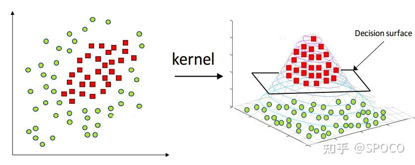
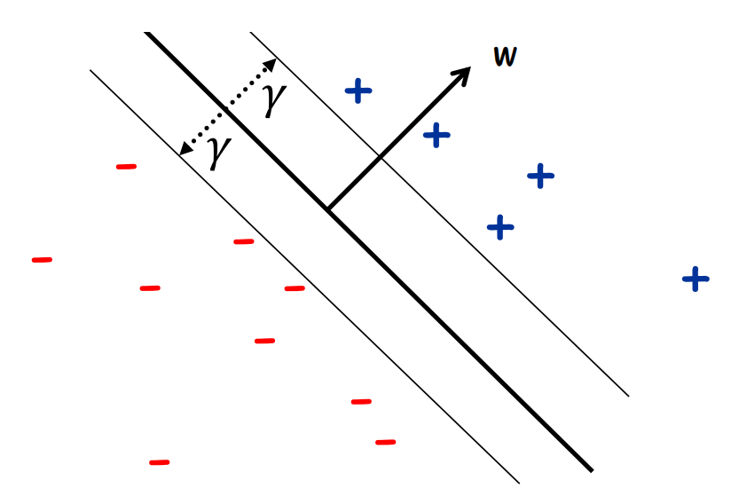
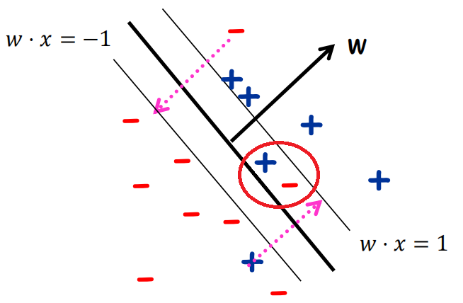
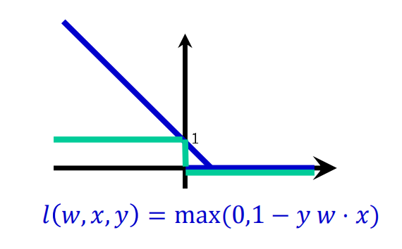
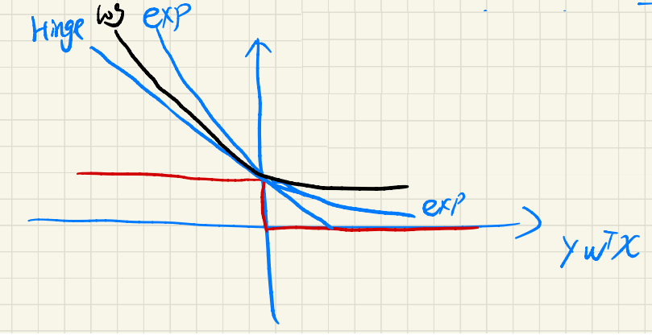

# CS182 Introduction to Machine Learning
# Recitation 4
2025.3.19

---

# Outline
- Kernel Methods
- SVM

---

# Kernel Methods 核方法

  

Definition: $K(\cdot, \cdot)$ is a kernel if it can be viewed as a legal definition of inner product:
$\exists \phi: K(x, z) = \phi(x)\cdot\phi(y)$
使用时将所有内积$x^{\top} z$替换为$K(x, z)$

---

# Kernel Methods
> 使用时将所有内积$x^{\top} z$替换为$K(x, z)$

$\phi: \mathbb{R}\mapsto\mathbb{R}^{N}$.

- 升维
- 节省计算复杂度
(e.g. 下面第二个Polynomial Kernel, 计算复杂度由$O(2^k-1)$降为$O(d)$)

---

# Kernels

- Polynomial Kernel: $K(x,z)=(x\cdot z)^k$: 只有最高次项
e.g. $k=2,d=2,x\in\mathbb{R}^d$: $\phi(x)=(x_1^2, x_2^2, x_1x_2, x_2x_1)$ or $\phi(x)=(x_1^2, x_2^2, \sqrt{2}x_1x_2)$
- Polynomial Kernel: $K(x,z)=(c+x\cdot z)^k$: 最高次项为$k$
e.g. $k=2,d=2,x\in\mathbb{R}^d$: $\phi(x)=(x_1^2, x_2^2, x_1x_2, x_2x_1, \sqrt{2c}x_1, \sqrt{2c}x_2, c)$
- Gaussian Kernel: $K(x,z)=\exp\left(-\dfrac{\|x-z\|^2}{2\sigma^2}\right)$
升到无穷维

> https://zhuanlan.zhihu.com/p/657916972
> https://www.zhihu.com/question/508649281/answer/2293811576
> https://zhuanlan.zhihu.com/p/79717760

---

# Kernel tricks on Ridge Regression
$$\mathcal{L}(\beta) = \dfrac{1}{2}\|y-X\beta\|^{2} + \dfrac{1}{2}\lambda\|\beta\|^2$$
$$\Rightarrow \beta = \left(\textcolor{red}{X^{\top}X}+\lambda I\right)^{-1}X^{\top}y$$
> $X^{\top}X+\lambda I$ 一定可逆?

---

# Support Vector Machine(SVM) 支持向量机
> Max Margin Classifier
Margin $\gamma$: **Support Vector** 到 Hyperplane $\mathcal{H}$ 的距离
$\mathcal{H} = \{\mathbf{x} | \mathbf{w}^{\top}\mathbf{x} = 0\}, \mathbf{x}\in\mathbb{R}^{d+1}$

  

---

# SVM 优化问题
- Max Margin Classifier
- 点x到Hyperplane $\mathcal{H} = \{\mathbf{x} | \mathbf{w}^{\top}\mathbf{x} = 0\}$的距离公式
$$d=\dfrac{|\mathbf{w}^{\top}\mathbf{x}|}{\|w\|}$$
为了方便表示距离, 我们设 $\|w\|=1$, 且假设数据点线性可分:
$$
\begin{equation}
\begin{aligned}
&\max_{w, \gamma}\qquad\quad \gamma \\
&\text{subject to}\quad \|w\|=1 \\
&\qquad\qquad\quad\ y_ix_i\cdot w\geq \gamma,\ \forall i\in\{1,2,\cdots,n\} \\
\end{aligned}
\end{equation}
$$
> problem: $\|w\|=1$是圆周, 非凸!

---

# SVM 凸优化问题

$$
\begin{equation}
\begin{aligned}
&\max_{w, \gamma}\qquad\quad \gamma \\
&\text{subject to}\quad \|w\|=1 \\
&\qquad\qquad\quad\ y_ix_i\cdot w\geq \gamma,\ \forall i\in\{1,2,\cdots,n\} \\
\end{aligned}
\end{equation} \\
$$
$$\Downarrow$$
$$
\begin{aligned}
& \min_{w'}
& & \|w'\|^2 \\
& \text{subject to}
& & y_i(x_i\cdot w')\geq 1,\ \forall i\in\{1,2,\cdots,n\} \\
\end{aligned}
$$

> 此时已经是凸优化问题, 可以用优化算法求解

---

# SVM 线性不可分
- 01 loss: 分类正确为0, 分类错误为1. 枚举所有的情况: NP-hard
Hinge loss(折页损失): $\max(0,1-y_iw^{\top}x_i)$, 01 loss的上界

  
  
  

---

# SVM 线性不可分

$$
\begin{aligned}
& \min_{w, \xi}
& & \|w\|^2 + \lambda \sum_{i=1}^n \xi_i \\
& \text{subject to}
& & y_i(x_i\cdot w)\geq 1 - \xi_i,\ \forall i\in\{1,2,\cdots,n\} \\
& & & \xi_i \geq 0,\ \forall i\in\{1,2,\cdots,n\}
\end{aligned}
$$

  

---

# Kernel SVM!

- primal problem
$$
\begin{aligned}
& \min_{w, \xi}
& & \|w\|^2 + \lambda \sum_{i=1}^n \xi_i \\
& \text{subject to}
& & y_i(x_i\cdot w)\geq 1 - \xi_i,\ \forall i\in\{1,2,\cdots,n\} \\
& & & \xi_i \geq 0,\ \forall i\in\{1,2,\cdots,n\}
\end{aligned}
$$

> $\mathcal{L}(w, \xi, \alpha, \beta) = ?$

---

# Dual problem
$$\mathcal{L}(w, \xi, \alpha, \beta) = \dfrac{1}{2}\|w\|^2 + \lambda \sum_{i=1}^n \xi_i + \sum_{i=1}^n \alpha_i(1 - \xi_i - y_iw^{\top}x_i) - \sum_{i=1}^n \beta_i\xi_i$$
- dual problem
$$
\begin{aligned}
& \max_{\alpha, \beta}
& & g(\alpha, \beta) \\
& \text{subject to}
& & \alpha \succeq 0 \\
& & & \beta \succeq 0 \\
& & & g(\alpha, \beta) 取到 \min_{w,\xi} \mathcal{L}(w, \xi, \alpha, \beta)
\end{aligned}
$$

---

# Dual problem
$$
\begin{aligned}
& \max_{\alpha}
& & -\dfrac{1}{2}\sum_{i=1}^n\sum_{j=1}^n\alpha_i\alpha_jy_iy_jx_i^{\top}x_j + \sum_{i=1}^n\alpha_i \\
& \text{subject to}
& & \alpha \succeq 0 \\
& & & \lambda\mathbf{1} - \alpha \succeq 0 \\
\end{aligned}
$$

- 出现$x_i^{\top}x_j$, 可以用kernel method $\Rightarrow K(x_i, x_j)$
- 变量个数 $n+d+1 \rightarrow n$

---

# Multi-class SVM
类似于其他二分类问题拓展成多(n)分类问题的方法
- 训练$n$个二分类器
- 第$i$个分类器将第$i$类作为正类，其他类作为负类
- 预测时，选择最大的分类器的结果作为预测结果