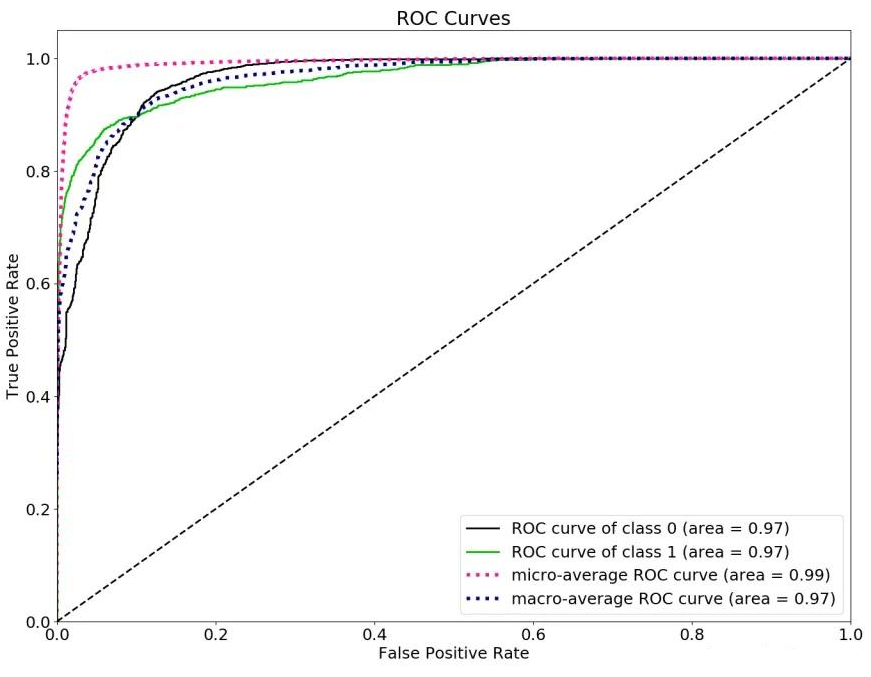

# CS182 Introduction to Machine Learning
# Recitation 5
2025.3.26

---

# Outline
- review: probability & statistics
- Logistic Regression
- Metrics for binary classification

---

# Review(Preview): Probability & Statistics
- 什么用到概率论与数理统计：
  - 概率论为机器学习提供了问题的假设
  - 回归和分类问题都可以描述为一个估计问题
  - 数据的分布往往服从正态分布
- 用哪些知识：
  - 常用的概率公式（条件概率、全概率、贝叶斯）
  - 常用的分布和他们的特殊性质（正态、泊松、两点、二项、均匀）
  - 常用的统计量（均值、方差、协方差）和他们的无偏估计

---

# Probability
- $$P(A,B) = P(A|B)P(B) = P(B|A)P(A)$$
- Bayes' Rule
$$P(A|B) = \frac{P(B|A)P(A)}{P(B)}$$
$P(A)$: prior probability of $A$
$P(B)$: Evidence
$P(A|B)$: posterior probability of $A$ given $B$
$P(B|A)$: likelyhood (info of data given prior congnition)

---
# Probability
- LOTP
$$P(A) = \sum_{i=1}^{n} P(A|B_i)P(B_i)$$
> $\{B_1, B_2, \cdots, B_n\}$ is a partition of the sample space. 交集为空集, 并集为全集

---

# Conditional Probability
> 条件概率也是概率

- Bayes' Rule
$$P(A|B,C) = \frac{P(B|A,C)P(A|C)}{P(B|C)}$$
- LOTP
$$P(A|C) = \sum_{i=1}^{n} P(A|B_i,C)P(B_i|C)$$

> Let $\hat{P}(\cdot)=P(\cdot|C)$

---

# Independent & Exclusive Events 独立与互斥
- Independent:
  $P(A,B) = P(A)P(B)$
  $P(A|B) = P(A)$
  $P(B|A) = P(B)$
- Exclusive:
  $P(A\cup B)=P(A)+P(B)$
  i.e. $P(A\cap B) = 0$

---

# Expectation
$$\mathbb{E}(X) = \int x f(x)dx$$
Linearity
- $\mathbb{E}(X+Y) = \mathbb{E}(X) + \mathbb{E}(Y)$
- $\mathbb{E}(aX) = a\mathbb{E}(X)$
- $\nabla\mathbb{E}(f)=\mathbb{E}(\nabla f)$

- $X\perp \!\!\! \perp Y\Rightarrow \mathbb{E}(XY)=\mathbb{E}(X)\mathbb{E}(Y)$
LOTUS(Law of the Unconscious Statistician)
- $\mathbb{E}(g(X)) = \int g(x)f(x)dx$
> 条件期望也是期望

---

# Variance

- $\text{Var}(X) = \mathbb{E}[(X-\mathbb{E}(X))^2]$
- $\text{Var}(X) = \mathbb{E}(X^2) - \mathbb{E}(X)^2$

If $X$ and $Y$ are independent, then $\text{Var}(X+Y) = \text{Var}(X) + \text{Var}(Y)$
方差没有线性性
- $\text{Var}(X+Y) = \text{Var}(X) + \text{Var}(Y) + 2\text{Cov}(X,Y)$
- $\text{Var}(cX) = c^2\text{Var}(X)$

---

# Covariance
- $\text{Cov}(X,Y) = \mathbb{E}[(X-\mathbb{E}(X))(Y-\mathbb{E}(Y))]$
- $\text{Cov}(X,Y) = \mathbb{E}(XY) - \mathbb{E}(X)\mathbb{E}(Y)$

- $\text{Var}(X+Y) = \text{Var}(X) + \text{Var}(Y) + 2\text{Cov}(X,Y)$
> $\text{Var}(X+Y) = \text{Var}(X) + \text{Var}(Y)$ if $X$ and $Y$ are independent

---

# Correlation 相关性
- $\rho=\text{Corr}(X,Y) = \dfrac{\text{Cov}(X,Y)}{\sqrt{\text{Var}(X)\text{Var}(Y)}}\in[-1,1]$

只能刻画**线性**相关性, 且正负相关程度相同(正负相关).
$X$,$Y$独立, 则$\rho_{X,Y}=0$. 但是$\rho_{X,Y}=0$**不一定**独立.
> e.g. $Y=X^2, X\sim N(0,1)\Rightarrow \mathbb{E}(X)=0, \text{Var}(X)=1, \mathbb{E}(Y)=\mathbb{E}(X^2)=1$
$\text{Cov}(X,Y)=\mathbb{E}(XY)-\mathbb{E}(X)\mathbb{E}(Y)=0$

$\textcolor{red}{Gaussian分布独立\Leftrightarrow不相关}$.

---

# Iterated Expectation(Adam's law)
For any r.v. $X$, $Y$ and $Z$:
$$\mathbb{E}_X\left[\mathbb{E}_{Y|X}(Y|X)\right] = \mathbb{E}_Y(Y)$$
$$\mathbb{E}_X\left[\mathbb{E}_{Y|X}(Y|X,Z)|Z\right] = \mathbb{E}_Y(Y|Z)$$

# Law of Total Variance(Eve's law)
$$\operatorname{Var}(Y)=\mathbb{E}_X\left[\operatorname{Var}(Y|X)\right] + \operatorname{Var}(\mathbb{E}_{Y|X}(Y|X))$$

---

# MAP: maximum a posteriori 最大后验分布
> Bayesian 统计学派

  

贝叶斯学派把一切变量看作随机变量, 利用过去的知识和抽样数据,将概率解释为信念度(degree of belief), 不需要大量的实验
$\Theta$是个随机变量, 根据样本的具体情况来估计参数, 使样本发生发可能性最大(与时俱进,不断更新)
$$\hat{\theta} = \arg \max_{\theta} p(\theta|\mathcal{D}) \propto P(\mathcal{D}|\theta)P_{\Theta}(\theta)$$

---

# MLE: maximum a likelihood 最大似然估计
> Frequentist 统计学派

  

频率学派把未知参数看作普通变量(固定值), 把样本看作随机变量, 仅仅利用抽样数据, 频率论方法通过大量独立实验将概率解释为统计均值(大数定律)

$$\begin{aligned}
\hat{\theta} = \arg \max_{\theta} p(\mathcal{D};\theta) \text{ or } \hat{\theta} &= \arg \max_{\theta} p(\mathcal{D}|\theta) \\
&\stackrel{i.i.d.}{=} \arg \max_{\theta} \prod_{i=1}^{n} p(y_i|\theta) \\
&= \arg \max_{\theta} \sum_{i=1}^{n} \log p(y_i|\theta) \\
\end{aligned}$$

---

# Conjugate Prior 共轭先验

  

---
# Conjugate Prior 共轭先验

  

---
# Linear Least Square Estimate (LLSE)
拟合函数为线性: $h(X)=a+bX$, 则 minimizes $\mathbb{E}\left[\left(Y-a-bX\right)^2\right]$的函数为
$$L[Y|X]=\mathbb{E}(Y)+\dfrac{\operatorname{Cov}(X,Y)}{\operatorname{Var}(X)}(X-\mathbb{E}(X))$$

  

---

# Minimum Mean Square Error (MMSE)
拟合函数为**任意函数**h(X), 则 minimizes $\mathbb{E}\left[\left(Y-h(X)\right)^2\right]$的函数为
$$h(X)=\mathbb{E}(Y|X)$$

  

---

# Concentration Inequalities
For any r.v. $X$, and any constant $a>0$:
- Markov Inequality
$$P(X\geq a)\leq \frac{\mathbb{E}(X)}{a}$$
- Chebyshev Inequality
$$P(|X-\mathbb{E}(X)|\geq a)\leq \frac{\text{Var}(X)}{a^2}$$
- Chernoff's Inequality
$$P(X\geq a)\leq \dfrac{\mathbb{E}(e^{tX})}{e^{ta}}, \forall t>0$$

---
# Probability Inequalities
- Hoffding Lemma: $\mathbb{E}(X)=0, a\leq X\leq b, \forall \lambda>0$
$$\mathbb{E}(e^{\lambda X})\leq e^{\frac{1}{8}\lambda^2(b-a)^2}$$
- Hoffding Bound: $X_1,\ldots,X_n$ independent, $\mathbb{E}(X_i)=\mu, a\leq X_i\leq b, \forall\epsilon>0$
$$P(|\frac{1}{n}\sum_{i=1}^nX_i-\mu|\geq\epsilon)\leq 2\exp\left(-\frac{2n\epsilon^2}{\sum_{i=1}^{n}(b_i-a_i)^2}\right)$$

---

# Logistic Regression

  

> https://zhuanlan.zhihu.com/p/139122386

---

# Sigmoid function

  

$$p(y_i=1|x_i;\theta)=\sigma(\theta^{\top}x_i)=\frac{1}{1+e^{-\theta^{\top}x_i}}$$
$$p(y_i=0|x_i;\theta)=1-\sigma(\theta^{\top}x_i)=\frac{e^{-\theta^{\top}x_i}}{1+e^{-\theta^{\top}x_i}}$$

---

# Logistic Regression
$$\begin{aligned}
p(y_i=1|x_i;\theta) &= \sigma(\theta^{\top}x_i)=\frac{1}{1+e^{-\theta^{\top}x_i}} \\
p(y_i=0|x_i;\theta) &= 1-\sigma(\theta^{\top}x_i)=\frac{e^{-\theta^{\top}x_i}}{1+e^{-\theta^{\top}x_i}} \\
\Rightarrow p(y_i|x_i;\theta) &= \left[\sigma(\theta^{\top}x_i)\right]^{y_i}\cdot\left[1-\sigma(\theta^{\top}x_i)\right]^{1-y_i}
\end{aligned}$$
$$\begin{aligned}
\hat{\theta} &= \arg \max_{\theta} \prod_{i=1}^{n} p(y_i|x_i;\theta) \\
&= \arg \max_{\theta} \prod_{i=1}^{n} \left[\sigma(\theta^{\top}x_i)\right]^{y_i}\cdot\left[1-\sigma(\theta^{\top}x_i)\right]^{1-y_i} \\
&= \arg \max_{\theta} \sum_{i=1}^{n} y_i\log \left[\sigma(\theta^{\top}x_i)\right] + (1-y_i)\log \left[1-\sigma(\theta^{\top}x_i)\right]
\end{aligned}$$

---

# Multi-class Logistic Regression
sigmoid -> softmax
$$p(y_i=k|x_i;W) = \frac{e^{w_k^{\top}x_i}}{\sum\limits_{j=1}^{K}e^{w_j^{\top}x_i}}$$
$$\mathcal{L}(W)=\prod_{i=1}^{n}\prod_{k=1}^K p(y_i=k|x_i;W)^{y_{ik}}$$
Or commonly as
$$\mathcal{L}(W)=\sum_{i=1}^{n}\sum_{k=1}^{K}y_{ik}\log p(y_i=k|x_i;W)$$
其中$y_{ik}=1$表示第i个样本的真实标签是第k类, 否则 $y_{ik}=0$

---

# Metrics for binary classification
- Accuracy
- Precision
- Recall
- F1 Score
- ROC Curve
- ROC-AUC

---
# Metrics for binary classification

  

True Positive(TP): 真阳性
False Positive(FP): 假阳性(错误的判断为正样本)
True Negative(TN): 真阴性
False Negative(FN): 假阴性(错误的判断为负样本)

> reference: https://zhuanlan.zhihu.com/p/364253497

---
# Metrics for binary classification

  

- Accuracy: 正确率 = $\dfrac{\text{TP+TN}}{\text{TP+TN+FP+FN}}$
- Precision: 精准度 = $\dfrac{\text{TP}}{\text{TP+FP}}$
- Recall: 召回率 = $\dfrac{\text{TP}}{\text{TP+FN}}$
- F1 Score = $\dfrac{2\times\text{Precision}\times\text{Recall}}{\text{Precision}+\text{Recall}}$

---

# Metrics for binary classification
- ROC (Receiver Operating Characteristic)

  

ROC-AUC(area-under-curve)