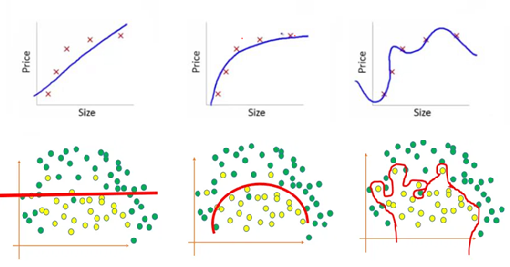
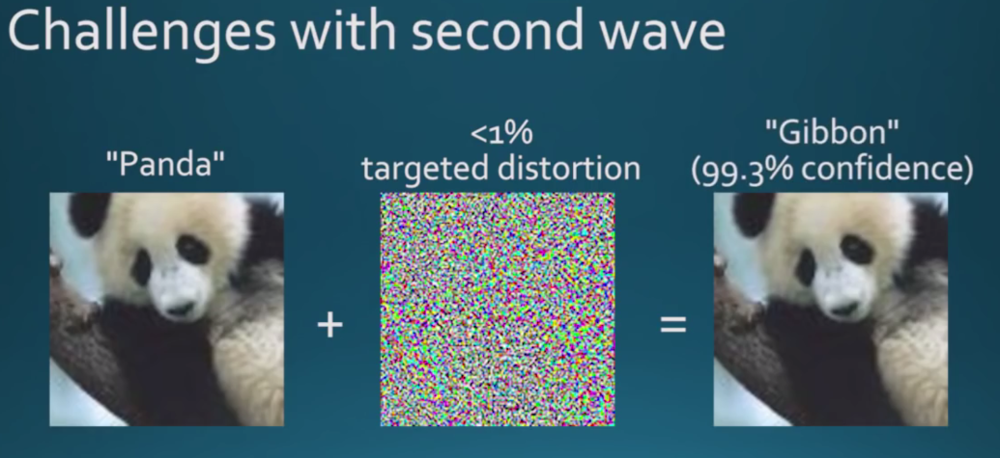
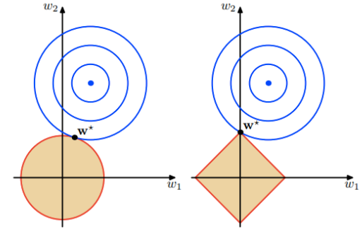
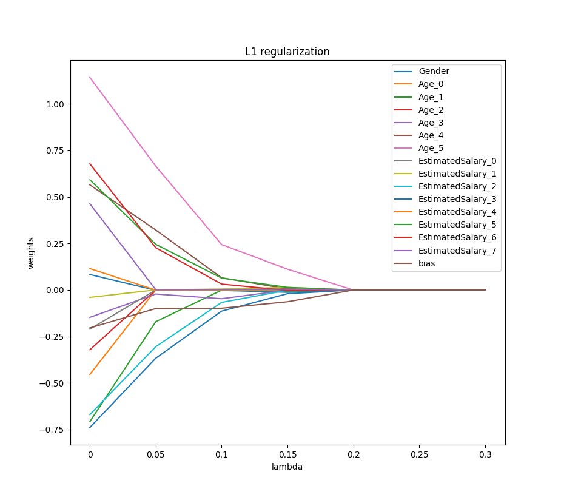
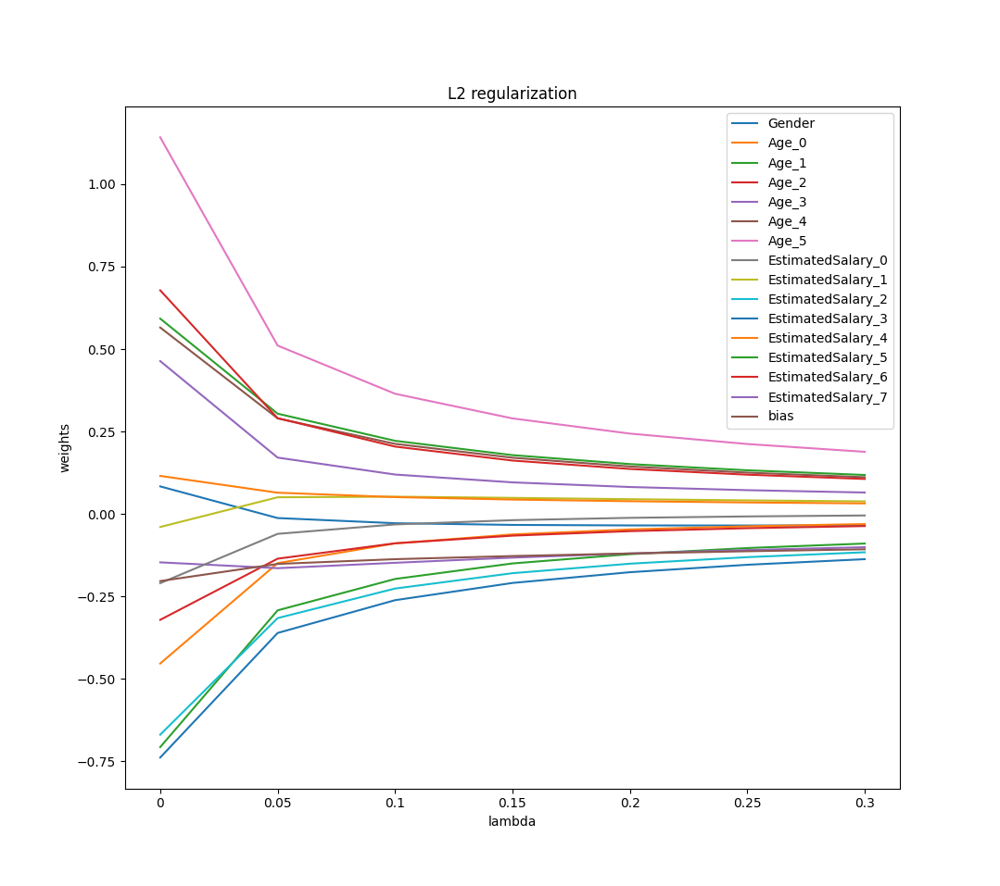
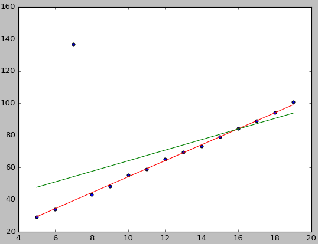
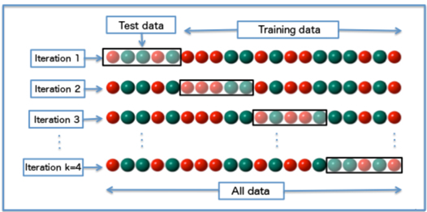
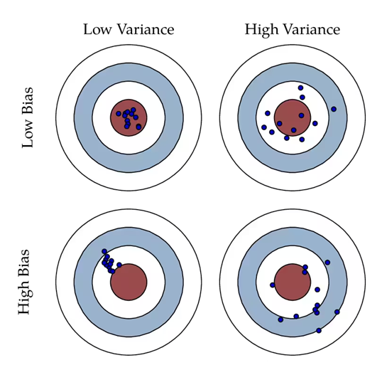
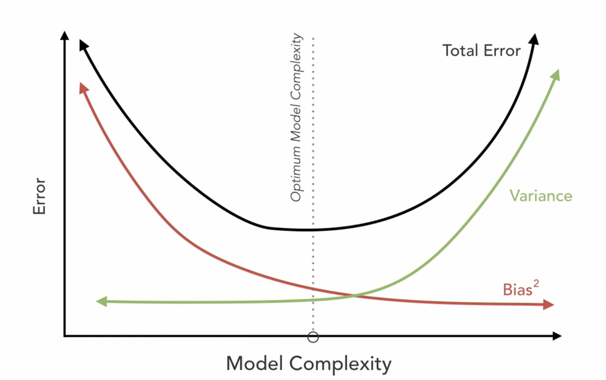

# CS182 Introduction to Machine Learning
# Recitation 6
2025.4.2

---

# Outline
- Linear Regression
- underfitting and overfitting
- Model Selection

---

# Linear Regression

Sample points $\{(x_i,y_i)\}_{i=1}^n$.
Linear: 关于参数是线性的.
$$\hat{y}=w^{\top}x$$
$$\min_{w} \sum_{i=1}^n \left(y_i - \hat{y}_i\right)^2$$
$$\min_{w} \sum_{i=1}^n \left\|\mathbf{y}-Xw\right\|^2$$

---

# Underfitting & Overfitting

---

# Underfitting 欠拟合

模型在训练数据上的表现就不佳,显然没有学到足够的数据特征,因此在新数据上的表现也不好. 这表明模型太过简单,无法捕捉到数据中的基本关系.

原因:
1. 模型过于简单: 模型的结构可能太简单, 以至于不能捕捉到数据中的所有相关模式和关系.
2. 特征处理不当: 如果输入数据的特征未经适当的预处理或选择, 模型可能无法接收到解释数据的足够信息.
3. 训练不足:训练epoch过少或训练数据使用不当, 可能导致模型未能学习到有效的数据表示.
4. 数据质量问题: 如果训练数据质量差(如错误, 异常值多), 模型可能难以从中学习到有效信息.

---

# Overfitting 过拟合

模型在训练数据上表现得非常好,但在新的, 未见过的数据上表现不佳. 这意味着模型学习到了训练数据中的随机波动和噪声, 而不仅仅是底层数据分布的关键特征.

原因:
1. 模型复杂度过高: 当模型有过多的参数或层(如深层神经网络)时, 它可能会"记住"训练数据, 而不是"学习"从中推广到新数据的模式.
2. 训练数据不足: 如果训练数据集小, 模型可能无法从中学习到足够的信息, 而容易受到数据中偶然出现的特征的影响.
3. 训练时间过长: 尤其在使用梯度下降类算法时, 过长的训练时间可能导致模型逐渐适应训练数据中的噪声.
4. 缺乏正则化: 没有实施适当的正则化(如L1, L2正则化)可以防止模型权重变得过大,过大的权重通常与高度复杂的模型相关.

---

# Overfitting & Underfitting

过拟合和欠拟合是机器学习中两种常见的模型性能问题,它们反映了模型在训练数据和未见数据上的泛化能力.

解决方案
- 对于欠拟合:可以尝试使用更复杂的模型, 增加模型训练的时间, 改进特征工程或优化模型参数等策略.
- 对于过拟合:可以通过增加训练数据的多样性, 引入正则化, 使用早停(early stopping)策略, 降低模型复杂度或通过模型剪枝等方法来处理.

---

# Robustness 鲁棒性

  

> https://machinelearning.technicacuriosa.com/2017/03/19/a-darpa-perspective-on-artificial-intelligence/

---

# Regularization
降低模型复杂度, 增加 robustness
- L2 正则化(Ridge Regression)

  

$$\begin{aligned}
\min \sum_{i=1}^n \left(y_i - \hat{y}_i\right)^2 \\
s.t. \|\beta\|_2^2 \leq \lambda
\end{aligned}$$
  

$$\min \sum_{i=1}^n \left(y_i - \hat{y}_i\right)^2 + \lambda \|\beta\|_2^2$$

  

- L1 正则化(Lasso Regression)

  

$$\begin{aligned}
\min \sum_{i=1}^n \left(y_i - \hat{y}_i\right)^2 \\
s.t. \|\beta\|_1 \leq \lambda
\end{aligned}$$
  

  

$$\min \sum_{i=1}^n \left(y_i - \hat{y}_i\right)^2 + \lambda \|\beta\|_1$$

  

---

# Sparsity 稀疏性

  

可以看到在正则化的限制之下, L2正则化给出的最优解 $w^∗$ 是使解更加靠近原点, 也就是说L2正则化能降低参数范数的总和. L1正则化给出的最优解$w^∗$ 是使解更加靠近某些轴, 而其它的轴则为0, 所以L1正则化能使得到的参数稀疏化

---

# Sparsity

  
  

---

# RANSAC (RANdom SAmple Consistent) 随机采样一致

  

---

# RANSAC

RANSAC是通过反复选择数据集去估计出模型,一直迭代到估计出认为比较好的模型.
具体的实现步骤可以分为以下几步:

- 1.选择出可以估计出模型的最小数据集(对于直线拟合来说就是两个点)
- 2.使用这个数据集来计算出数据模型
- 3.将所有数据带入这个模型, 计算出"内点"的数目, (累加在一定误差范围内的适合当前迭代推出模型的数据)
- 4.比较当前模型和之前推出的最好的模型的"内点"的数量,记录最大"内点"数的模型参数和"内点"数
重复1-4步,直到迭代结束或者当前模型已经足够好了("内点数目大于一定数量").

---

# Iteration steps

假设内点(inliner)在数据中的占比为 $t$
$$t=\frac{n_{\text {inliers }}}{n_{\text {inliers }}+n_{\text {outliers}}}$$

那么我们每次计算模型使用 $n$ 个点的情况下, 选取的点**至少**有一个外点的情况就是

$$1-t^n$$

也就是说,在迭代 $k$ 次的情况下,$\left(1-t^n\right)^k$ 就是 $k$ 次迭代计算模型都至少采样到一个＂外点＂去计算模型的概率。那么能采样到正确的 $n$ 个点去计算出正确模型的概率就是

$$P=1-\left(1-t^n\right)^k$$

通过上式,可以求得

$$k=\frac{\log (1-P)}{\log \left(1-t^n\right)}$$

---

# Model Selection
- Train-Validation-Test Split
- K-fold Cross Validation

  

---

# Occam's razor 奥卡姆剃刀原则

- "如无必要,勿增实体"

如果两个模型都能**同样好**地解释同一组数据,那么**更简单**的模型通常更受青睐,因为它们更易于测试和验证,且在实际应用中更为可靠. 简单的模型通常更不容易过拟合,能更好地泛化到新的数据集.

---

# Unbiased estimation 无偏估计
令$\mu$为真实分布$X$的均值, $\hat{\mu}$ 为估计的均值, 若
$$\hat{\mu} = \mu$$
则称$\hat{\mu}$为$X$的一个**无偏估计**, 否则偏差(bias)为
$$\text{bias}^2 = \left(\hat{\mu} - \mu\right)^2$$

---

# Bias-Variance Tradeoff

  

> https://www.bilibili.com/opus/412801371382122346

---

# Bias-Variance Tradeoff

groundtruth: $Y = f(X) + \epsilon, \epsilon\sim\mathcal{N}(0,\sigma^2)$
predicted: $\hat{Y}=\hat{f}(X)$

$$\begin{aligned}
\mathbb{E}\left[(Y-\hat{Y})^2\right] & =\mathbb{E}\left[(f+\epsilon-\hat{f})^2\right] \\
&= \mathbb{E}\left[(\underbrace{f-\mathbb{E}[\hat{f}]}+\underbrace{\mathbb{E}[\hat{f}]-\hat{f}}+\epsilon)^2\right] \\
&= \mathbb{E}\left[(f-\mathbb{E}[\hat{f}])^2\right]+\mathbb{E}\left[(\mathbb{E}[\hat{f}]-\hat{f})^2\right]+\mathbb{E}\left[\epsilon^2\right] + 2\mathbb{E}[(f-\mathbb{E}[\hat{f}])(\mathbb{E}[\hat{f}]-\hat{f})]+2\mathbb{E}[(f-\mathbb{E}[\hat{f}]) \epsilon]+ 2\mathbb{E}[(\mathbb{E}[\hat{f}]-\hat{f})\epsilon] \\
&= (f-\mathbb{E}[\hat{f}])^2+\mathbb{E}\left[(\mathbb{E}[\hat{f}]-\hat{f})^2\right]+\mathbb{E}\left[\epsilon^2\right]+2(f-\mathbb{E}[\hat{f}]) \underbrace{\mathbb{E}[\mathbb{E}[\hat{f}]-\hat{f}]}_{0} +2(f-\mathbb{E}[\hat{f}]) \underbrace{\mathbb{E}[\epsilon]}_{0}+2\mathbb{E}[\mathbb{E}[\hat{f}]-\hat{f}]\underbrace{\mathbb{E}[\epsilon]}_{0} \\
&= (f-\mathbb{E}[\hat{f}])^2+\mathbb{E}\left[(\mathbb{E}[\hat{f}]-\hat{f})^2\right]+\mathbb{E}\left[\epsilon^2\right] \\
&= \operatorname{Bias}[\hat{f}]^2+\operatorname{Var}[\hat{f}]+\sigma^2
\end{aligned}$$

---

# Bias-Variance Tradeoff

  

error = bias$^2$ + variance + $\sigma^2$