# CS182 Introduction to Machine Learning
# Recitation 7
2025.4.9

---

# Outline
- Neural Networks
- BackPropagation
- Gradient Descent
- Stochastic Gradient Descent
- Mini-batch Gradient Descent

---

# Neural Networks

  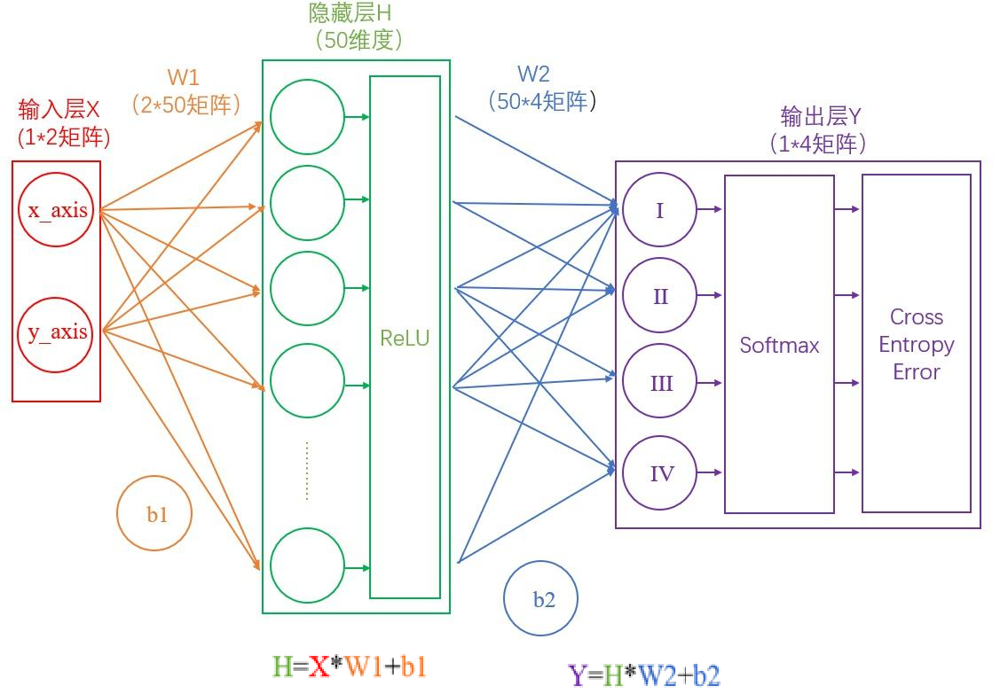

> have a play! https://playground.tensorflow.org/

---

# Neural, Activation Functions(激活函数)
> 没有激活函数, 不管多少层MLP都可以用一层替代

  

---

# Activation Functions

  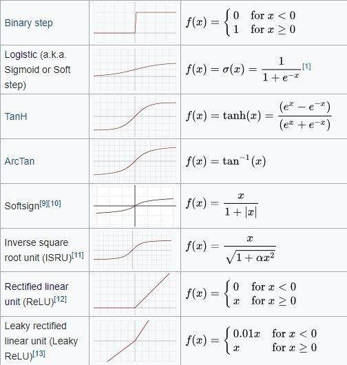

---

# Multi-layer Perceptron(MLP) 多层感知机 / 全连接层

  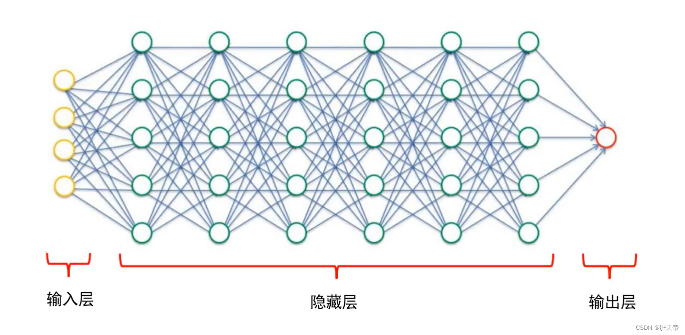

---

# Regularization for NNs
- L1 / L2 regularization
- Dropout

  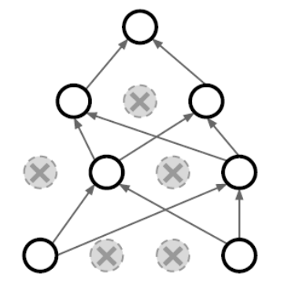

---

# BackPropagation(BP) 反向传播

  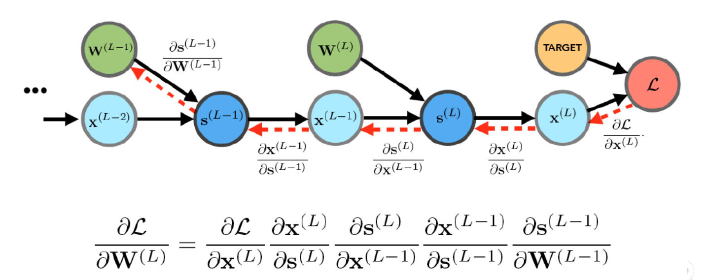

---

# BackPropagation
- Chain Rule 矩阵求导链式法则
注意将矩阵的维度对上
$$\dfrac{\partial z}{\partial\mathbf{x}} = \left(\dfrac{\partial \mathbf{y}}{\partial\mathbf{x}}\right)^{\top}\dfrac{\partial z}{\partial\mathbf{y}}$$
$$\dfrac{\partial z}{\partial\mathbf{y}_1} = \left(\dfrac{\partial \mathbf{y}_{n}}{\partial\mathbf{y}_{n-1}}\dfrac{\partial \mathbf{y}_{n-1}}{\partial\mathbf{y}_{n-2}}\cdots\dfrac{\partial \mathbf{y}_{2}}{\partial\mathbf{y}_{1}}\right)^{\top}\dfrac{\partial z}{\partial\mathbf{y}_n}$$
> https://www.cnblogs.com/yifanrensheng/p/12639539.html

---

# Gradient Descent 梯度下降

  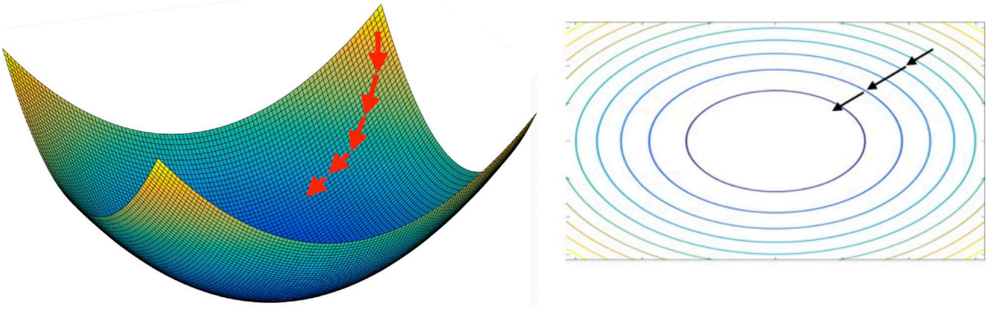

初始化一个位置, 然后迭代:
$$x^{k+1}\gets x^{k} - \alpha_k \nabla f(x^{k})$$
Until convergence: $\|\nabla f(x^{k})\|<\epsilon$, 或 $\|x^{k+1}-x^{k}\|\leq\epsilon$, 或 $\|f(x^{k+1})-f(x^{k})\|\leq\epsilon$...

> 梯度下降法有一系列变种: SGD, proximal gradient descent, ADMM; 以及用到二阶信息的牛顿法, 拟牛顿法.......

---

# Stepsize / learning rate 步长 / 学习率
算法的效率取决于学习率

  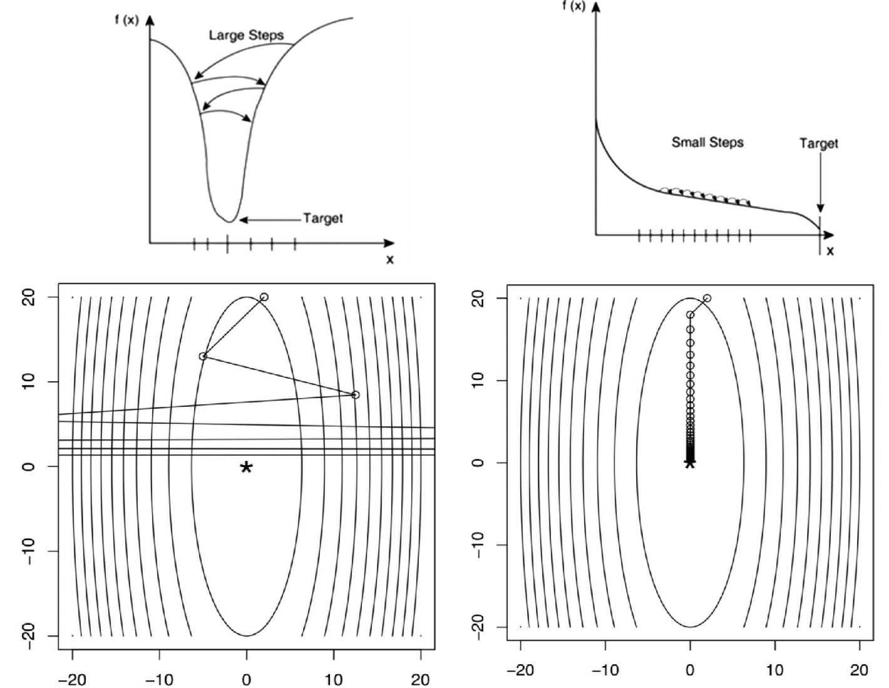

---

# Exact line search 精确线搜索
迭代: $x^{k+1}\gets x^{k} - \alpha_k \nabla f(x^{k})$
取 $\alpha_k\gets\arg\min\limits_{\alpha\in(0,1)}f(x^{k}-\alpha\nabla f(x^{k}))$
e.g.
$$f(\mathbf{x})=\dfrac{1}{2}\mathbf{x}^{\top}\mathbf{Qx}-\mathbf{b}^{\top}\mathbf{x}, \mathbf{Q}\succeq 0$$

---

# Exact line search
- Problem: zig-zag

  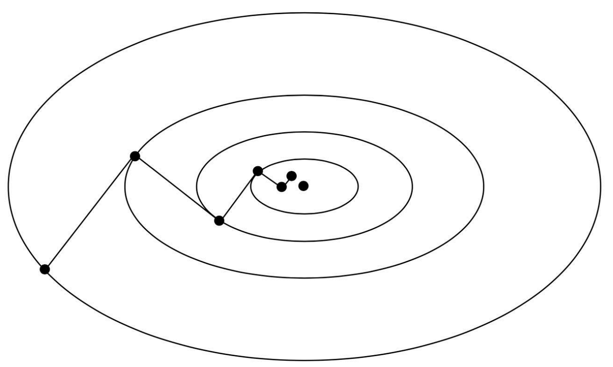

> others: backtracking, Armijo 线搜索, Wolfe 线搜索, Zoutendijk 线搜索...
> https://zhuanlan.zhihu.com/p/651901246

---

# Convergence rate 收敛速率
$f(x)$ 被称为: $\mu$-strongly convex, $L$-smooth:
$$\mu I \preceq \nabla^2 f(x)\preceq LI$$

$L$-smooth:
$f(\mathbf{x}^K)-f(\mathbf{x}^*)\leq\dfrac{1}{2K\alpha}\left\|\mathbf{x}^0-\mathbf{x}^*\right\|^2\Rightarrow$ sublinear convergence rate.

$L$-smooth + $\mu$-strongly convex:
$f\left(\mathbf{x}^k\right)-f\left(\mathbf{x}^*\right) \leq \frac{L}{2}\left(\frac{\kappa-1}{\kappa+1}\right)^{2 k}\left\|\mathbf{x}^0-\mathbf{x}^*\right\|^2\Rightarrow$ linear convergence rate.

> GD 在光滑函数下有收敛速率保障, 凸函数下有收敛性的保障, 但是在非凸函数通常也能较好的走出local minima / saddle points. 但能找到泛化性较好的flatten minima.

---

# Learning rate in deep learning
- warm-up stage
- learning rate delay

  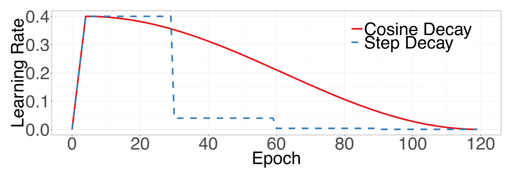

---

# Stochastic Gradient Descent 随机梯度下降

  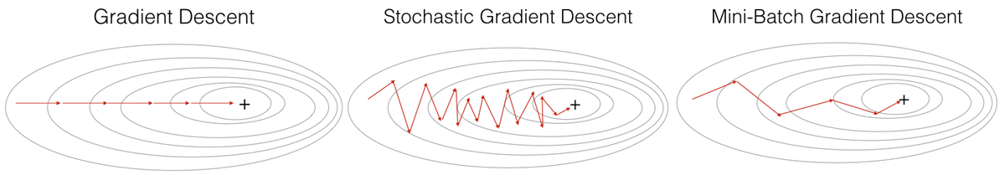

在深度学习中，很多直接把mini-batch gradient descent（a.k.a stochastic mini-batch gradient descent）简称为SGD，所以当你看到深度学习中的SGD，一般指的就是mini-batch gradient descent

---

# Local Minima 局部最小值 / Saddle Points 鞍点
- 和global minima(全局最小值)的关系: 都有$\nabla f(x)=0$

  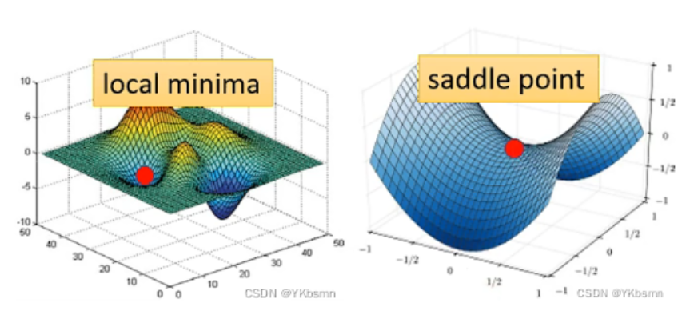

---

# Adam / AdamW
Adaptive Moment Estimation
Weight Decay Regularization for Adam

基于动量的优化算法 => 更好的逃离鞍点, 但不如SGD能更好的找到flatten minima

  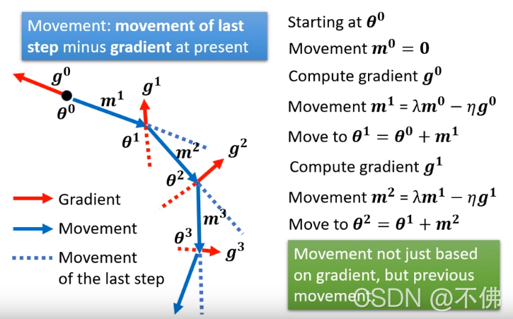

