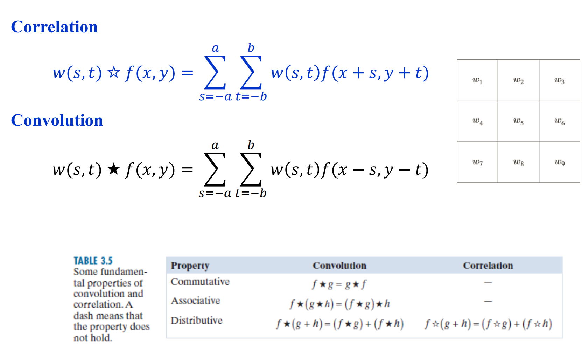
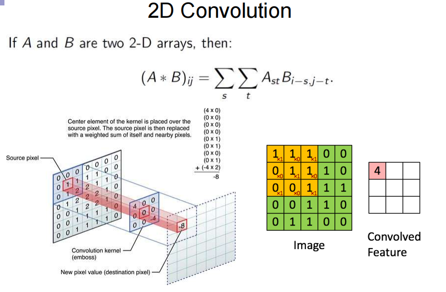
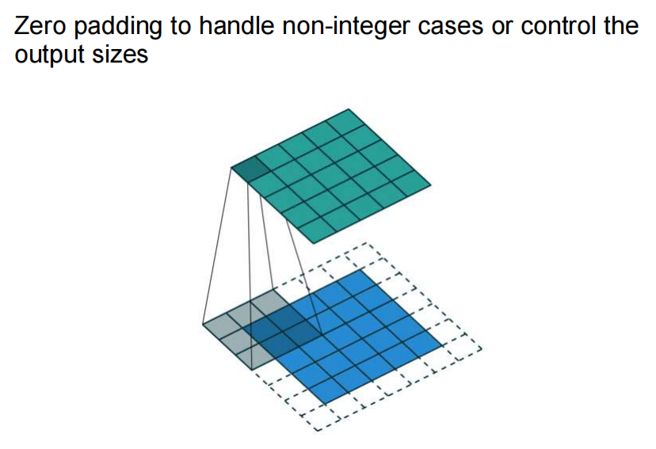
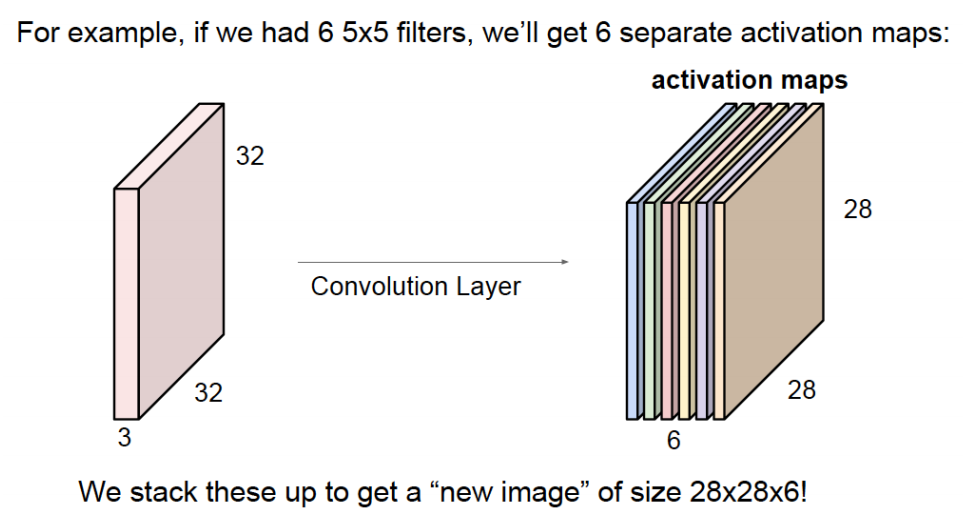
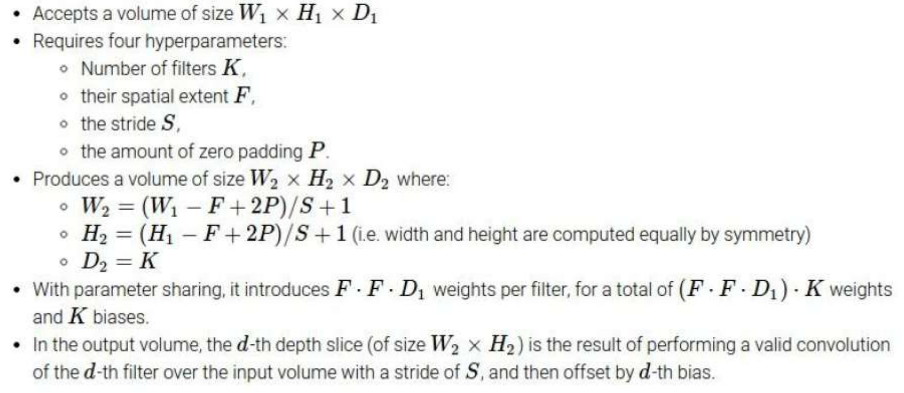
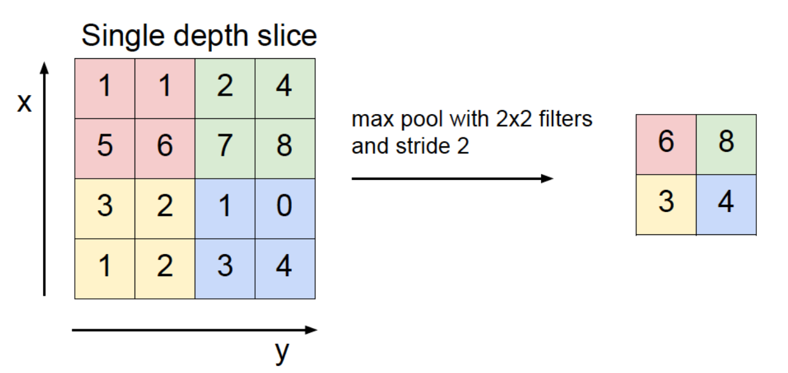
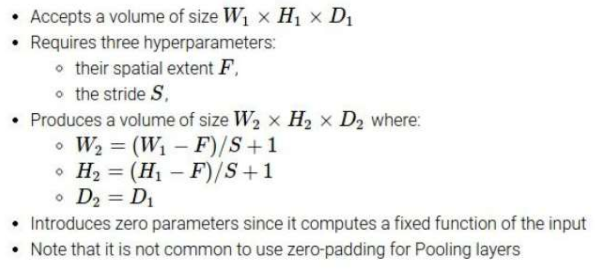
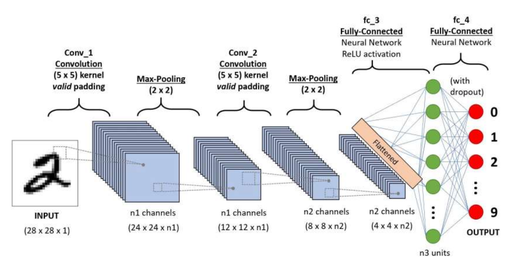

# CS182 Introduction to Machine Learning
# Recitation 8
2025.4.16

---

# Outline
- Correlation & Convolution
- CNN
- Upsampling & Downsampling

---

# Correlation 相关 & Convolution 卷积

  

> 卷积 = 卷积核反转一下之后做相关

---

  

> 卷积核反转一下就是做一个相关, 因为卷积核的参数是可训练的, 所以在CNN里具体是做的卷积还是做的相关其实并不重要. 实际上torch就是用correlation算的
https://pytorch.org/docs/stable/generated/torch.nn.Conv2d.html#torch.nn.Conv2d

---

# Padding 填充

  

> padding_mode='zeros' / 'reflect' / 'replicate' / 'circular', default='zeros'

---

# Dimension 维度

  

一个32*32*3的图像, 经过6个5*5*3的卷积核, 没有padding, 步长为1: 变成28*28*6的特征图.

> special: $W*H*D$的图像经过$n$个$1*1*D$的卷积核, 得到$W*H*n$的特征图. 作用: 改变维度数 (feature层面的pooling)

---

# Dimension of convolution operation 卷积操作的维度

  

一个$W_1*H_1*D_1$的图像, 经过$K$个$F*F*D_1$的卷积核, padding的大小为$P$, 步长为$S$
最终得到一个$W_2*H_2*D_2$的特征图

---

# Upsampling 上采样 & Downsampling 下采样

  

- upsample: 时域 / 频域 补零
- downsample: max pooling / average pooling / ...

---

# Dimension of pooling operation 池化操作的维度

  

> pooling操作只改变图像的大小, 不改变特征的维度
一个$W_1*H_1*D_1$的图像, 经过**感受野**$F*F$池化, 步长为$S$
最终得到一个$W_2*H_2*D_1$的特征图

---

# Have a try!
- LeNet-5

  

