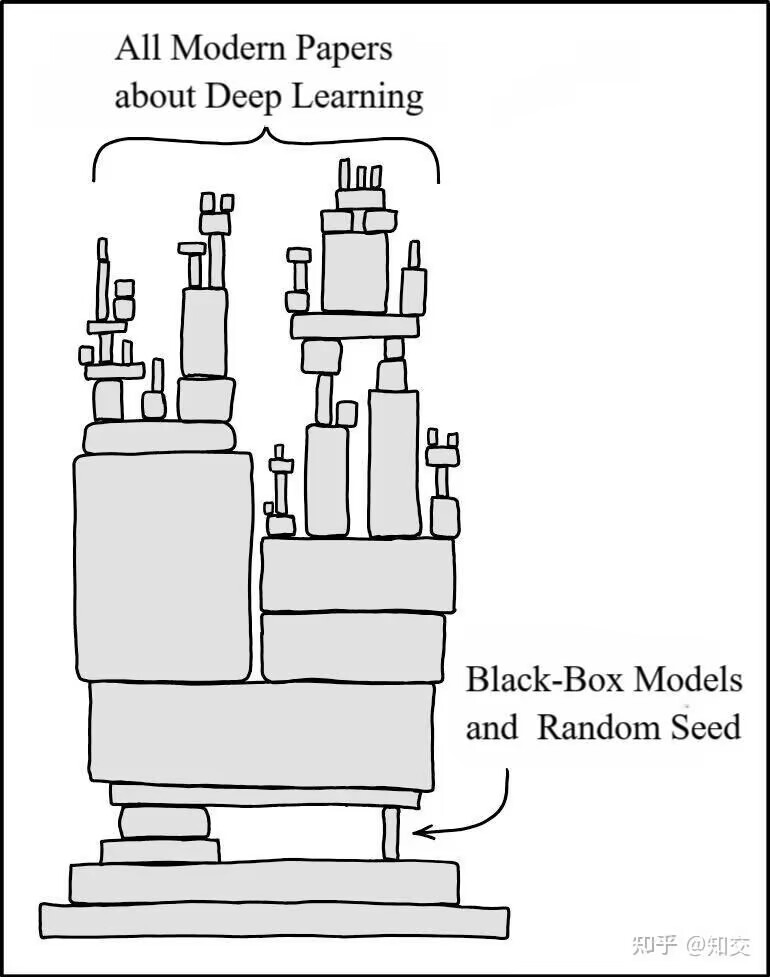
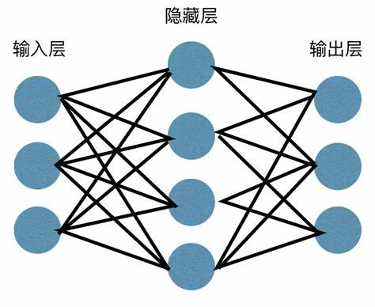

# CS182 Introduction to Machine Learning
# Recitation 9
2025.4.23

---

# Outline
- Deep Learning models
- Training process

---

# Deep Learning 深度学习

  

---
# Deep Learning

  

---
# Models
- CV
    - CNN, ViT
- NLP
    - RNN, LSTM
    - Transformer(BERT, GPT)
- Generative models
    - VAE, GAN, Diffusion
- Reinforcement learning
    - DQN, PPO, A3C

$\vdots$

---
# Vision Transformer (ViT)

  

---

# Data Properation 数据预处理
- centralization
- normalization
- remove outliers
- generate features
    > 可以用一些预训练好的模型来生成特征, concat成新的特征

$\vdots$

---

# Data Augmentation 数据增强
> 增加数据的多样性, 避免过拟合
- shift
- rotation
- flip
- crop
- color
- noise
- mixup
- jitter
$\vdots$

---

# Parameter Initialization 参数初始化

  

> e.g. 多头注意力机制, 每个head初始化成不同的值, 学习到不同的特征
> pytorch 自带的初始化: torch.nn.init
https://pytorch.org/docs/stable/nn.init.html

---

# Normalization 局部归一化

  

> N: batch size, C: 通道数 / 句子长度, H,W: 图片高宽 / 词向量维度

标准化: 得到均值为0，方差为1的分布
$$\hat{x} \gets \frac{x-\mu}{\sigma}$$

比较好的抑制梯度消失和梯度爆炸的情况

---

# Normalization

  

> N: batch size, C: 通道数 / 句子长度, H,W: 图片高宽 / 词向量维度

- Batch Normalization (BN)
对一批样本的同一纬度特征做归一化
- Layer Normalization (LN)
对单个样本的所有维度特征做归一化
> https://blog.csdn.net/qq_35812205/article/details/122330669

---

# Normalization

  

- Batch Normalization不适合RNN,transformer等序列网络,不适合文本长度不定和batchsize较小的情况,适合于CV中的CNN等网络
- Layer Normalization适合用于NLP中的RNN,transformer等网络,因为sequence的长度可能是不一致的